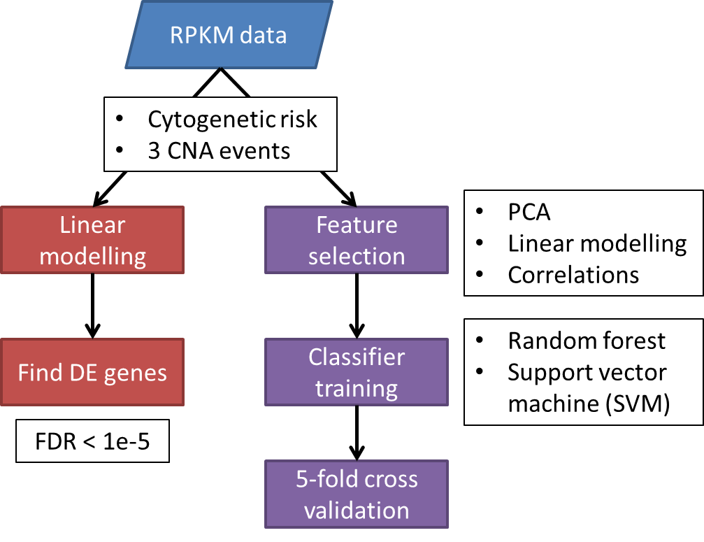

Using RNA-Seq Data to Predict Large-scale Copy-number Alterations in AML
========================================================================

Group project for STAT540, Winter 2014.

Overview
--------
Here is a general diagram of our workflow:  

### Project Proposal
* Proposal: [here](https://github.com/rdocking/stat540-group-project-aml-cnv/blob/master/Proposal.md)

### Inputs
* RPKM data: [here](https://github.com/rdocking/stat540-group-project-aml-cnv/blob/master/data/aml.rnaseq.gaf2.0_rpkm_cleaned.txt)
* Patient metadata: [here](https://github.com/rdocking/stat540-group-project-aml-cnv/blob/master/data/experimental_design_cleaned.txt)

### Outputs
* Poster text: **link to be added**
* Poster figures: [here](https://github.com/rdocking/stat540-group-project-aml-cnv/tree/master/poster)

### Analysis scripts
1. Linear regression - Cytogenetic risk: [here](https://github.com/rdocking/stat540-group-project-aml-cnv/blob/master/code/diff_expr_rna_seq_rpkm.md)
2. Linear regression - CNA events: [here](https://github.com/rdocking/stat540-group-project-aml-cnv/blob/master/code/Bayly_rna_seq_diff_exp_analysis.md)
3. SVM (PCA-based feature selection): [here](https://github.com/rdocking/stat540-group-project-aml-cnv/blob/master/code/pca_exploratory)
4. SVM (lm and correlation-based feature selection): [here](https://github.com/rdocking/stat540-group-project-aml-cnv/blob/master/code/svm_exploratory)
5. Random forest (lm and correlation-based feature selection): [here](https://github.com/rdocking/stat540-group-project-aml-cnv/blob/master/code/rf_exploratory)

### Bibliography
1. Genomic and Epigenomic Landscapes of Adult De Novo Acute Myeloid Leukemia. New England Journal of Medicine 368, 2059–2074 (2013). [PubMed](http://www.ncbi.nlm.nih.gov/pubmed/23634996)
2. Grimwade, D. et al. Refinement of cytogenetic classification in acute myeloid leukemia: determination of prognostic significance of rare recurring chromosomal abnormalities among 5876 younger adult patients treated in the United Kingdom Medical Research Council trials. Blood 116, 354–365 (2010). [PubMed](http://www.ncbi.nlm.nih.gov/pubmed/20385793)
3. Prebet, T. et al. Secondary Philadelphia chromosome after non-myeloablative peripheral blood stem cell transplantation for a myelodysplastic syndrome in transformation. Bone Marrow Transplant 33, 247–249 (2004). [PubMed](http://www.ncbi.nlm.nih.gov/pubmed/14716291)
4. Law, C. W., Chen, Y., Shi, W. & Smyth, G. K. voom: precision weights unlock linear model analysis tools for RNA-seq read counts. Genome Biology 15, R29 (2014). [PubMed](http://www.ncbi.nlm.nih.gov/pubmed/24485249)

* Missing one reference from poster
* Just the ones in the poster, or additional?