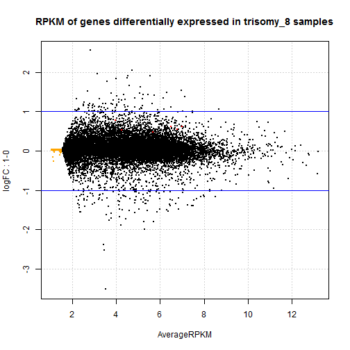
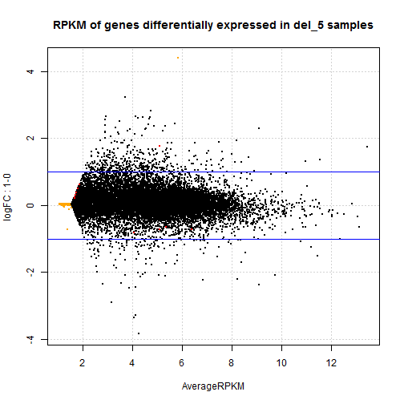
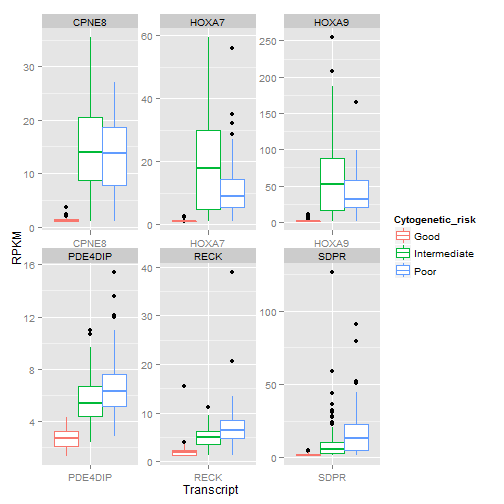
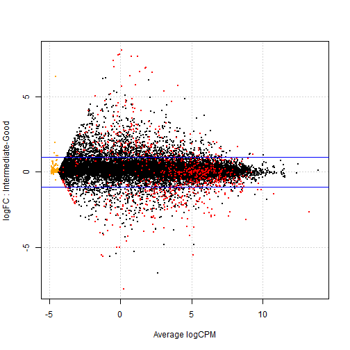
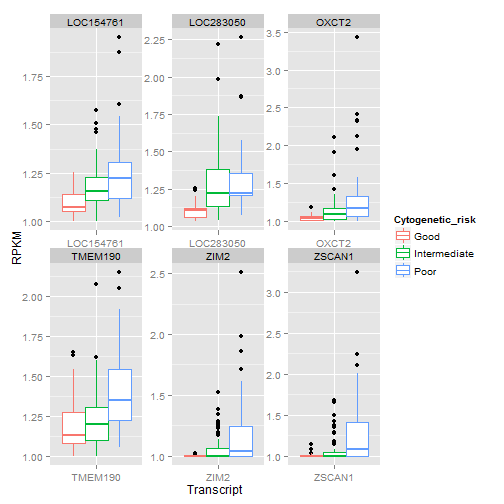
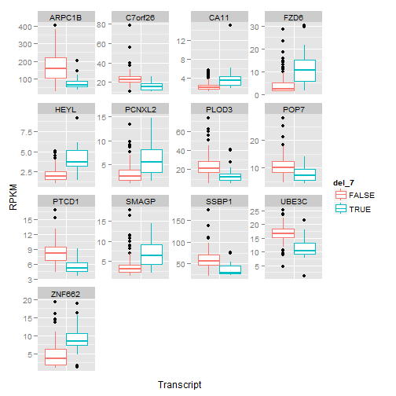

Differential expression analysis for trisomy 8, deletion 5 and deletion 7
========================================================

> To knit .rmd file, read data files in using "../data"  
> To run chunks in Rstudio, read data files in using "./data"

This code performs differential expression analysis on cleaned RNA-seq read count data. In particular, it tests whether there is differential expression between different *deletions* (trisomy 8, del 5 and del 7) using `voom`.


## Load data and required libraries
Load RNA-seq data and the experimental design files:

```r
rDes <- read.table("../data/experimental_design_cleaned.txt", sep = "\t", header = TRUE, 
    row.names = 1)  #might need to fix pathname
rDat <- read.table("../data/aml.rnaseq.gaf2.0_read_count_cleaned.txt", sep = "\t", 
    header = TRUE, row.names = 1)  #might need to fix pathname
```


Load required libraries:

```r
library(lattice)  # if you don't already have this loaded ...
library(ggplot2)  # we'll make figures with both
library(reshape2)  # for the function melt
library(limma)
library(edgeR)
library(car)
library(RColorBrewer)
```


## Data inspection

```r
str(rDat, max.level = 0)
```

```
## 'data.frame':	20001 obs. of  179 variables:
##   [list output truncated]
```

```r
rDat[1:4, 1:4]
```

```
##                            X2803 X2805  X2806  X2807
## A1BG-AS|503538_calculated  794.1 431.6  893.2 1097.4
## A1BG|1_calculated         1141.2 405.4 1006.7 1123.7
## A1CF|29974_calculated        2.0   2.0    2.0    3.0
## A2LD1|87769_calculated     196.5 229.1  181.8  113.1
```

```r
head(names(rDat))
```

```
## [1] "X2803" "X2805" "X2806" "X2807" "X2808" "X2810"
```

```r
head(rownames(rDat), n = 10)
```

```
##  [1] "A1BG-AS|503538_calculated" "A1BG|1_calculated"        
##  [3] "A1CF|29974_calculated"     "A2LD1|87769_calculated"   
##  [5] "A2ML1|144568_calculated"   "A2M|2_calculated"         
##  [7] "A4GALT|53947_calculated"   "A4GNT|51146_calculated"   
##  [9] "AAA1|404744_calculated"    "AAAS|8086_calculated"
```

```r
tail(rownames(rDat), n = 10)
```

```
##  [1] "ZWINT|11130_calculated"      "ZXDA|7789_calculated"       
##  [3] "ZXDB|158586_calculated"      "ZXDC|79364_calculated"      
##  [5] "ZYG11B|79699_calculated"     "ZYX|7791_calculated"        
##  [7] "ZZEF1|23140_calculated"      "ZZZ3|26009_calculated"      
##  [9] "psiTPTE22|387590_calculated" "tAKR|389932_calculated"
```

```r
str(rDes, max.level = 0)
```

```
## 'data.frame':	179 obs. of  9 variables:
```

```r
head(rDes)
```

```
##      Sex Race FAB_subtype Age trisomy_8 del_5 del_7 Cytogenetic_risk
## 2803   F    W          M3  61     FALSE FALSE FALSE             Good
## 2805   M    W          M0  77     FALSE FALSE FALSE     Intermediate
## 2806   M    W          M1  46     FALSE FALSE FALSE             Good
## 2807   F    W          M1  68     FALSE FALSE FALSE     Intermediate
## 2808   M    W          M2  23     FALSE FALSE FALSE     Intermediate
## 2810   F    B          M2  76     FALSE FALSE FALSE             N.D.
##      Molecular_risk
## 2803           Good
## 2805   Intermediate
## 2806           Good
## 2807   Intermediate
## 2808   Intermediate
## 2810           N.D.
```


Both the design matrix and the data matrix have already been cleaned and filtered. 

RNA-seq data: there are 20001 transcripts (rows) for 179 patients (columns). Experimental design: there are 179 rows, representing information for each of the patients with RNA-seq data in the AML TCGA data set, and 179 variables.

### Differential expression analysis

I will use `voom` to perform differential expression analysis.

**Deletion**
Which genes are differentially expressed between trisomy 8, deletion 5, deletion 7?

```r
trisomy8 <- rDes$trisomy_8
table(trisomy8)
```

```
## trisomy8
## FALSE  TRUE 
##   160    19
```

```r

del5 <- rDes$del_5
table(del5)
```

```
## del5
## FALSE  TRUE 
##   163    16
```

```r

del7 <- rDes$del_7
table(del7)
```

```
## del7
## FALSE  TRUE 
##   158    21
```


Apply scale normalization:

```r
normFactor <- calcNormFactors(rDat)
```


Preparing model matrix:

```r
# Preparing Model matrices for Voom normalization-------------
modelMat_noInt <- model.matrix(~trisomy_8 * del_5 * del_7, rDes)
# The intercept represents a group with all samples without deletion of
# interest. this group changes depending on the deletion, since some samples
# share multiple deletions.
head(modelMat_noInt)
```

```
##      (Intercept) trisomy_8TRUE del_5TRUE del_7TRUE trisomy_8TRUE:del_5TRUE
## 2803           1             0         0         0                       0
## 2805           1             0         0         0                       0
## 2806           1             0         0         0                       0
## 2807           1             0         0         0                       0
## 2808           1             0         0         0                       0
## 2810           1             0         0         0                       0
##      trisomy_8TRUE:del_7TRUE del_5TRUE:del_7TRUE
## 2803                       0                   0
## 2805                       0                   0
## 2806                       0                   0
## 2807                       0                   0
## 2808                       0                   0
## 2810                       0                   0
##      trisomy_8TRUE:del_5TRUE:del_7TRUE
## 2803                                 0
## 2805                                 0
## 2806                                 0
## 2807                                 0
## 2808                                 0
## 2810                                 0
```


Now find genes differentially expressed between deletion type:

```r
dat.voomed <- voom(rDat, modelMat_noInt, plot = TRUE, lib.size = colSums(rDat) * 
    normFactor)
```

 

```r
fit_lm <- lmFit(dat.voomed, modelMat_noInt)
fit <- eBayes(fit_lm)
```


Investigating hits (with no interaction)

```r
ttfit_tris8 <- topTable(fit, number = Inf, coef = "trisomy_8TRUE", p.value = 1e-05)
ttfit_del5 <- topTable(fit, number = Inf, coef = "del_5TRUE", p.value = 1e-05)
ttfit_del7 <- topTable(fit, number = Inf, coef = "del_7TRUE", p.value = 1e-05)
```

there are:
4 hits for trisomy 8, 29 hits for del 5, and 190 hits for del 7.

Is there overlap between the hits?

```r
a <- length(intersect(rownames(ttfit_tris8), rownames(ttfit_del5)))
b <- length(intersect(rownames(ttfit_tris8), rownames(ttfit_del7)))
c <- length(intersect(rownames(ttfit_del5), rownames(ttfit_del7)))
sum(a, b, c)
```

```
## [1] 1
```

there is: 1 overlapping gene, at `intersect(rownames(ttfit_del5), rownames(ttfit_del7)))`

Investigating hits with interaction at 1e-5

```r
a <- nrow(ttfit_t8d5 <- topTable(fit, number = Inf, coef = "trisomy_8TRUE:del_5TRUE", 
    p.value = 1e-05))
b <- nrow(ttfit_t8d7 <- topTable(fit, number = Inf, coef = "trisomy_8TRUE:del_7TRUE", 
    p.value = 1e-05))
c <- nrow(ttfit_d5d7 <- topTable(fit, number = Inf, coef = "del_5TRUE:del_7TRUE", 
    p.value = 1e-05))
d <- nrow(ttfit_t8d5d7 <- topTable(fit, number = Inf, coef = "trisomy_8TRUE:del_5TRUE:del_7TRUE", 
    p.value = 1e-05))
sum(a, b, c, d)
```

```
## [1] 0
```

there are 0 genes with differential expression influenced by interaction effects (with cutoff of 1e-5).

Investigating hits with interaction at 1e-4

```r
a <- nrow(ttfit_t8d5 <- topTable(fit, number = Inf, coef = "trisomy_8TRUE:del_5TRUE", 
    p.value = 1e-04))
b <- nrow(ttfit_t8d7 <- topTable(fit, number = Inf, coef = "trisomy_8TRUE:del_7TRUE", 
    p.value = 1e-04))
c <- nrow(ttfit_d5d7 <- topTable(fit, number = Inf, coef = "del_5TRUE:del_7TRUE", 
    p.value = 1e-04))
d <- nrow(ttfit_t8d5d7 <- topTable(fit, number = Inf, coef = "trisomy_8TRUE:del_5TRUE:del_7TRUE", 
    p.value = 1e-04))
sum(a, b, c, d)
```

```
## [1] 0
```

there is 0 gene with differential expression influenced by interaction effects.

*Exploring hit genes from trisomy_8.*
topTable for Trisomy 8


```r
(ttfit_tris8)
```

```
##                           logFC AveExpr     t   P.Value adj.P.Val     B
## NEIL2|252969_calculated  0.9572   3.084 7.761 6.879e-13 1.376e-08 18.05
## PPP2R2A|5520_calculated  0.6299   6.278 7.323 8.630e-12 8.630e-08 16.31
## ZNF7|7553_calculated     0.5785   5.240 6.698 2.813e-10 1.875e-06 12.99
## WHSC1L1|54904_calculated 0.6583   7.255 6.578 5.388e-10 2.694e-06 12.42
```


Plotsmear of trisomy_8 hits


```r
# Create a DGEList object
voomTris8genes <- rownames(ttfit_tris8)
trisomy_8 <- rDes$trisomy_8
dgeGlmT8 <- DGEList(counts = rDat, group = as.numeric(trisomy_8))
plotSmear(dgeGlmT8, de.tags = voomTris8genes, ylab = "logFC", xlab = "AverageCounts", main = "Counts of genes differentially expressed in trisomy_8 samples")
abline(h = c(-1, 1), col = "blue")
```

 


Creating a boxplot with the 4 genes of interest (FDR 1e-5) for trisomy 8


```r
#subsetting and reforming transcripts of interest from main RPKM matrix
tris8Dat <- rDat[voomTris8genes,]
tris8Dat$Transcript <- rownames(tris8Dat) #creating a transcript group
tris8Dat <- melt(tris8Dat, id.vars = "Transcript", 
                   variable.name = "TCGA_patient_id",
                   value.name = "Counts")

#cleaup molten RPKM data
tris8Dat$TCGA_patient_id <- gsub("X", "", tris8Dat$TCGA_patient_id)
tris8Dat$Transcript <- gsub("[|].*$", "", tris8Dat$Transcript)

#preparing a small design matrix and merging
miniDes <- rDes[,c("trisomy_8", "del_5" , "del_7")]
miniDes$"TCGA_patient_id" <- rownames(rDes)
tris8Dat <- merge(tris8Dat, miniDes, by = "TCGA_patient_id") #merging

#plotting
ggplot(tris8Dat, aes(Transcript, log2(Counts), colour = trisomy_8)) +
  geom_boxplot() +
  facet_wrap(~ Transcript, scales = "free") +
  theme(axis.text.x = element_blank(), axis.ticks.x = element_blank())
```

 


*Exploring hit genes from del_5.*
TopTable for del_5


```r
(ttfit_del5)
```

```
##                                 logFC  AveExpr      t   P.Value adj.P.Val
## KIAA0087|9808_calculated       5.6456 -1.13041  8.577 5.195e-15 1.039e-10
## CCDC48|79825_calculated        4.1990  1.01960  8.035 1.367e-13 1.367e-09
## KIAA1257|57501_calculated      1.7930  2.56677  7.710 9.259e-13 4.630e-09
## CREB3L3|84699_calculated       4.5521 -1.48049  7.724 8.510e-13 4.630e-09
## COL5A1|1289_calculated         4.1928  2.45496  7.526 2.697e-12 1.079e-08
## EGF|1950_calculated            4.0692  0.21886  7.421 4.929e-12 1.643e-08
## SIGLECP3|284367_calculated     3.0554  2.88471  7.278 1.119e-11 2.796e-08
## MME|4311_calculated            4.0055  0.37304  7.286 1.065e-11 2.796e-08
## SALL4|57167_calculated         4.2178 -0.19362  6.968 6.380e-11 1.418e-07
## KDM3B|51780_calculated        -0.8282  7.80337 -6.908 8.884e-11 1.777e-07
## HARS|3035_calculated          -0.9414  5.76861 -6.803 1.584e-10 2.881e-07
## ATP9A|10079_calculated         3.4181  2.38543  6.453 1.050e-09 1.750e-06
## CEACAM1|634_calculated         2.3850  2.85692  6.369 1.643e-09 2.191e-06
## PRSS2|5645_calculated          4.9834 -1.63022  6.389 1.472e-09 2.102e-06
## KIAA0141|9812|1of2_calculated -0.9614  6.61507 -6.265 2.833e-09 3.148e-06
## PFDN1|5201_calculated         -0.9939  5.26149 -6.269 2.775e-09 3.148e-06
## RBM22|55696_calculated        -0.7448  6.75538 -6.235 3.318e-09 3.493e-06
## B3GALT5|10317_calculated       2.8209 -3.80784  6.406 1.351e-09 2.079e-06
## XKR3|150165_calculated         3.7480 -1.01183  6.271 2.741e-09 3.148e-06
## TCOF1|6949_calculated         -0.9526  6.68845 -6.145 5.295e-09 5.295e-06
## ZNF793|390927_calculated       2.7844  3.10667  6.106 6.461e-09 5.619e-06
## LHX6|26468_calculated          4.0936 -0.09352  6.112 6.267e-09 5.619e-06
## WDR55|54853_calculated        -1.1310  5.08447 -6.049 8.682e-09 6.946e-06
## SYN2|6854_calculated           3.9667 -1.36087  6.107 6.425e-09 5.619e-06
## STARD10|10809_calculated       1.5538  2.25264  6.004 1.094e-08 8.416e-06
## ELN|2006_calculated            3.8871  0.19153  5.983 1.215e-08 9.004e-06
## NFASC|23114_calculated         3.2288 -1.08132  6.062 8.135e-09 6.779e-06
## VPREB1|7441_calculated         4.3300 -0.87257  5.975 1.266e-08 9.043e-06
## CLNK|116449_calculated         3.6920 -0.31977  5.968 1.315e-08 9.069e-06
##                                    B
## KIAA0087|9808_calculated      23.210
## CCDC48|79825_calculated       20.209
## KIAA1257|57501_calculated     18.337
## CREB3L3|84699_calculated      17.879
## COL5A1|1289_calculated        17.491
## EGF|1950_calculated           16.673
## SIGLECP3|284367_calculated    16.136
## MME|4311_calculated           16.000
## SALL4|57167_calculated        14.229
## KDM3B|51780_calculated        14.176
## HARS|3035_calculated          13.598
## ATP9A|10079_calculated        11.807
## CEACAM1|634_calculated        11.372
## PRSS2|5645_calculated         11.164
## KIAA0141|9812|1of2_calculated 10.868
## PFDN1|5201_calculated         10.862
## RBM22|55696_calculated        10.716
## B3GALT5|10317_calculated      10.665
## XKR3|150165_calculated        10.460
## TCOF1|6949_calculated         10.272
## ZNF793|390927_calculated      10.084
## LHX6|26468_calculated          9.986
## WDR55|54853_calculated         9.772
## SYN2|6854_calculated           9.676
## STARD10|10809_calculated       9.495
## ELN|2006_calculated            9.364
## NFASC|23114_calculated         9.349
## VPREB1|7441_calculated         9.283
## CLNK|116449_calculated         9.209
```


Plotsmear of del_5 hits

 


Creating a boxplot with the 29 genes of interest (FDR 1e-5) for del 5

 


Creating a boxplot with the genes of interest (FDR 1e-6) for del 5
 


testing expression level cutoff: Removing genes with max counts of less than 10000
 


Examining impact of removing 3 samples containing apparent outliers, and then filtereing for max counts>10000. This is because going by adj.P.Val alone does seem to give false positives...

```
## X2908 
##    94
```

 


*Exploring hit genes from del_7.*
TopTable for genes from del_7.
There are 190, so I will explore the head an tail.


```r
head(ttfit_del7)
```

```
##                            logFC AveExpr       t   P.Value adj.P.Val     B
## PDAP1|11333_calculated   -1.0883  5.5998 -11.688 1.149e-23 2.299e-19 42.75
## LUC7L2|51631_calculated  -1.0413  7.3370 -10.015 6.244e-19 6.245e-15 32.37
## MKRN1|23608_calculated   -1.3148  6.9044  -9.899 1.311e-18 8.739e-15 31.64
## FAM169A|26049_calculated  2.4923  2.4384   9.728 3.903e-18 1.952e-14 30.41
## C7orf42|55069_calculated -0.8228  7.0560  -9.535 1.330e-17 5.321e-14 29.40
## PAWR|5074_calculated      4.5181  0.2477   9.182 1.228e-16 4.095e-13 26.96
```

```r
nrow(ttfit_del7)
```

```
## [1] 190
```

```r
tail(ttfit_del7)
```

```
##                               logFC AveExpr      t   P.Value adj.P.Val
## KIF7|374654|2of2_calculated  2.6074 -0.1821  5.605 8.018e-08 8.860e-06
## GIGYF1|64599_calculated     -0.8692  7.0424 -5.600 8.243e-08 9.014e-06
## ATP6V1F|9296_calculated     -1.2360  5.4071 -5.575 9.281e-08 9.822e-06
## LUZP6|767558_calculated     -0.9773  8.0983 -5.593 8.499e-08 9.091e-06
## CDK5|1020_calculated        -1.3384  3.5607 -5.576 9.248e-08 9.822e-06
## ARPC1B|10095_calculated     -1.4622  7.7903 -5.574 9.355e-08 9.848e-06
##                                 B
## KIF7|374654|2of2_calculated 7.599
## GIGYF1|64599_calculated     7.579
## ATP6V1F|9296_calculated     7.543
## LUZP6|767558_calculated     7.535
## CDK5|1020_calculated        7.522
## ARPC1B|10095_calculated     7.452
```


Plotsmear of del_7 hits
 


Creating a boxplot with genes of interest (FDR 1e-5) for del 7. 
Again, this is exploring the head and tail of the genelist.
 


 


Remaking topTable with a cutoff of 1e-8


```r
nrow(ttfit_del72 <- topTable(fit, number = Inf, coef = "del_7TRUE", p.value = 1e-08))
```

```
## [1] 49
```


This is a much more manageable size.

 


Another way to cut would be based on counts - here, excluding genes with a max count of >10000.

 


*Investigating hit shared by del_5 and del_7*
adj. P. Values hit shared by del_5 and del_7


```r
SharedGene <- intersect(rownames(ttfit_del5), rownames(ttfit_del7))
(ttfit_del5[SharedGene, ]$adj.P.Val)
```

```
## [1] 1.079e-08
```

```r
(ttfit_del7[SharedGene, ]$adj.P.Val)
```

```
## [1] 2.1e-08
```


Plotsmear of hit shared by `del_5` and `del_7`

  


Boxplot of hit shared by `del_5` and `del_7`

  


What is this gene?
