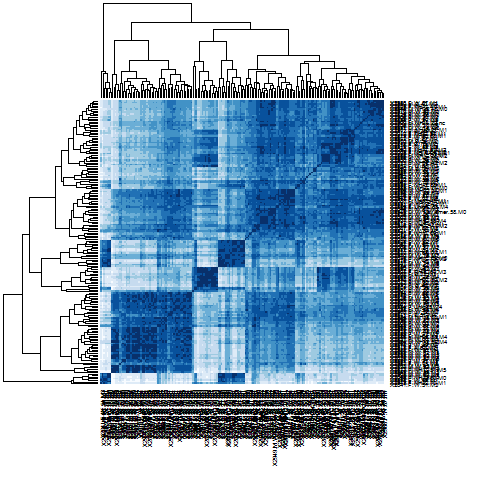
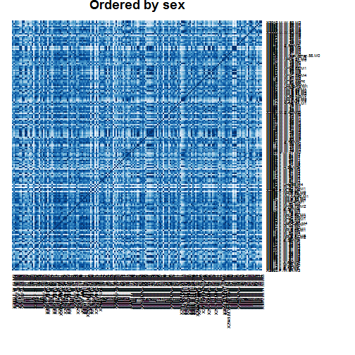
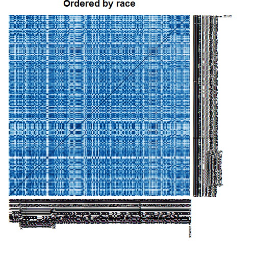
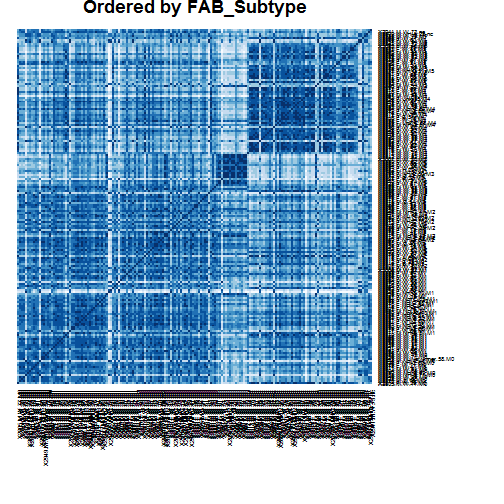
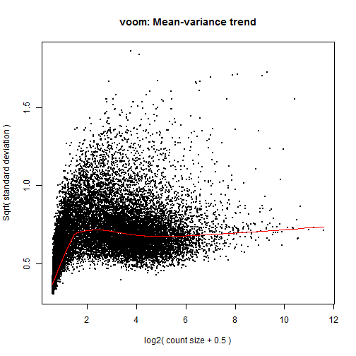

Differential expression analysis for trisomy 8, deletion 5 and deletion 7
========================================================

> To knit .rmd file, read data files in using "../data"  
> To run chunks in Rstudio, read data files in using "./data"

Use `voom + limma` to perform differential expression analysis on the RNA-seq data.

First load required libraries.

```r
library(lattice)  # if you don't already have this loaded ...
library(ggplot2)  # we'll make figures with both
library(reshape2)  # for the function melt
library(limma)
library(edgeR)
library(car)
library(RColorBrewer)
```


Load RNA-seq data and the experimental design:

```r
rDes <- read.table("experimental_design_cleaned.txt", sep = "\t", header = TRUE, 
    row.names = 1)  #might need to fix pathname
rDat <- read.table("aml.rnaseq.gaf2.0_rpkm_cleaned.txt", sep = "\t", header = TRUE, 
    row.names = 1)  #might need to fix pathname
```


Both the design matrix and the data matrix have already been cleaned and filtered. 

RPKM data: There are 20001 transcripts (rows) for 179 patients (columns).

Experimental design: there are 179 rows, representing information for each of the patients in the AML TCGA data set, and 179 variables.

### Explore rDat      

Check the RNA-seq data using a sample-to-sample correlation heatmap.
preparing for heatmap:


```r
HMprDes <- rDes
HMprDes$sampleID <- paste0("X", rownames(rDes))
hDat <- rDat

colnames(hDat) <- with(HMprDes, paste(sampleID, Sex, Race, Age, FAB_subtype, 
    sep = "."))
HMprDes$HmID <- with(HMprDes, paste(sampleID, Sex, Race, Age, FAB_subtype, sep = "."))
```


Before reordering to investigate possible trends, I will first see how it clusteres without ordering.


```r
heatmap(cor(hDat), margins = c(10, 10), scale = "none", col = brewer.pal(n = 9, 
    name = "Blues"))
```

 


There certainly seems to be groups of high correlation. 
Let's see if any of the following variables could be responsible for this. 

     


Trying to find commonalities in most highly correlated samples. More to be done on this. 


```r
corMelt <- melt(cor(hDat), variable.name = "colname", value.name = "cor_coef")
# will continue this...
```


exploring data via boxplot:


```r
rDatMelt <- melt(rDat, variable.name = "Sample", value.name = "RPKM")
```

```
## Using  as id variables
```

```r
ggplot(rDatMelt, aes(Sample, RPKM)) + geom_boxplot()
```

 


### Differential expression analysis
I will use `voom` to perform differential expression analysis. From my experience, `voom` makes the most stringent calls for differential expression. 

**differential analysis: deletion**
Which genes are differentially expressed between trisomy 8, deletion 5, deletion 7?

```r
# Preparing Model matrices for Voom normalization-------------
colnames(modelMat_noInt <- model.matrix(~trisomy_8 * del_5 * del_7, rDes))
```

```
## [1] "(Intercept)"                       "trisomy_8TRUE"                    
## [3] "del_5TRUE"                         "del_7TRUE"                        
## [5] "trisomy_8TRUE:del_5TRUE"           "trisomy_8TRUE:del_7TRUE"          
## [7] "del_5TRUE:del_7TRUE"               "trisomy_8TRUE:del_5TRUE:del_7TRUE"
```

```r

dat.voomed <- voom(rDat, modelMat_noInt, plot = TRUE, lib.size = colSums(rDat))
```

 

```r
fit_lm <- lmFit(dat.voomed, modelMat_noInt)
fit <- eBayes(fit_lm)
```


Investigating hits (with no interaction)

```r
ttfit_tris8 <- topTable(fit, number = Inf, coef = "trisomy_8TRUE", p.value = 1e-05)
ttfit_del5 <- topTable(fit, number = Inf, coef = "del_5TRUE", p.value = 1e-05)
ttfit_del7 <- topTable(fit, number = Inf, coef = "del_7TRUE", p.value = 1e-05)
```

there are:
-6 hits for trisomy 8,
-14 hits for del 5, and
-14 hits for del 7.

Is there overlap between the hits?

```r
a <- length(intersect(rownames(ttfit_tris8), rownames(ttfit_del5)))
b <- length(intersect(rownames(ttfit_tris8), rownames(ttfit_del7)))
c <- length(intersect(rownames(ttfit_del5), rownames(ttfit_del7)))
```

there are: 0 overlapping genes.

Investigating hits with interaction at 1e-5

```r
a <- nrow(ttfit_t8d5 <- topTable(fit, number = Inf, coef = "trisomy_8TRUE:del_5TRUE", 
    p.value = 1e-05))
b <- nrow(ttfit_t8d7 <- topTable(fit, number = Inf, coef = "trisomy_8TRUE:del_7TRUE", 
    p.value = 1e-05))
c <- nrow(ttfit_d5d7 <- topTable(fit, number = Inf, coef = "del_5TRUE:del_7TRUE", 
    p.value = 1e-05))
d <- nrow(ttfit_t8d5d7 <- topTable(fit, number = Inf, coef = "trisomy_8TRUE:del_5TRUE:del_7TRUE", 
    p.value = 1e-05))
```


there are 0 genes with differential expression influenced by interaction effects (with cutoff of 1e-5).

Investigating hits with interaction at 1e-4

```r
a <- nrow(ttfit_t8d5 <- topTable(fit, number = Inf, coef = "trisomy_8TRUE:del_5TRUE", 
    p.value = 1e-04))
b <- nrow(ttfit_t8d7 <- topTable(fit, number = Inf, coef = "trisomy_8TRUE:del_7TRUE", 
    p.value = 1e-04))
c <- nrow(ttfit_d5d7 <- topTable(fit, number = Inf, coef = "del_5TRUE:del_7TRUE", 
    p.value = 1e-04))
d <- nrow(ttfit_t8d5d7 <- topTable(fit, number = Inf, coef = "trisomy_8TRUE:del_5TRUE:del_7TRUE", 
    p.value = 1e-04))
```


there is 1 gene with differential expression influenced by interaction effects. It is KCNH6|81033_calculated

Does it come up in any of the other lists?

```r
a <- length(intersect("KCNH6|81033_calculated", rownames(ttfit_tris8)))
b <- length(intersect("KCNH6|81033_calculated", rownames(ttfit_del5)))
c <- length(intersect("KCNH6|81033_calculated", rownames(ttfit_del7)))
```

it occurs in 0 of the other lists. 

*Exploring hit genes from trisomy_8.*
Plotsmear of trisomy_8 hits. NOTE: plotsmear scales differently with different glms, though the counts are the same. Ideally they should be made to scale the same, so that only the colored points shift between them.


```r
# Create a DGEList object
voomTris8genes <- rownames(ttfit_tris8)
trisomy_8 <- rDes$trisomy_8
dgeGlmT8 <- DGEList(counts = rDat, group = as.numeric(trisomy_8))
plotSmear(dgeGlmT8, de.tags = voomTris8genes, ylab = "logFC", xlab = "AverageRPKM", main = "RPKM of genes differentially expressed in trisomy_8 samples")
abline(h = c(-1, 1), col = "blue")
```

 


#NOTE: Y axis label is wrong, and why is part of the graph yellow?

Creating a boxplot with genes of interest for trisomy 8


```r
#subsetting and reforming transcripts of interest from main RPKM matrix
tris8Dat <- rDat[voomTris8genes,]
tris8Dat$Transcript <- rownames(tris8Dat) #creating a transcript group
tris8Dat <- melt(tris8Dat, id.vars = "Transcript", 
                   variable.name = "TCGA_patient_id",
                   value.name = "RPKM")

#cleaup molten RPKM data
tris8Dat$TCGA_patient_id <- gsub("X", "", tris8Dat$TCGA_patient_id)
tris8Dat$Transcript <- gsub("[|].*$", "", tris8Dat$Transcript)

#preparing a small design matrix and merging
miniDes <- rDes[,c("trisomy_8", "del_5" , "del_7")]
miniDes$"TCGA_patient_id" <- rownames(rDes)
tris8Dat <- merge(tris8Dat, miniDes, by = "TCGA_patient_id") #merging

#plotting
ggplot(tris8Dat, aes(Transcript, RPKM, colour = trisomy_8)) +
  geom_boxplot()
```

 


*Exploring hit genes from del_5.*
Plotsmear of del_5 hits

 


Creating a boxplot with genes of interest for del 7

 


*Exploring hit genes from del_7.*
Plotsmear of del_7 hits

 


Creating a boxplot with genes of interest for del 7

 


writing lists of genes of interest...

```r
write.table(ttfit_tris8, "tris8.topTable.tsv", row.names = TRUE, col.names = NA)
write.table(ttfit_del5, "del5.topTable.tsv", row.names = TRUE, col.names = NA)
write.table(ttfit_del7, "del7.topTable.tsv", row.names = TRUE, col.names = NA)
```

