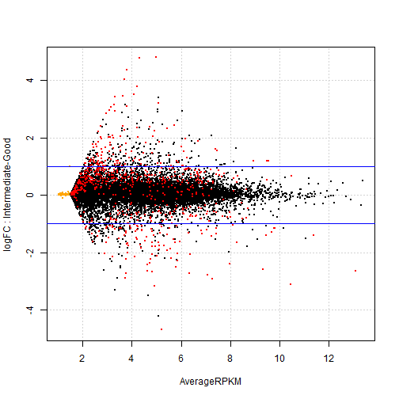

Differential expression analysis for trisomy 8, deletion 5 and deletion 7
========================================================

> To knit .rmd file, read data files in using "../data"  
> To run chunks in Rstudio, read data files in using "./data"

This code performs differential expression analysis on cleaned RNA-seq RPKM data. In particular, it tests whether there is differential expression between different *deletions* (trisomy 8, del 5 and del 7) using `voom`.


## Load data and required libraries
Load RNA-seq data and the experimental design files:

```r
rDes <- read.table("../data/experimental_design_cleaned.txt", sep = "\t", header = TRUE, 
    row.names = 1)  #might need to fix pathname
rDat <- read.table("../data/aml.rnaseq.gaf2.0_rpkm_cleaned.txt", sep = "\t", 
    header = TRUE, row.names = 1)  #might need to fix pathname
```


Load required libraries:

```r
library(lattice)  # if you don't already have this loaded ...
library(ggplot2)  # we'll make figures with both
library(reshape2)  # for the function melt
library(limma)
library(edgeR)
library(car)
library(RColorBrewer)
```


## Data inspection

```r
str(rDat, max.level = 0)
```

```
## 'data.frame':	20001 obs. of  179 variables:
##   [list output truncated]
```

```r
rDat[1:4, 1:4]
```

```
##                           X2803 X2805 X2806  X2807
## A1BG-AS|503538_calculated 8.316 4.156 6.895 11.370
## A1BG|1_calculated         8.472 3.105 5.719  8.541
## A1CF|29974_calculated     1.000 1.000 1.000  1.011
## A2LD1|87769_calculated    2.776 2.650 2.176  2.039
```

```r
head(names(rDat))
```

```
## [1] "X2803" "X2805" "X2806" "X2807" "X2808" "X2810"
```

```r
head(rownames(rDat), n = 10)
```

```
##  [1] "A1BG-AS|503538_calculated" "A1BG|1_calculated"        
##  [3] "A1CF|29974_calculated"     "A2LD1|87769_calculated"   
##  [5] "A2ML1|144568_calculated"   "A2M|2_calculated"         
##  [7] "A4GALT|53947_calculated"   "A4GNT|51146_calculated"   
##  [9] "AAA1|404744_calculated"    "AAAS|8086_calculated"
```

```r
tail(rownames(rDat), n = 10)
```

```
##  [1] "ZWINT|11130_calculated"      "ZXDA|7789_calculated"       
##  [3] "ZXDB|158586_calculated"      "ZXDC|79364_calculated"      
##  [5] "ZYG11B|79699_calculated"     "ZYX|7791_calculated"        
##  [7] "ZZEF1|23140_calculated"      "ZZZ3|26009_calculated"      
##  [9] "psiTPTE22|387590_calculated" "tAKR|389932_calculated"
```

```r
str(rDes, max.level = 0)
```

```
## 'data.frame':	179 obs. of  9 variables:
```

```r
head(rDes)
```

```
##      Sex Race FAB_subtype Age trisomy_8 del_5 del_7 Cytogenetic_risk
## 2803   F    W          M3  61     FALSE FALSE FALSE             Good
## 2805   M    W          M0  77     FALSE FALSE FALSE     Intermediate
## 2806   M    W          M1  46     FALSE FALSE FALSE             Good
## 2807   F    W          M1  68     FALSE FALSE FALSE     Intermediate
## 2808   M    W          M2  23     FALSE FALSE FALSE     Intermediate
## 2810   F    B          M2  76     FALSE FALSE FALSE             N.D.
##      Molecular_risk
## 2803           Good
## 2805   Intermediate
## 2806           Good
## 2807   Intermediate
## 2808   Intermediate
## 2810           N.D.
```


Both the design matrix and the data matrix have already been cleaned, filtered and normalized.

RNA-seq data: there are 20001 transcripts (rows) for 179 patients (columns). Experimental design: there are 179 rows, representing information for each of the patients with RNA-seq data in the AML TCGA data set, and 179 variables.

```


### Differential expression analysis

I will use `voom` to perform differential expression analysis.

**Deletion**
Which genes are differentially expressed between trisomy 8, deletion 5, deletion 7?

Which genes are differentially expressed between trisomy 8, deletion 5, deletion 7?

```r
trisomy8 <- rDes$trisomy_8
table(trisomy8)
```

```
## trisomy8
## FALSE  TRUE 
##   160    19
```

```r

del5 <- rDes$del_5
table(del5)
```

```
## del5
## FALSE  TRUE 
##   163    16
```

```r

del7 <- rDes$del_7
table(del7)
```

```
## del7
## FALSE  TRUE 
##   158    21
```


Preparing model matrix

```r
# Preparing Model matrices for Voom normalization-------------
modelMat_noInt <- model.matrix(~trisomy_8 * del_5 * del_7, rDes)
# The intercept represents a group with all samples without deletion of
# interest. this group changes depending on the deletion, since some samples
# share multiple deletions.
head(modelMat_noInt)
```

```
##      (Intercept) trisomy_8TRUE del_5TRUE del_7TRUE trisomy_8TRUE:del_5TRUE
## 2803           1             0         0         0                       0
## 2805           1             0         0         0                       0
## 2806           1             0         0         0                       0
## 2807           1             0         0         0                       0
## 2808           1             0         0         0                       0
## 2810           1             0         0         0                       0
##      trisomy_8TRUE:del_7TRUE del_5TRUE:del_7TRUE
## 2803                       0                   0
## 2805                       0                   0
## 2806                       0                   0
## 2807                       0                   0
## 2808                       0                   0
## 2810                       0                   0
##      trisomy_8TRUE:del_5TRUE:del_7TRUE
## 2803                                 0
## 2805                                 0
## 2806                                 0
## 2807                                 0
## 2808                                 0
## 2810                                 0
```


Now find genes differentially expressed between deletion types:

```r
dat.voomed <- voom(rDat, modelMat_noInt, plot = TRUE, lib.size = colSums(rDat))
```

 

```r
fit_lm <- lmFit(dat.voomed, modelMat_noInt)
fit <- eBayes(fit_lm)
```


Investigating hits (with no interaction)

```r
ttfit_tris8 <- topTable(fit, number = Inf, coef = "trisomy_8TRUE", p.value = 1e-05)
ttfit_del5 <- topTable(fit, number = Inf, coef = "del_5TRUE", p.value = 1e-05)
ttfit_del7 <- topTable(fit, number = Inf, coef = "del_7TRUE", p.value = 1e-05)
```

there are:
6 hits for trisomy 8, 14 hits for del 5, and 61 hits for del 7.

Is there overlap between the hits?

```r
a <- length(intersect(rownames(ttfit_tris8), rownames(ttfit_del5)))
b <- length(intersect(rownames(ttfit_tris8), rownames(ttfit_del7)))
c <- length(intersect(rownames(ttfit_del5), rownames(ttfit_del7)))
sum(a, b, c)
```

```
## [1] 0
```

there is: 0 overlapping gene, at `intersect(rownames(ttfit_del5), rownames(ttfit_del7)))`

Investigating hits with interaction at 1e-55

```r
a <- nrow(ttfit_t8d5 <- topTable(fit, number = Inf, coef = "trisomy_8TRUE:del_5TRUE", 
    p.value = 1e-05))
b <- nrow(ttfit_t8d7 <- topTable(fit, number = Inf, coef = "trisomy_8TRUE:del_7TRUE", 
    p.value = 1e-05))
c <- nrow(ttfit_d5d7 <- topTable(fit, number = Inf, coef = "del_5TRUE:del_7TRUE", 
    p.value = 1e-05))
d <- nrow(ttfit_t8d5d7 <- topTable(fit, number = Inf, coef = "trisomy_8TRUE:del_5TRUE:del_7TRUE", 
    p.value = 1e-05))
sum(a, b, c, d)
```

```
## [1] 0
```

there are 0 genes with differential expression influenced by interaction effects (with cutoff of 1e-5).

Investigating hits with interaction at 1e-4

```r
a <- nrow(ttfit_t8d5 <- topTable(fit, number = Inf, coef = "trisomy_8TRUE:del_5TRUE", 
    p.value = 1e-04))
b <- nrow(ttfit_t8d7 <- topTable(fit, number = Inf, coef = "trisomy_8TRUE:del_7TRUE", 
    p.value = 1e-04))
c <- nrow(ttfit_d5d7 <- topTable(fit, number = Inf, coef = "del_5TRUE:del_7TRUE", 
    p.value = 1e-04))
d <- nrow(ttfit_t8d5d7 <- topTable(fit, number = Inf, coef = "trisomy_8TRUE:del_5TRUE:del_7TRUE", 
    p.value = 1e-04))
sum(a, b, c, d)
```

```
## [1] 1
```

there is 1 gene with differential expression influenced by interaction effects. It is KCNH6|81033_calculated

Does it come up in any of the other lists?

```r
a <- length(intersect("KCNH6|81033_calculated", rownames(ttfit_tris8)))
b <- length(intersect("KCNH6|81033_calculated", rownames(ttfit_del5)))
c <- length(intersect("KCNH6|81033_calculated", rownames(ttfit_del7)))
sum(a, b, c)
```

```
## [1] 0
```

it occurs in 0 of the other lists. 

*Exploring hit genes from trisomy_8.*
topTable for Trisomy 8


```r
(ttfit_tris8)
```

```
##                            logFC AveExpr     t   P.Value adj.P.Val     B
## PPP2R2A|5520_calculated   0.7294   6.254 7.867 3.642e-13 7.284e-09 19.10
## NEIL2|252969_calculated   0.7958   3.770 7.604 1.695e-12 1.695e-08 17.49
## COPS5|10987_calculated    0.6020   5.496 6.712 2.580e-10 1.720e-06 12.98
## KIAA1967|57805_calculated 0.5650   6.575 6.641 3.801e-10 1.900e-06 12.63
## ZNF7|7553_calculated      0.5741   4.131 6.434 1.153e-09 4.614e-06 11.51
## INTS10|55174_calculated   0.7287   6.722 6.340 1.904e-09 6.347e-06 11.13
```


Plotsmear of trisomy_8 hits.


```r
# Create a DGEList object
voomTris8genes <- rownames(ttfit_tris8)
trisomy_8 <- rDes$trisomy_8
dgeGlmT8 <- DGEList(counts = rDat, group = as.numeric(trisomy_8))
plotSmear(dgeGlmT8, de.tags = voomTris8genes, ylab = "logFC", xlab = "AverageRPKM", main = "RPKM of genes differentially expressed in trisomy_8 samples")
abline(h = c(-1, 1), col = "blue")
```

 


Creating a boxplot with the 6 genes of interest (FDR 1e-5) for trisomy 8


```r
#subsetting and reforming transcripts of interest from main RPKM matrix
tris8Dat <- rDat[voomTris8genes,]
tris8Dat$Transcript <- rownames(tris8Dat) #creating a transcript group
tris8Dat <- melt(tris8Dat, id.vars = "Transcript", 
                   variable.name = "TCGA_patient_id",
                   value.name = "RPKM")

#cleaup molten RPKM data
tris8Dat$TCGA_patient_id <- gsub("X", "", tris8Dat$TCGA_patient_id)
tris8Dat$Transcript <- gsub("[|].*$", "", tris8Dat$Transcript)

#preparing a small design matrix and merging
miniDes <- rDes[,c("trisomy_8", "del_5" , "del_7")]
miniDes$"TCGA_patient_id" <- rownames(rDes)
tris8Dat <- merge(tris8Dat, miniDes, by = "TCGA_patient_id") #merging

#plotting
ggplot(tris8Dat, aes(Transcript, log2(RPKM), colour = trisomy_8)) +
  geom_boxplot() +
  facet_wrap(~ Transcript, scales = "free") +
  theme(axis.text.x = element_blank(), axis.ticks.x = element_blank())
```

 


*Exploring hit genes from del_5.*
TopTable for del_5


```r
(ttfit_del5)
```

```
##                              logFC AveExpr      t   P.Value adj.P.Val
## PFDN1|5201_calculated      -0.7735   5.644 -7.594 1.799e-12 3.598e-08
## ATOX1|475_calculated       -0.8571   4.445 -7.184 1.880e-11 1.880e-07
## T|6862_calculated           0.6166   2.127  6.944 7.224e-11 4.817e-07
## NDUFA2|4695_calculated     -1.0408   6.635 -6.880 1.030e-10 5.150e-07
## SIGLECP3|284367_calculated  2.5406   4.009  6.571 5.557e-10 2.223e-06
## KCNA7|3743_calculated       0.5232   2.127  6.521 7.276e-10 2.426e-06
## GRM4|2914_calculated        0.6555   2.144  6.369 1.630e-09 4.076e-06
## LGI3|203190_calculated      0.4423   2.132  6.384 1.506e-09 4.076e-06
## TLX1|3195_calculated        0.4677   2.131  6.322 2.089e-09 4.405e-06
## DNAJC5G|285126_calculated   0.5153   2.132  6.312 2.202e-09 4.405e-06
## NPAS3|64067_calculated      0.4294   2.127  6.213 3.703e-09 6.732e-06
## ONECUT1|3175_calculated     0.7199   2.135  6.137 5.500e-09 8.461e-06
## WDR55|54853_calculated     -0.8569   5.405 -6.153 5.053e-09 8.423e-06
## FAM176A|84141_calculated    0.4144   2.133  6.091 6.973e-09 9.962e-06
##                                 B
## PFDN1|5201_calculated      17.196
## ATOX1|475_calculated       14.964
## T|6862_calculated          14.372
## NDUFA2|4695_calculated     13.624
## SIGLECP3|284367_calculated 12.106
## KCNA7|3743_calculated      12.103
## GRM4|2914_calculated       11.388
## LGI3|203190_calculated     11.365
## TLX1|3195_calculated       11.053
## DNAJC5G|285126_calculated  11.032
## NPAS3|64067_calculated     10.474
## ONECUT1|3175_calculated    10.226
## WDR55|54853_calculated      9.987
## FAM176A|84141_calculated    9.864
```


Plotsmear of del_5 hits

 


Creating a boxplot with the 14 genes of interest (FDR 1e-5) for del 5

 


Creating a boxplot with the genes of interest (FDR 1e-6) for del 5
 


testing expression level cutoff: Removing genes with max RPKM of less than 8
 


*Exploring hit genes from del_7.*
TopTable for genes from del_7

```r
head(ttfit_del7)
```

```
##                          logFC AveExpr       t   P.Value adj.P.Val     B
## PDAP1|11333_calculated -0.8102   5.971 -11.151 3.788e-22 7.577e-18 38.82
## BUD31|8896_calculated  -1.0947   6.523 -10.323 8.412e-20 8.412e-16 33.77
## MKRN1|23608_calculated -1.0531   6.519  -9.693 4.796e-18 3.198e-14 29.95
## COPS6|10980_calculated -0.8780   6.604  -8.979 4.289e-16 1.548e-12 25.71
## YKT6|10652_calculated  -0.7637   5.828  -8.986 4.102e-16 1.548e-12 25.70
## SUMF2|25870_calculated -1.1644   6.887  -8.966 4.644e-16 1.548e-12 25.64
```

```r
nrow(ttfit_del7)
```

```
## [1] 61
```

```r
tail(ttfit_del7)
```

```
##                                 logFC AveExpr      t   P.Value adj.P.Val
## CA11|770_calculated            0.8645   3.043  5.986 1.195e-08 4.232e-06
## ZNF662|389114|1of2_calculated  1.6416   3.663  5.980 1.227e-08 4.232e-06
## UBE3C|9690_calculated         -0.8014   5.530 -5.981 1.224e-08 4.232e-06
## POP7|10248_calculated         -0.7152   4.894 -5.913 1.727e-08 5.856e-06
## HEYL|26508_calculated          1.0450   2.941  5.855 2.310e-08 7.700e-06
## PTCD1|26024_calculated        -0.6371   4.548 -5.822 2.726e-08 8.937e-06
##                                   B
## CA11|770_calculated           9.471
## ZNF662|389114|1of2_calculated 9.460
## UBE3C|9690_calculated         9.459
## POP7|10248_calculated         9.124
## HEYL|26508_calculated         8.856
## PTCD1|26024_calculated        8.697
```


Plotsmear of del_7 hits
 


Creating a boxplot with genes of interest (FDR 1e-5) for del 7. Since there are 61 genes I will plot a few genes at a time:
 


 


 


 

