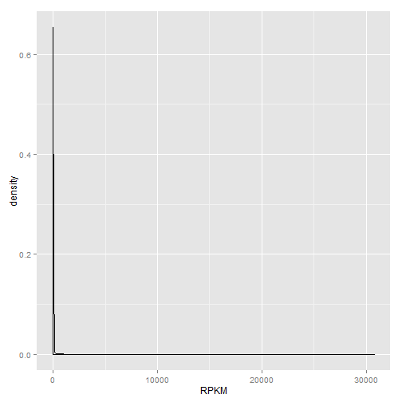

Clean RNA-seq RPKM data
=======================

> To knit .rmd file, read data files in using "../data"  
> To run chunks in Rstudio, read data files in using "./data"

This code applies filters to the RNA seq RPKM data and cleans row and column names.

## Load data and required libraries
Load RNA-seq data and the experimental design files:

```r
rDat <- read.table("../data/laml.rnaseq.179_v1.0_gaf2.0_rpkm_matrix.txt.tcgaID.txt.gz", 
    sep = "\t", header = TRUE, row.names = 1)
rDes <- read.delim("../data/experimental_design_cleaned.txt")
```


```r
library(reshape2)  # For reshaping data from wide to tall format
library(ggplot2)  # for plotting
```

```
## Warning: package 'ggplot2' was built under R version 3.0.3
```


## Data inspection

```r
str(rDat, max.level = 0)
```

```
## 'data.frame':	20442 obs. of  179 variables:
##   [list output truncated]
```

```r
rDat[1:4, 1:4]
```

```
##                        TCGA.AB.2803 TCGA.AB.2807 TCGA.AB.2963 TCGA.AB.2826
## ?|100132510_calculated       1.1250       0.3295       1.9477        2.735
## ?|100134860_calculated      13.0095      15.0336       5.7934        4.625
## ?|10357_calculated           0.2028       0.0831       0.2774        1.127
## ?|10431_calculated          36.1781      17.8495      34.9591       29.438
```

```r
head(names(rDat))
```

```
## [1] "TCGA.AB.2803" "TCGA.AB.2807" "TCGA.AB.2963" "TCGA.AB.2826"
## [5] "TCGA.AB.2867" "TCGA.AB.2818"
```

```r
head(rownames(rDat), n = 10)
```

```
##  [1] "?|100132510_calculated" "?|100134860_calculated"
##  [3] "?|10357_calculated"     "?|10431_calculated"    
##  [5] "?|114130_calculated"    "?|115669_calculated"   
##  [7] "?|120126_calculated"    "?|1231_calculated"     
##  [9] "?|127550_calculated"    "?|136157_calculated"
```

```r
tail(rownames(rDat), n = 10)
```

```
##  [1] "ZWINT|11130_calculated"      "ZXDA|7789_calculated"       
##  [3] "ZXDB|158586_calculated"      "ZXDC|79364_calculated"      
##  [5] "ZYG11B|79699_calculated"     "ZYX|7791_calculated"        
##  [7] "ZZEF1|23140_calculated"      "ZZZ3|26009_calculated"      
##  [9] "psiTPTE22|387590_calculated" "tAKR|389932_calculated"
```

```r
str(rDes, max.level = 0)
```

```
## 'data.frame':	179 obs. of  10 variables:
```

```r
head(rDes)
```

```
##   TCGA_patient_id Sex Race FAB_subtype Age trisomy_8 del_5 del_7
## 1            2803   F    W          M3  61     FALSE FALSE FALSE
## 2            2805   M    W          M0  77     FALSE FALSE FALSE
## 3            2806   M    W          M1  46     FALSE FALSE FALSE
## 4            2807   F    W          M1  68     FALSE FALSE FALSE
## 5            2808   M    W          M2  23     FALSE FALSE FALSE
## 6            2810   F    B          M2  76     FALSE FALSE FALSE
##   Cytogenetic_risk Molecular_risk
## 1             Good           Good
## 2     Intermediate   Intermediate
## 3             Good           Good
## 4     Intermediate   Intermediate
## 5     Intermediate   Intermediate
## 6             N.D.           N.D.
```


RNA-seq data: there are 20442 transcripts (rows) for 179 patients (columns). The row names are strange, I will attempt to change them.

Experimental design: there are 179 rows, representing information for each of the patients with RNA-seq data in the AML TCGA data set, and 179 variables. Note the sample ID naming scheme does not match across `rDat` and `rDes`, so I will need to fix this.


## Clean rDat
Change sample names in `rDat` to match `rDes` by extracting substrings, i.e. extract the numbers in each sample name:

```r
names(rDat) <- regmatches(names(rDat), regexpr("(?<=AB.).*", names(rDat), perl = TRUE))
head(names(rDat))
```

```
## [1] "2803" "2807" "2963" "2826" "2867" "2818"
```


Reorder the columns (patients) to match the order of the experimental design file 'rDes$TCGA\_patient_id`:

```r
rDat <- rDat[, order(names(rDat))]
identical(names(rDat), as.character(rDes$TCGA_patient_id))
```

```
## [1] TRUE
```


Now to fix the row names: some row names begin with "?", and each row name has the suffix "|", followed by an integer, then "_calculated". This naming scheme is explained [here](https://wiki.nci.nih.gov/display/TCGA/RNASeq+Data+Format+Specification), where the row names are: "valid HUGO name|GENEID (if no HUGO name, '?' is present)".

Remove the rows with "?" in the row name:

```r
# '?' only present at the start of the row name: rownames(rDat)[grep('[?]',
# rownames(rDat))]
length(grep("[?]", rownames(rDat)))
```

```
## [1] 123
```

```r
rDat <- rDat[grep("[?]", rownames(rDat), invert = TRUE), ]
dim(rDat)
```

```
## [1] 20319   179
```


I attempted to remove substrings after and including the "|" symbol, but this was not allowed since I obtain non-unique row names. 

```r
(test <- tail(rownames(rDat)))
```

```
## [1] "ZYG11B|79699_calculated"     "ZYX|7791_calculated"        
## [3] "ZZEF1|23140_calculated"      "ZZZ3|26009_calculated"      
## [5] "psiTPTE22|387590_calculated" "tAKR|389932_calculated"
```

```r
gsub("[|].*$", "", test)
```

```
## [1] "ZYG11B"    "ZYX"       "ZZEF1"     "ZZZ3"      "psiTPTE22" "tAKR"
```

```r
rownames(rDat) <- gsub("[|].*$", "", rownames(rDat))
```

```
## Warning: non-unique values when setting 'row.names': 'ADAM12', 'AGFG1',
## 'AKAP17A', 'AKD1', 'AMY1A', 'ANKRD20A3', 'ANKRD30BP2', 'ANXA8',
## 'ARHGAP42', 'ASMT', 'ASMTL', 'ASMTL-AS', 'BOLA2', 'BPY2', 'BRD3',
## 'C11orf34', 'C11orf95', 'C3orf16', 'C4B', 'C8orf30A', 'CACNA1B', 'CAPN8',
## 'CBWD3', 'CCL3L1', 'CCL3L3', 'CCL4L2', 'CD99', 'CDY1', 'CDY1B', 'CFC1B',
## 'CHRDL1', 'CLMN', 'CRLF2', 'CSAG2', 'CSF2RA', 'CSPG4P2Y', 'CT45A4',
## 'CT47A10', 'CT47A6', 'CTAG1A', 'CTAGE4', 'CYTH2', 'DAZ2', 'DAZ3', 'DCLK1',
## 'DDX5', 'DEFA1B', 'DEFB103A', 'DEFB104B', 'DEFB105B', 'DEFB106B',
## 'DEFB107B', 'DEFB109P1B', 'DEFB130', 'DHRSX', 'DNAH12', 'DNAH14', 'DNAH6',
## 'DNHD1', 'DNM1P35', 'DPH3', 'DUX4', 'EIF3C', 'EIF3CL', 'EIF4EBP2', 'EML6',
## 'EMP2', 'EP400NL', 'F8A1', 'FAM126B', 'FAM138A', 'FAM156A', 'FAM156B',
## 'FAM197Y2P', 'FAM21B', 'FAM23A', 'FAM25B', 'FAM27A', 'FAM75A2', 'FAM75A5',
## 'FAM7A1', 'FAM95B1', 'FBRSL1', 'FER1L4', 'FGF13', 'FLJ45340', 'FOXD4L2',
## 'GAGE2A', 'GAGE2D', 'GFRA1', 'GOLGA2P2Y', 'GOLGA6L9', 'GOLGA8G', 'GPR19',
## 'GPR26', 'GPR89C', 'GRIN2A', 'GSPT1', 'GSTT2', 'GTF2H2C', 'GTF2H2D',
## 'GTF2IP1', 'GTPBP6', 'H2AFB1', 'H2BFXP', 'HIST2H2AA4', 'HIST2H3A',
## 'HIST2H4B', 'HSBP1L1', 'HSFX1', 'HSFY2', 'IL3RA', 'IL9R', 'IRGQ', 'JMY',
## 'KCNA6', 'KCP', 'KGFLP1', 'KIAA0141', 'KIAA1671', 'KIF7', 'LIMS3',
## 'LOC100093631', 'LOC100129637', 'LOC100130872', 'LOC100190986',
## 'LOC149837', 'LOC221710', 'LOC254559', 'LOC285740', 'LOC286094',
## 'LOC286135', 'LOC388242', 'LOC399744', 'LOC400931', 'LOC440354',
## 'LOC606724', 'LOC642826', 'LOC642846', 'LOC642852', 'LOC646762',
## 'LOC653501', 'LOC728855', 'LOC728875', 'LOC729375', 'LOC80154',
## 'LOC91316', 'MAGEA2', 'MAGEA2B', 'MAGEA9B', 'MBTPS2', 'MDM2', 'MGC21881',
## 'MGC45800', 'MICAL3', 'MID2', 'MRC1', 'NBEAL1', 'NCRNA00230B',
## 'NCRNA00246B', 'NCRNA00256A', 'NCRNA00256B', 'NEK7', 'NFIA', 'NXF2',
## 'NXF2B', 'OCLN', 'OPN1MW2', 'OR2A1', 'OR2A9P', 'OR4F3', 'OR7E37P',
## 'P2RY8', 'PBX1', 'PDZK1P1', 'PLCXD1', 'PLEKHM3', 'PLGLB2', 'PMS2L2',
## 'POM121L10P', 'POM121L8P', 'POTEM', 'PPIAL4C', 'PPP2R3B', 'PRAMEF14',
## 'PRAMEF19', 'PRAMEF20', 'PRAMEF5', 'PRAMEF8', 'PRAMEF9', 'PRICKLE1',
## 'PRY', 'PSEN1', 'PTPN13', 'PTPN20B', 'RBMS1', 'RBMS2', 'RBMY1A1',
## 'RBMY1J', 'RFT1', 'RGPD1', 'RGPD6', 'RHOXF2B', 'RIMBP3C', 'RLIM', 'RORA',
## 'RPS17', 'RSPH10B', 'SAP30L', 'SCXB', 'SDK2', 'SERF1A', 'SERF1B',
## 'SETBP1', 'SETD1B', 'SFTPA1', 'SFTPA2', 'SHISA9', 'SHOX', 'SLC22A24',
## 'SLC25A6', 'SLX1A', 'SMN2', 'SNAR-A12', 'SNAR-A2', 'SNORA11E',
## 'SNORD115-12', 'SNORD115-19', 'SNORD115-43', 'SNORD116-19', 'SNORD116-2',
## 'SNORD116-5', 'SNORD116-9', 'SPACA5', 'SPAG11B', 'SPANXA2', 'SPANXB1',
## 'SPDYE8P', 'SPRY3', 'SSC5D', 'SSX2', 'SSX4', 'ST3GAL1', 'ST6GAL2',
## 'STK16', 'STK19', 'STMN1', 'SULT1A3', 'TBC1D3', 'TBC1D3H', 'TCEB3C',
## 'TMEM120B', 'TMOD2', 'TMSL3', 'TNRC6C', 'TP53TG3B', 'TPCN1', 'TRIM49L1',
## 'TSPY3', 'TTTY17B', 'TTTY1B', 'TTTY23', 'TTTY6B', 'TTTY7', 'TTTY7B',
## 'UBE2Q2P2', 'UGT2B15', 'UNC5B', 'UNC80', 'UNKL', 'USP13', 'VAMP7', 'VCY',
## 'VWDE', 'XAGE1A', 'XAGE1C', 'XAGE1E', 'XAGE2', 'XKRY2', 'XPR1', 'YIF1B',
## 'ZBED1', 'ZDHHC3', 'ZNF662'
```

```
## Error: duplicate 'row.names' are not allowed
```


## Filtering
Remove transcripts with RPKM = 0 across all samples:

```r
# Number of transcripts with RPKM = 0 for all samples
nrow(rDat[rowSums(rDat) == 0, ])
```

```
## [1] 318
```

```r
# Remove these transcripts
rDat <- rDat[rowSums(rDat) != 0, ]
dim(rDat)
```

```
## [1] 20001   179
```

This filter does not remove all RPKM values of 0. What do we do when RPKM = 0? Do we need to apply more filters for low RPKM values?

Potential additional filters: How many transcripts would be left to analyse if we apply any one of the following filters?

```r
nrow(rDat)
```

```
## [1] 20001
```

```r
# 1. Keep rows where sum RPKM values across all samples > 5
nrow(rDat[rowSums(rDat) > 5, ])
```

```
## [1] 17441
```

```r
# 2. Remove rows where at least one sample has RPKM value = 0
nrow(rDat[apply(rDat, 1, prod) != 0, ])
```

```
## [1] 12904
```

```r
# 3. Remove rows where more than 50 samples have RPKM values < 1
nrow(rDat[apply(rDat, 1, function(x) sum(abs(x) < 1) < 50), ])
```

```
## [1] 11311
```

```r
# 4. Keep rows where average expression per transcript > 5
nrow(rDat[apply(rDat, 1, function(x) mean(abs(x) > 5)), ])
```

```
## [1] 4042
```


I have decided not to apply any additional filters to our data, since I believe we may be removing biologically significant data. We are working with RNA-seq data from AML patients, a cancer type that is prone to translocations and copy number changes. Therefore, genes with 0 RPKM values may be instances where genes are completely deleted from the genome and thus no transcription can occur.


## Density plot
Check the density plot of RPKM values across all samples:

```r
rDatMelt <- melt(rDat, variable.name = "Sample", value.name = "RPKM")
```

```
## Using  as id variables
```

```r
head(rDatMelt)
```

```
##   Sample   RPKM
## 1   2803 7.3159
## 2   2803 7.4715
## 3   2803 0.0000
## 4   2803 1.7760
## 5   2803 0.1024
## 6   2803 5.4296
```

```r
ggplot(rDatMelt, aes(RPKM)) + geom_density()
```

 


The data has to be log transformed:

```r
ggplot(rDatMelt, aes(log(RPKM))) + geom_density()
```

```
## Warning: Removed 541040 rows containing non-finite values (stat_density).
```

 


A lot of genes have RPKM values < 1 and become negative values post-log2 transformation.  Therefore, I will add 1 to all values in `rDat`:

```r
rDat <- rDat + 1
```


Now re-make the density plot:

```r
rDat <- rDat + 1
rDatMelt <- melt(rDat, variable.name = "Sample", value.name = "RPKM")
```

```
## Using  as id variables
```

```r
ggplot(rDatMelt, aes(log2(RPKM))) + geom_density()
```

 


## Save the cleaned RNA-seq data to file

```r
write.table(rDat, "../data/aml.rnaseq.gaf2.0_rpkm_cleaned.txt", sep = "\t", 
    row.names = TRUE)
```


Ensure we can read the data back in correctly:

```r
test <- read.table("../data/aml.rnaseq.gaf2.0_rpkm_cleaned.txt", sep = "\t", 
    header = TRUE, check.names = FALSE)
str(test, max.level = 0)
```

```
## 'data.frame':	20001 obs. of  179 variables:
##   [list output truncated]
```

```r
head(test[1:5, 1:5])
```

```
##                            2803  2805  2806   2807  2808
## A1BG-AS|503538_calculated 9.316 5.156 7.895 12.370 7.002
## A1BG|1_calculated         9.472 4.105 6.719  9.541 5.306
## A1CF|29974_calculated     2.000 2.000 2.000  2.011 2.000
## A2LD1|87769_calculated    3.776 3.650 3.176  3.039 3.066
## A2ML1|144568_calculated   2.102 2.113 2.138  2.048 2.086
```

```r
tail(test[1:5, 1:5])
```

```
##                            2803  2805  2806   2807  2808
## A1BG-AS|503538_calculated 9.316 5.156 7.895 12.370 7.002
## A1BG|1_calculated         9.472 4.105 6.719  9.541 5.306
## A1CF|29974_calculated     2.000 2.000 2.000  2.011 2.000
## A2LD1|87769_calculated    3.776 3.650 3.176  3.039 3.066
## A2ML1|144568_calculated   2.102 2.113 2.138  2.048 2.086
```

