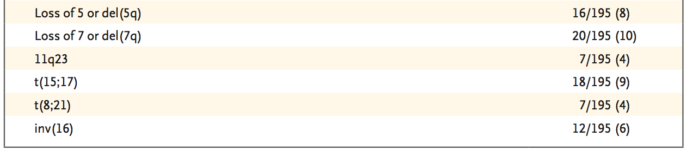

Clinical Data Import and Cleaning
=================================

> To knit .rmd file, make sure the working directory is set to that of the source file  

Load required libraries and print working directory:

```r
library(RCurl)
library(knitr)
```


Read in the clinical data-sheet from the [TCGA Publication Website](https://tcga-data.nci.nih.gov/docs/publications/laml_2012/):


```r
# To re-download data from TCGA portal site, uncomment this block
# Require "ssl.verifypeer = FALSE" to avoid SSL certificate issues
#url <- "https://tcga-data.nci.nih.gov/docs/publications/laml_2012/clinical_patient_laml.tsv"
#raw_clinical_data <- getURL(url, ssl.verifypeer = FALSE)
#raw_clinical_data <- read.table(text = raw_clinical_data, header = TRUE, sep ='\t')
# Read in raw clinical data:
raw_clinical_data <- read.table("../../data/clinical_patient_laml.tsv", header = TRUE, 
                                 sep = "\t")
```


```r
str(raw_clinical_data, max.level = 0)
```

```
## 'data.frame':	200 obs. of  78 variables:
```

```r
names(raw_clinical_data)
```

```
##  [1] "bcr_patient_barcode"                                                    
##  [2] "acute_myeloid_leukemia_calgb_cytogenetics_risk_category"                
##  [3] "age_at_initial_pathologic_diagnosis"                                    
##  [4] "atra_exposure"                                                          
##  [5] "bcr_patient_uuid"                                                       
##  [6] "cumulative_agent_total_dose"                                            
##  [7] "cytogenetic_abnormality"                                                
##  [8] "cytogenetic_abnormality_other"                                          
##  [9] "cytogenetic_analysis_performed_ind"                                     
## [10] "date_of_form_completion"                                                
## [11] "date_of_initial_pathologic_diagnosis"                                   
## [12] "days_to_birth"                                                          
## [13] "days_to_death"                                                          
## [14] "days_to_initial_pathologic_diagnosis"                                   
## [15] "days_to_last_followup"                                                  
## [16] "days_to_last_known_alive"                                               
## [17] "diagnosis_age"                                                          
## [18] "disease_detection_molecular_analysis_method_type"                       
## [19] "disease_detection_molecular_analysis_method_type_other_text"            
## [20] "eastern_cancer_oncology_group"                                          
## [21] "ethnicity"                                                              
## [22] "fish_evaluation_performed_ind"                                          
## [23] "fluorescence_in_situ_hybrid_cytogenetics_metaphase_nucleus_result_count"
## [24] "fluorescence_in_situ_hybridization_abnormal_result_indicator"           
## [25] "gender"                                                                 
## [26] "hydroxyurea_administration_prior_registration_clinical_study_indicator" 
## [27] "hydroxyurea_agent_administered_day_count"                               
## [28] "icd_10"                                                                 
## [29] "icd_o_3_histology"                                                      
## [30] "icd_o_3_site"                                                           
## [31] "immunophenotype_cytochemistry_percent_positive"                         
## [32] "immunophenotype_cytochemistry_testing_result"                           
## [33] "informed_consent_verified"                                              
## [34] "initial_pathologic_diagnosis_method"                                    
## [35] "karnofsky_performance_score"                                            
## [36] "lab_procedure_abnormal_lymphocyte_result_percent_value"                 
## [37] "lab_procedure_blast_cell_outcome_percentage_value"                      
## [38] "lab_procedure_bone_marrow_band_cell_result_percent_value"               
## [39] "lab_procedure_bone_marrow_basophil_result_percent_value"                
## [40] "lab_procedure_bone_marrow_blast_cell_outcome_percent_value"             
## [41] "lab_procedure_bone_marrow_cellularity_outcome_percent_value"            
## [42] "lab_procedure_bone_marrow_diff_not_reported_reason"                     
## [43] "lab_procedure_bone_marrow_lab_eosinophil_result_percent_value"          
## [44] "lab_procedure_bone_marrow_lymphocyte_outcome_percent_value"             
## [45] "lab_procedure_bone_marrow_metamyelocyte_result_value"                   
## [46] "lab_procedure_bone_marrow_myelocyte_result_percent_value"               
## [47] "lab_procedure_bone_marrow_neutrophil_result_percent_value"              
## [48] "lab_procedure_bone_marrow_prolymphocyte_result_percent_value"           
## [49] "lab_procedure_bone_marrow_promonocyte_count_result_percent_value"       
## [50] "lab_procedure_bone_marrow_promyelocyte_result_percent_value"            
## [51] "lab_procedure_hematocrit_outcome_percent_value"                         
## [52] "lab_procedure_hemoglobin_result_specified_value"                        
## [53] "lab_procedure_leukocyte_result_unspecified_value"                       
## [54] "lab_procedure_monocyte_result_percent_value"                            
## [55] "lab_procedure_platelet_result_specified_value"                          
## [56] "leukemia_french_american_british_morphology_code"                       
## [57] "leukemia_specimen_cell_source_type"                                     
## [58] "molecular_analysis_abnormal_result_indicator"                           
## [59] "molecular_analysis_abnormality_testing_percentage_value"                
## [60] "molecular_analysis_abnormality_testing_result"                          
## [61] "molecular_analysis_performed_indicator"                                 
## [62] "patient_id"                                                             
## [63] "performance_status_assessment_timepoint_category_other_text"            
## [64] "performance_status_scale_timing"                                        
## [65] "person_history_leukemogenic_agent_other_exposure_text"                  
## [66] "person_history_nonmedical_leukemia_causing_agent_type"                  
## [67] "pretreatment_history"                                                   
## [68] "primary_other_site_of_disease_name"                                     
## [69] "prior_diagnosis"                                                        
## [70] "prior_hematologic_disorder_diagnosis_indicator"                         
## [71] "race"                                                                   
## [72] "steroid_therapy_administered"                                           
## [73] "tissue_source_site"                                                     
## [74] "total_dose_units"                                                       
## [75] "tumor_tissue_site"                                                      
## [76] "vital_status"                                                           
## [77] "FISH_test_component"                                                    
## [78] "FISH_test_component_percentage_value"
```

This data-sheet has 78 columns, a lot more variables than we'll need for this project. The 200 rows represent the patients.

Also available, as an Excel sheet, is a Supplementary table listing much of the same information, but with more annotation.

*Note:* We're using the updated version as of 2013-05-13. Since the data is only available as an Excel sheet, we've saved the data in .csv format outside of R:*

- Download the Supplementary file from [the paper website](https://tcga-data.nci.nih.gov/docs/publications/laml_2012/SuppTable01.update.2013.05.13.xlsx)
- Open in Excel, save as CSV


```r
supp_d <- read.csv("../../data/SuppTable01.update.2013.05.13.csv")
str(supp_d, max.level = 0)
```

```
## 'data.frame':	201 obs. of  2006 variables:
##   [list output truncated]
```


As a first pass, we'll try to clean the `cytogenetic_abnormality` column from the raw clinical data into a simpler categorical variable:


```r
summary(raw_clinical_data$cytogenetic_abnormality)
```

```
##                                                                                     [Not Available] 
##                                                                                                  19 
##                                         Complex (greater than or equal to 3 distinct abnormalities) 
##                                                                                                   4 
##                          Complex (greater than or equal to 3 distinct abnormalities)|del (5q) / 5q- 
##                                                                                                   4 
##           Complex (greater than or equal to 3 distinct abnormalities)|del (5q) / 5q-|del (7q) / 7q- 
##                                                                                                   4 
## Complex (greater than or equal to 3 distinct abnormalities)|del (5q) / 5q-|del (7q) / 7q-|Trisomy 8 
##                                                                                                   2 
##                Complex (greater than or equal to 3 distinct abnormalities)|del (5q) / 5q-|Trisomy 8 
##                                                                                                   2 
##                Complex (greater than or equal to 3 distinct abnormalities)|del (7q) / 7q-|Trisomy 8 
##                                                                                                   1 
##                               Complex (greater than or equal to 3 distinct abnormalities)|t (15;17) 
##                                                                                                   1 
##                               Complex (greater than or equal to 3 distinct abnormalities)|Trisomy 8 
##                                                                                                   2 
##                                                                                      del (5q) / 5q- 
##                                                                                                   1 
##                                                                       del (5q) / 5q-|del (7q) / 7q- 
##                                                                                                   1 
##                                                                                      del (7q) / 7q- 
##                                                                                                   3 
##                                                                                            inv (16) 
##                                                                                                   4 
##                                                                                              Normal 
##                                                                                                 102 
##                                  Normal|Complex (greater than or equal to 3 distinct abnormalities) 
##                                                                                                   1 
##                   Normal|Complex (greater than or equal to 3 distinct abnormalities)|del (7q) / 7q- 
##                                                                                                   2 
##         Normal|Complex (greater than or equal to 3 distinct abnormalities)|del (7q) / 7q-|Trisomy 8 
##                                                                                                   1 
##                        Normal|Complex (greater than or equal to 3 distinct abnormalities)|Trisomy 8 
##                                                                                                   1 
##                                                                Normal|del (5q) / 5q-|del (7q) / 7q- 
##                                                                                                   1 
##                                                                               Normal|del (7q) / 7q- 
##                                                                                                   4 
##                                                                      Normal|del (7q) / 7q-|t (9;11) 
##                                                                                                   1 
##                                                           Normal|del (7q) / 7q-|Trisomy 8|t (15;17) 
##                                                                                                   1 
##                                                                                     Normal|inv (16) 
##                                                                                                   5 
##                                                                                    Normal|t (15;17) 
##                                                                                                   5 
##                                                                                     Normal|t (8;21) 
##                                                                                                   1 
##                                                                                     Normal|t (9;11) 
##                                                                                                   1 
##                                                                                    Normal|Trisomy 8 
##                                                                                                   4 
##                                                                                           t (15;17) 
##                                                                                                   9 
##                                                                                            t (8;21) 
##                                                                                                   6 
##                                                                                           Trisomy 8 
##                                                                                                   6 
##                                                                                 Trisomy 8|t (15;17) 
##                                                                                                   1
```


There are some immediate problems with this approach:

- 19 samples are missing data
- Several samples have many of the CNAs of interest
- The notation seems inconsistent between samples

Alternate approaches possible:

1. Limit the analysis to things with a single, distinct karyotypic event (will lose lots of samples)
2. Make a 'best guess' at the most relevant alteration for each sample (messy)
3. Make several different binary variables for each of the main CNAs, e.g.:

| Patient | del(5q) | del(7q) | Trisomy 8 | t(15:17) | inv(16) | 
| ------- | ------- | ------- | --------- | -------- | ------- |
| 1 | T | F | F | F |T |
| 2 | F | F | F |T | F |

Thoughts? This would make the annotation simpler, but might complicate the analysis a bit.

### Follow-up to that question: 

#### Summarize Columns in Raw Clinical Data and Supplementary Table 1

To address the comments at [issue #3](https://github.com/rdocking/stat540-group-project-aml-cnv/issues/3), I'm going to try a few approaches to stratifying the data-set.

First, I'll work on trying to get a workable stratification out of the `raw_clinical_data` imported above. The main issues I've been having so far:

- In the `cytogenetic_abnormality` column, the entries are sometimes split by pipes, e.g. 'Normal|del (7q) / 7q-' vs. 'del (7q) / 7q-' - it's not clear that these should be treated equivalently.
- There is a second column, `cytogenetic_abnormality_other` that is even more inconsistently filled in (i.e. no data for 172 samples, uses 'no', 'No', and 'NO' for others)

This is looking a bit like a rabbit-hole. I'm going to try another tack and see if I can regenerate the sample counts from Table 1 in the main text of the paper:



From Supplementary Table 1, (loaded above as `supp_d`), the cytogenetic data is available in the following columns:

- `Cytogenetics` - karyotype using [cytogenetic nomenclature](http://www.radford.edu/~rsheehy/cytogenetics/Cytogenetic_Nomeclature.html). These seem consistently filled in (yay!), but are tricky to parse (boo!)
- `Gene Fusions by RNA-Seq` - predicted gene fusions from the RNA-Seq data. This has entries like 'PML(+)RARA(+) (In frame)', which corresponds to 't(15;17)' from the `Cytogenetics` column. This _should_ be pretty accurate for fusions, but not for CNAs
- `Inferred genomic rearrangement (from RNA-Seq fusion)` - translation of `Gene Fusions by RNA-Seq` into `Cytogenetics` nomenclature
- `Cytogenetic Classification` - A categorical variable summarizing the previous columns:


```r
summary(supp_d$Cytogenetic.Classification)
```

```
##                                           
##                                         1 
##                                  BCR-ABL1 
##                                         3 
##                                CBFB-MYH11 
##                                        12 
##                      Complex Cytogenetics 
##                                        24 
## Intermediate Risk Cytogenetic Abnormality 
##                                        22 
##              MLL translocation, poor risk 
##                                         5 
##                MLL translocation, t(9;11) 
##                                         2 
##                                      N.D. 
##                                         5 
##                          Normal Karyotype 
##                                        92 
##                                  PML-RARA 
##                                        18 
##         Poor Risk Cytogenetic Abnormality 
##                                        10 
##                             RUNX1-RUNX1T1 
##                                         7
```


  this is _not quite_ what we're after - we'd like to call individual karyotype-level events.
- `RISK (Cyto)` - another categorical classification of the samples by risk type:


```r
summary(supp_d$RISK..Cyto.)
```

```
##                      Good Intermediate         N.D.         Poor 
##            1           37          115            5           43
```


- Then two more classifications, `Molecular Classification` and `RISK (Molecular)`
  
#### Annotate Samples with Karyotypic events of interest  

Per conversation with group members and Shaun, I'll clean the supplemental data in `SuppTable01.update.2013.05.13.csv`. Note that I'm doing this in Python with [`parse_supplementary_table.py`](https://github.com/rdocking/stat540-group-project-aml-cnv/blob/master/code/parse_supplementary_table.py) for expediency.

Manipulations are as follows:

- Select a relevant subset of variables
- For variables that can be converted to Boolean types, do so
- Convert column names to be more R-friendly (e.g., `'Expired?  4.30.13'` became `Expired` and `'%BM Blast'` became `BM_blast_pct`)

The script should be run like so:

```
python parse_supplementary_table.py > experimental_design.csv
```

Now I can read in the modified CSV file to get a cleaner data frame:

```r
cleaned_data <- read.csv("../../data/experimental_design.csv")
```


This data frame is quite a bit smaller and simpler than the original:

```r
str(cleaned_data)
```

```
## 'data.frame':	200 obs. of  48 variables:
##  $ TCGA_patient_id                      : int  2803 2806 2870 2815 2872 2998 2914 2819 2875 2823 ...
##  $ RNAseq_available                     : logi  TRUE TRUE TRUE TRUE TRUE TRUE ...
##  $ Expired                              : logi  TRUE TRUE TRUE TRUE FALSE TRUE ...
##  $ Sex                                  : Factor w/ 2 levels "F","M": 1 2 2 2 2 1 1 1 2 1 ...
##  $ Race                                 : Factor w/ 13 levels "A","B","H","NH/A",..: 12 12 12 12 2 12 12 12 7 12 ...
##  $ FAB_subtype                          : Factor w/ 9 levels "M0","M1","M2",..: 4 2 2 5 4 4 3 3 3 4 ...
##  $ Age                                  : int  61 46 76 49 42 68 22 52 43 61 ...
##  $ BM_blast_pct                         : int  44 90 73 81 88 85 55 67 40 73 ...
##  $ White_blood_cell_count               : num  1 29.4 34 57.1 2.1 29 51.8 4.1 4.3 86.4 ...
##  $ PB_blast_pct                         : int  NA 81 55 48 2 32 70 18 39 68 ...
##  $ WGS_subclones_detected               : int  NA NA NA NA NA 1 NA NA NA NA ...
##  $ Cytogenetics                         : Factor w/ 125 levels "37~49,XY,+Y,der(1)add(1)(p13)del(1)(q21q25),-5,der(7)inv(7)(p15q11.2)?inv(7)(q22q32),+17,add(17)(p13),+21,+mar[cp20]",..: 52 13 74 72 69 51 46 53 15 100 ...
##  $ trisomy_8                            : logi  FALSE FALSE FALSE FALSE FALSE FALSE ...
##  $ del_5                                : logi  FALSE FALSE FALSE FALSE FALSE FALSE ...
##  $ del_7                                : logi  FALSE FALSE FALSE FALSE FALSE FALSE ...
##  $ RNAseq_gene_fusions                  : Factor w/ 58 levels "AF086125(+)USP22(+) (Out of Frame),CA7(-)USP22(+) (Out of Frame)",..: 48 55 34 38 43 49 36 53 53 45 ...
##  $ RNAseq_inferred_genomic_rearrangement: Factor w/ 51 levels "del17q11.2","del3q21.3-q26",..: 34 48 39 38 34 34 41 47 47 34 ...
##  $ Cytogenetic_classification           : Factor w/ 11 levels "BCR-ABL1","CBFB-MYH11",..: 9 11 2 2 9 9 2 11 11 9 ...
##  $ Cytogenetic_risk                     : Factor w/ 4 levels "Good","Intermediate",..: 1 1 1 1 1 1 1 1 1 1 ...
##  $ Molecular_classification             : Factor w/ 13 levels "BCR-ABL1","CBFB-MYH11",..: 11 13 2 2 11 11 2 13 13 11 ...
##  $ Molecular_risk                       : Factor w/ 4 levels "Good","Intermediate",..: 1 1 1 1 1 1 1 1 1 1 ...
##  $ SVs_from_WGS                         : Factor w/ 18 levels "1:166453112-3:53150925(CTX),12:128688979-12:128689118(DEL),14:84366862-14:84371916(DEL),15:32718038-15:32718374(DEL),15:6683662"| __truncated__,..: NA NA NA NA NA 6 NA NA NA NA ...
##  $ event_free_survival_months           : num  24.1 16.1 4.5 14.2 55.9 1 54.3 95.6 42.9 0.2 ...
##  $ overall_survival_months              : num  25.7 30.6 4.5 26.3 55.9 1 54.3 95.6 42.9 0.2 ...
##  $ PML_RARA_present                     : logi  TRUE FALSE FALSE FALSE TRUE TRUE ...
##  $ MLL_partner                          : Factor w/ 4 levels "MLL-ELL","MLL-MLLT3",..: NA NA NA NA NA NA NA NA NA NA ...
##  $ MYH11_CBFB                           : logi  FALSE FALSE TRUE TRUE FALSE FALSE ...
##  $ RUNX1_RUNX1T1                        : logi  FALSE TRUE FALSE FALSE FALSE FALSE ...
##  $ MLLT10_partner                       : Factor w/ 4 levels "MLLT10-CEP164, MLLT10-MLL",..: NA NA NA NA NA NA NA NA NA NA ...
##  $ BCR_ABL                              : logi  FALSE FALSE FALSE FALSE FALSE FALSE ...
##  $ GPR128_TFG                           : logi  FALSE FALSE FALSE FALSE FALSE FALSE ...
##  $ NUP98_NSD1                           : logi  FALSE FALSE FALSE FALSE FALSE FALSE ...
##  $ MLL_PTD                              : Factor w/ 4 levels "exons2-10","exons2-8",..: NA NA NA NA NA NA NA NA NA NA ...
##  $ other_in_frame_fusions               : Factor w/ 10 levels "BIRC6-LTBP1",..: NA NA NA NA NA NA NA NA NA NA ...
##  $ FLT3                                 : Factor w/ 36 levels "in_frame_ins",..: NA NA 6 NA NA 16 NA NA 11 NA ...
##  $ NPM1                                 : Factor w/ 4 levels "p.I268fs,p.N270fs",..: NA NA NA NA NA NA NA NA NA NA ...
##  $ DNMT3A                               : Factor w/ 25 levels "e14-1","e20+2,p.R792H",..: NA NA NA NA NA NA NA NA NA NA ...
##  $ IDH2                                 : Factor w/ 3 levels "p.R140L","p.R140Q",..: NA NA NA NA NA NA NA NA NA NA ...
##  $ IDH1                                 : Factor w/ 4 levels "p.R132C","p.R132G",..: NA NA NA NA NA NA NA NA NA NA ...
##  $ RUNX1                                : Factor w/ 17 levels "e5-2","outofframe_fusion",..: NA NA NA NA NA NA NA NA NA NA ...
##  $ TET2                                 : Factor w/ 17 levels "e3+2,p.R318*",..: NA NA NA NA NA NA NA NA NA NA ...
##  $ TP53                                 : Factor w/ 16 levels "e0+1","e4-1",..: NA NA NA NA NA NA NA NA NA NA ...
##  $ NRAS                                 : Factor w/ 7 levels "p.G12C","p.G12D",..: NA NA 5 NA NA NA NA NA NA NA ...
##  $ CEBPA                                : Factor w/ 13 levels "p.304in_frame_insL",..: NA NA NA NA NA NA NA NA NA NA ...
##  $ WT1                                  : Factor w/ 10 levels "e7+1","e9-1",..: NA NA NA NA NA NA NA NA NA NA ...
##  $ PTPN11                               : Factor w/ 9 levels "p.A72V","p.D61N",..: NA NA NA NA NA NA 1 NA NA NA ...
##  $ KIT                                  : Factor w/ 6 levels "p.419in_frame_insFF",..: NA NA NA NA NA NA NA 6 NA NA ...
##  $ KRAS                                 : Factor w/ 7 levels "p.A146T","p.A59E",..: NA NA NA NA NA NA NA NA NA NA ...
```


Here is a reduced data frame, with just the main karyotypic variables of interest:

```r
karyotypes <- subset(cleaned_data, select = c("trisomy_8", "del_5", "del_7"))
summary(karyotypes)
```

```
##  trisomy_8         del_5           del_7        
##  Mode :logical   Mode :logical   Mode :logical  
##  FALSE:179       FALSE:183       FALSE:179      
##  TRUE :21        TRUE :17        TRUE :21       
##  NA's :0         NA's :0         NA's :0
```


*Note:* In the original version of the parsing script, I selected for 'del(5q)' and 'del(7q)'. In the current version, the selection is expanded to include full-chromosome losses as well as the smaller deletions. The revised version gives numbers that more accurately match the numbers presented in the paper.

Summarizing the different classes:

```r
normal_karyotype <- nrow(subset(karyotypes, trisomy_8 == FALSE & del_5 == FALSE & 
    del_7 == FALSE))
trisomy_8_exclusive <- nrow(subset(karyotypes, trisomy_8 == TRUE & del_5 == 
    FALSE & del_7 == FALSE))
del_5_exclusive <- nrow(subset(karyotypes, trisomy_8 == FALSE & del_5 == TRUE & 
    del_7 == FALSE))
del_7_exclusive <- nrow(subset(karyotypes, trisomy_8 == FALSE & del_5 == FALSE & 
    del_7 == TRUE))
t8_del5 <- nrow(subset(karyotypes, trisomy_8 == TRUE & del_5 == TRUE & del_7 == 
    FALSE))
t8_del7 <- nrow(subset(karyotypes, trisomy_8 == TRUE & del_5 == FALSE & del_7 == 
    TRUE))
del5_del7 <- nrow(subset(karyotypes, trisomy_8 == FALSE & del_5 == TRUE & del_7 == 
    TRUE))
all_three <- nrow(subset(karyotypes, trisomy_8 == TRUE & del_5 == TRUE & del_7 == 
    TRUE))
count <- c(normal_karyotype, trisomy_8_exclusive, del_5_exclusive, del_7_exclusive, 
    t8_del5, t8_del7, del5_del7, all_three)
summary_frame <- data.frame(count, row.names = c("Normal Karyotype", "Trisomy 8", 
    "Loss of 5 or del(5q)", "Loss of 7 or del(7q)", "+8, -5", "+8, -7", "-5, -7", 
    "+8, -5, -7"))
```


Print the summary table:

```r
kable(summary_frame, format = "markdown")
```

|id                    |  count|
|:---------------------|------:|
|Normal Karyotype      |    156|
|Trisomy 8             |     14|
|Loss of 5 or del(5q)  |      7|
|Loss of 7 or del(7q)  |     10|
|+8, -5                |      2|
|+8, -7                |      3|
|-5, -7                |      6|
|+8, -5, -7            |      2|


So, we have a few cases where the abnormalities of interest occur in isolation, but several where they overlap.  


### Further cleaning of the experimental design file `cleaned_dat`

We only need to keep the patients for which we have RNA-seq data available:

```r
cleaned_data <- cleaned_data[cleaned_data$RNAseq_available == TRUE, ]
dim(cleaned_data)
```

```
## [1] 179  48
```


We won't need all the variables stored in the experimental design file, so let's keep the most relevant variables for our analyses:


```r
cleanExpDes <- cleaned_data[, c("TCGA_patient_id", "Sex", "Race", "FAB_subtype", 
    "Age", "trisomy_8", "del_5", "del_7", "Cytogenetic_risk", "Molecular_risk")]
str(cleanExpDes)
```

```
## 'data.frame':	179 obs. of  10 variables:
##  $ TCGA_patient_id : int  2803 2806 2870 2815 2872 2998 2914 2819 2875 2823 ...
##  $ Sex             : Factor w/ 2 levels "F","M": 1 2 2 2 2 1 1 1 2 1 ...
##  $ Race            : Factor w/ 13 levels "A","B","H","NH/A",..: 12 12 12 12 2 12 12 12 7 12 ...
##  $ FAB_subtype     : Factor w/ 9 levels "M0","M1","M2",..: 4 2 2 5 4 4 3 3 3 4 ...
##  $ Age             : int  61 46 76 49 42 68 22 52 43 61 ...
##  $ trisomy_8       : logi  FALSE FALSE FALSE FALSE FALSE FALSE ...
##  $ del_5           : logi  FALSE FALSE FALSE FALSE FALSE FALSE ...
##  $ del_7           : logi  FALSE FALSE FALSE FALSE FALSE FALSE ...
##  $ Cytogenetic_risk: Factor w/ 4 levels "Good","Intermediate",..: 1 1 1 1 1 1 1 1 1 1 ...
##  $ Molecular_risk  : Factor w/ 4 levels "Good","Intermediate",..: 1 1 1 1 1 1 1 1 1 1 ...
```


Much better, now we only have 10 variables (columns) instead of 48 variables.

Order the rows in 'cleanExpDes' by TCGA Patient ID:

```r
cleanExpDes <- cleanExpDes[order(cleanExpDes$TCGA_patient_id), ]
head(cleanExpDes)
```

```
##     TCGA_patient_id Sex Race FAB_subtype Age trisomy_8 del_5 del_7
## 1              2803   F    W          M3  61     FALSE FALSE FALSE
## 40             2805   M    W          M0  77     FALSE FALSE FALSE
## 2              2806   M    W          M1  46     FALSE FALSE FALSE
## 41             2807   F    W          M1  68     FALSE FALSE FALSE
## 42             2808   M    W          M2  23     FALSE FALSE FALSE
## 153            2810   F    B          M2  76     FALSE FALSE FALSE
##     Cytogenetic_risk Molecular_risk
## 1               Good           Good
## 40      Intermediate   Intermediate
## 2               Good           Good
## 41      Intermediate   Intermediate
## 42      Intermediate   Intermediate
## 153             N.D.           N.D.
```


Save the output to file:

```r
write.table(cleanExpDes, "../../data/experimental_design_cleaned.txt", sep = "\t", 
    row.names = FALSE)
```


Ensure we can read the file back in correctly:

```r
test <- read.delim("../../data/experimental_design_cleaned.txt")
str(test)
```

```
## 'data.frame':	179 obs. of  10 variables:
##  $ TCGA_patient_id : int  2803 2805 2806 2807 2808 2810 2811 2812 2813 2814 ...
##  $ Sex             : Factor w/ 2 levels "F","M": 1 2 2 1 2 1 2 1 2 1 ...
##  $ Race            : Factor w/ 13 levels "A","B","H","NH/A",..: 12 12 12 12 12 2 12 2 12 12 ...
##  $ FAB_subtype     : Factor w/ 9 levels "M0","M1","M2",..: 4 1 2 2 3 3 5 3 5 1 ...
##  $ Age             : int  61 77 46 68 23 76 81 25 78 39 ...
##  $ trisomy_8       : logi  FALSE FALSE FALSE FALSE FALSE FALSE ...
##  $ del_5           : logi  FALSE FALSE FALSE FALSE FALSE FALSE ...
##  $ del_7           : logi  FALSE FALSE FALSE FALSE FALSE FALSE ...
##  $ Cytogenetic_risk: Factor w/ 4 levels "Good","Intermediate",..: 1 2 1 2 2 3 2 2 4 4 ...
##  $ Molecular_risk  : Factor w/ 4 levels "Good","Intermediate",..: 1 2 1 2 2 3 2 2 4 4 ...
```

```r
head(test)
```

```
##   TCGA_patient_id Sex Race FAB_subtype Age trisomy_8 del_5 del_7
## 1            2803   F    W          M3  61     FALSE FALSE FALSE
## 2            2805   M    W          M0  77     FALSE FALSE FALSE
## 3            2806   M    W          M1  46     FALSE FALSE FALSE
## 4            2807   F    W          M1  68     FALSE FALSE FALSE
## 5            2808   M    W          M2  23     FALSE FALSE FALSE
## 6            2810   F    B          M2  76     FALSE FALSE FALSE
##   Cytogenetic_risk Molecular_risk
## 1             Good           Good
## 2     Intermediate   Intermediate
## 3             Good           Good
## 4     Intermediate   Intermediate
## 5     Intermediate   Intermediate
## 6             N.D.           N.D.
```

```r
tail(test)
```

```
##     TCGA_patient_id Sex Race FAB_subtype Age trisomy_8 del_5 del_7
## 174            3006   M    W          M1  61     FALSE FALSE FALSE
## 175            3007   M    W          M3  35      TRUE FALSE  TRUE
## 176            3008   M    W          M1  22     FALSE FALSE FALSE
## 177            3009   M    W          M4  23     FALSE FALSE FALSE
## 178            3011   F    W          M1  21     FALSE FALSE FALSE
## 179            3012   M    W          M3  53     FALSE FALSE FALSE
##     Cytogenetic_risk Molecular_risk
## 174     Intermediate   Intermediate
## 175             Good           Good
## 176     Intermediate   Intermediate
## 177     Intermediate   Intermediate
## 178     Intermediate   Intermediate
## 179             Good           Good
```


Great, so we will use the `experimental_design_cleaned.txt` file our experimental design, where the 179 rows represent the patients for which we have RNA-seq data available, and are sorted by their TCGA patient ID. There are 10 columns which represent the key variables we want to include in our linear modelling and machine learning tasks.
