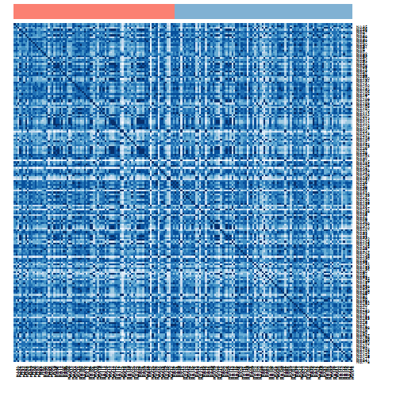
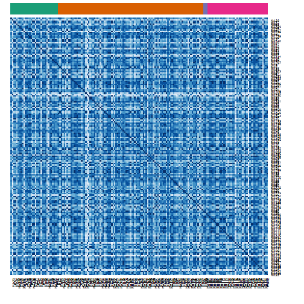

Some Correlation Heatmaps for Differential Expression Analysis using Read Count Data
========================================================

> To knit .rmd file, read data files in using "../data"  
> To run chunks in Rstudio, read data files in using "./data"

This code performs differential expression analysis on cleaned RNA-seq read count data. In particular, it tests whether there is differential expression between different *deletions* (trisomy 8, del 5 and del 7) using `voom`.


## Load data and required libraries
Load RNA-seq data and the experimental design files:

```r
rDes <- read.table("../data/experimental_design_cleaned.txt", sep = "\t", header = TRUE, 
    row.names = 1)  #might need to fix pathname
rDat <- read.table("../data/aml.rnaseq.gaf2.0_read_count_cleaned.txt", sep = "\t", 
    header = TRUE, row.names = 1)  #might need to fix pathname
```


Load required libraries:

```r
library(lattice)  # if you don't already have this loaded ...
library(ggplot2)  # we'll make figures with both
library(reshape2)  # for the function melt
library(limma)
library(edgeR)
library(car)
library(RColorBrewer)
library(plyr)  # data aggregation
library(scales)  # scale functions for graphics, esp. alpha() function
```


## Data inspection

```r
str(rDat, max.level = 0)
```

```
## 'data.frame':	20001 obs. of  179 variables:
##   [list output truncated]
```

```r
rDat[1:4, 1:4]
```

```
##                            X2803 X2805  X2806  X2807
## A1BG-AS|503538_calculated  794.1 431.6  893.2 1097.4
## A1BG|1_calculated         1141.2 405.4 1006.7 1123.7
## A1CF|29974_calculated        2.0   2.0    2.0    3.0
## A2LD1|87769_calculated     196.5 229.1  181.8  113.1
```

```r
head(names(rDat))
```

```
## [1] "X2803" "X2805" "X2806" "X2807" "X2808" "X2810"
```

```r
head(rownames(rDat), n = 10)
```

```
##  [1] "A1BG-AS|503538_calculated" "A1BG|1_calculated"        
##  [3] "A1CF|29974_calculated"     "A2LD1|87769_calculated"   
##  [5] "A2ML1|144568_calculated"   "A2M|2_calculated"         
##  [7] "A4GALT|53947_calculated"   "A4GNT|51146_calculated"   
##  [9] "AAA1|404744_calculated"    "AAAS|8086_calculated"
```

```r
tail(rownames(rDat), n = 10)
```

```
##  [1] "ZWINT|11130_calculated"      "ZXDA|7789_calculated"       
##  [3] "ZXDB|158586_calculated"      "ZXDC|79364_calculated"      
##  [5] "ZYG11B|79699_calculated"     "ZYX|7791_calculated"        
##  [7] "ZZEF1|23140_calculated"      "ZZZ3|26009_calculated"      
##  [9] "psiTPTE22|387590_calculated" "tAKR|389932_calculated"
```

```r
str(rDes, max.level = 0)
```

```
## 'data.frame':	179 obs. of  9 variables:
```

```r
head(rDes)
```

```
##      Sex Race FAB_subtype Age trisomy_8 del_5 del_7 Cytogenetic_risk
## 2803   F    W          M3  61     FALSE FALSE FALSE             Good
## 2805   M    W          M0  77     FALSE FALSE FALSE     Intermediate
## 2806   M    W          M1  46     FALSE FALSE FALSE             Good
## 2807   F    W          M1  68     FALSE FALSE FALSE     Intermediate
## 2808   M    W          M2  23     FALSE FALSE FALSE     Intermediate
## 2810   F    B          M2  76     FALSE FALSE FALSE             N.D.
##      Molecular_risk
## 2803           Good
## 2805   Intermediate
## 2806           Good
## 2807   Intermediate
## 2808   Intermediate
## 2810           N.D.
```


Both the design matrix and the data matrix have already been cleaned and filtered. 

RNA-seq data: there are 20001 transcripts (rows) for 179 patients (columns). Experimental design: there are 179 rows, representing information for each of the patients with RNA-seq data in the AML TCGA data set, and 179 variables.

### Differential expression analysis

I will use `voom` to perform differential expression analysis.


```r
HMprDes <- rDes
HMprDes$sampleID <- paste0("X", rownames(rDes))
hDat <- rDat
colnames(hDat) <- with(HMprDes, paste(sampleID, Sex, Race, Age, FAB_subtype, 
    sep = "."))
HMprDes$HmID <- with(HMprDes, paste(sampleID, Sex, Race, Age, FAB_subtype, sep = "."))
```


Before reordering to investigate possible trends, I will first see how it clusters without ordering.


```r
heatmap(cor(hDat), margins = c(10, 10), scale = "none", col = brewer.pal(n = 9, 
    name = "Blues"))
```

 


There certainly seems to be groups of high correlation. 
Let's see if any of the following variables could be responsible for this. 

     

I do get correlations..

As you can see, the labels don't line up with the color scheme. they must have gotten uncoupled
souwehere along the way. Trying to fix....

Note:
HMprDes is the design matrix with an extra column containing sample names with extra info pasted on the end.

Order the data based on Sex:

```r
pal <- c("#FB8072", "#80B1D3")
mapCols <- data.frame(palette = pal, Sex = levels(HMprDes$Sex))
HMprDesCol <- join(HMprDes, mapCols, by = "Sex")
head(HMprDesCol)
```

```
##   Sex Race FAB_subtype Age trisomy_8 del_5 del_7 Cytogenetic_risk
## 1   F    W          M3  61     FALSE FALSE FALSE             Good
## 2   M    W          M0  77     FALSE FALSE FALSE     Intermediate
## 3   M    W          M1  46     FALSE FALSE FALSE             Good
## 4   F    W          M1  68     FALSE FALSE FALSE     Intermediate
## 5   M    W          M2  23     FALSE FALSE FALSE     Intermediate
## 6   F    B          M2  76     FALSE FALSE FALSE             N.D.
##   Molecular_risk sampleID            HmID palette
## 1           Good    X2803 X2803.F.W.61.M3 #FB8072
## 2   Intermediate    X2805 X2805.M.W.77.M0 #80B1D3
## 3           Good    X2806 X2806.M.W.46.M1 #80B1D3
## 4   Intermediate    X2807 X2807.F.W.68.M1 #FB8072
## 5   Intermediate    X2808 X2808.M.W.23.M2 #80B1D3
## 6           N.D.    X2810 X2810.F.B.76.M2 #FB8072
```

```r
HMprDesColOrd <- arrange(HMprDesCol, Sex)
sexCols <- unlist(as.character(HMprDesColOrd$palette))

# CarmenCode with Rebecca Colors
heatmap(cor(hDat[, (HMprDes[order(HMprDes[, "Sex"]), ]$HmID)]), Rowv = NA, Colv = NA, 
    margins = c(10, 10), scale = "none", ColSideColors = sexCols, col = brewer.pal(n = 9, 
        name = "Blues"))
```




Order the data based on FAB_subtype

```r
pal <- brewer.pal(n = nlevels(HMprDes$FAB_subtype), name = "Set3")
mapCols <- data.frame(palette = pal, FAB_subtype = levels(HMprDes$FAB_subtype))
HMprDesCol <- join(HMprDes, mapCols, by = "FAB_subtype")
HMprDesColOrd <- arrange(HMprDesCol, FAB_subtype)
fabCols <- unlist(as.character(HMprDesColOrd$palette))

# CarmenCode with Rebecca Colors
heatmap(cor(hDat[, (HMprDes[order(HMprDes[, "FAB_subtype"]), ]$HmID)]), Rowv = NA, 
    margins = c(10, 10), scale = "none", ColSideColors = fabCols, symm = TRUE, 
    col = brewer.pal(n = 9, name = "Blues"), main = "Ordered by FAB_Subtype")
```


Order based on Cytogenetic risk

```r
pal <- brewer.pal(n = nlevels(HMprDes$Cytogenetic_risk), name = "Dark2")
mapCols <- data.frame(palette = pal, Cytogenetic_risk = levels(HMprDes$Cytogenetic_risk))
HMprDesCol <- join(HMprDes, mapCols, by = "Cytogenetic_risk")
HMprDesColOrd <- arrange(HMprDesCol, Cytogenetic_risk)
crCols <- unlist(as.character(HMprDesColOrd$palette))

# CarmenCode with Rebecca Colors
heatmap(cor(hDat[, (HMprDes[order(HMprDes[, "Cytogenetic_risk"]), ]$HmID)]), 
    Rowv = NA, margins = c(10, 10), scale = "none", ColSideColors = crCols, 
    symm = TRUE, col = brewer.pal(n = 9, name = "Blues"), main = "Ordered by Cytogenetic_risk")
```




Order based on Cytogenetic risk

```r
pal <- brewer.pal(n = nlevels(HMprDes$Cytogenetic_risk), name = "Dark2")
mapCols <- data.frame(palette = pal, Cytogenetic_risk = levels(HMprDes$Cytogenetic_risk))
HMprDesCol <- join(HMprDes, mapCols, by = "Cytogenetic_risk")
HMprDesColOrd <- arrange(HMprDesCol, Cytogenetic_risk)
crCols <- unlist(as.character(HMprDesColOrd$palette))

# CarmenCode with Rebecca Colors
heatmap(cor(hDat[, (HMprDes[order(HMprDes[, "Cytogenetic_risk"]), ]$HmID)]), 
    Rowv = NA, margins = c(10, 10), scale = "none", ColSideColors = crCols, 
    symm = TRUE, col = brewer.pal(n = 9, name = "Blues"), main = "Ordered by Cytogenetic_risk")
```


