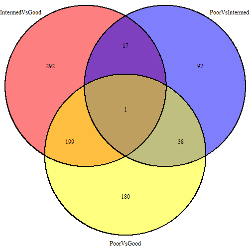

Differential expression analysis of RNA seq read count data
===========================================================

> To knit .rmd file, read data files in using "../data"  
> To run chunks in Rstudio, read data files in using "./data"

This code performs differential expression analysis on cleaned RNA-seq read count data. In particular, it tests whether there is differential expression between **sexes** (Male vs. Female) and the different **cytogenetic risk** groups (Good vs. Intermediate vs. Poor) using `voom`.


## Load data and required libraries
Load RNA-seq data and the experimental design files:

```r
rDat <- read.table("../data/aml.rnaseq.gaf2.0_read_count_cleaned.txt", sep = "\t", 
    header = TRUE, check.names = FALSE)
rDes <- read.delim("../data/experimental_design_cleaned.txt")
```


Load required libraries:

```r
library(reshape2)  # for reshaping data from wide to tall format
library(ggplot2)  # for graphing
library(RColorBrewer)  # for better colour palettes
library(plyr)  # data aggregation
library(limma)  # fit linear models
library(edgeR)  # differential expression analysis of RNA-seq data
library(VennDiagram)  # for `venn.plot` function
```


## Data inspection

```r
str(rDat, max.level = 0)
```

```
## 'data.frame':	20001 obs. of  179 variables:
##   [list output truncated]
```

```r
rDat[1:4, 1:4]
```

```
##                             2803  2805   2806   2807
## A1BG-AS|503538_calculated  794.1 431.6  893.2 1097.4
## A1BG|1_calculated         1141.2 405.4 1006.7 1123.7
## A1CF|29974_calculated        2.0   2.0    2.0    3.0
## A2LD1|87769_calculated     196.5 229.1  181.8  113.1
```

```r
head(names(rDat))
```

```
## [1] "2803" "2805" "2806" "2807" "2808" "2810"
```

```r
head(rownames(rDat), n = 10)
```

```
##  [1] "A1BG-AS|503538_calculated" "A1BG|1_calculated"        
##  [3] "A1CF|29974_calculated"     "A2LD1|87769_calculated"   
##  [5] "A2ML1|144568_calculated"   "A2M|2_calculated"         
##  [7] "A4GALT|53947_calculated"   "A4GNT|51146_calculated"   
##  [9] "AAA1|404744_calculated"    "AAAS|8086_calculated"
```

```r
tail(rownames(rDat), n = 10)
```

```
##  [1] "ZWINT|11130_calculated"      "ZXDA|7789_calculated"       
##  [3] "ZXDB|158586_calculated"      "ZXDC|79364_calculated"      
##  [5] "ZYG11B|79699_calculated"     "ZYX|7791_calculated"        
##  [7] "ZZEF1|23140_calculated"      "ZZZ3|26009_calculated"      
##  [9] "psiTPTE22|387590_calculated" "tAKR|389932_calculated"
```

```r
str(rDes, max.level = 0)
```

```
## 'data.frame':	179 obs. of  10 variables:
```

```r
head(rDes)
```

```
##   TCGA_patient_id Sex Race FAB_subtype Age trisomy_8 del_5 del_7
## 1            2803   F    W          M3  61     FALSE FALSE FALSE
## 2            2805   M    W          M0  77     FALSE FALSE FALSE
## 3            2806   M    W          M1  46     FALSE FALSE FALSE
## 4            2807   F    W          M1  68     FALSE FALSE FALSE
## 5            2808   M    W          M2  23     FALSE FALSE FALSE
## 6            2810   F    B          M2  76     FALSE FALSE FALSE
##   Cytogenetic_risk Molecular_risk
## 1             Good           Good
## 2     Intermediate   Intermediate
## 3             Good           Good
## 4     Intermediate   Intermediate
## 5     Intermediate   Intermediate
## 6             N.D.           N.D.
```


RNA-seq data: there are 20001 transcripts (rows) for 179 patients (columns). Experimental design: there are 179 rows, representing information for each of the patients with RNA-seq data in the AML TCGA data set, and 179 variables.


## Differential expression analysis using voom

I will use `voom` to perform differential expression analysis. From my experience, `voom` makes the most stringent calls for differential expression. 

**Sex**  
First I will do a simple differential expression analysis: which genes are differentially expressed between males and females?

```r
sex <- rDes$Sex
table(sex)
```

```
## sex
##  F  M 
## 85 94
```


Apply scale normalization:

```r
normFactor <- calcNormFactors(rDat)
```


Use `voom` to convert read count to log2-ReadCount ready for linear modelling:

```r
design <- model.matrix(~sex)
# The intercept represents females
head(design)
```

```
##   (Intercept) sexM
## 1           1    0
## 2           1    1
## 3           1    1
## 4           1    0
## 5           1    1
## 6           1    0
```

```r
rDatVoom <- voom(rDat, design, plot = TRUE, lib.size = colSums(rDat) * normFactor)
```

 


Now find genes differentially expressed between males and females:

```r
fit <- lmFit(rDatVoom, design)
fit <- eBayes(fit)
voomSex <- topTable(fit, coef = "sexM", p.value = 1e-05, n = Inf)
nrow(voomSex)
```

```
## [1] 33
```

```r
head(voomSex, n = 10)
```

```
##                             logFC AveExpr     t    P.Value  adj.P.Val
## KDM5D|8284_calculated      11.383  2.2073 66.24 2.168e-128 4.336e-124
## UTY|7404_calculated         9.964  1.4646 65.76 7.481e-128 6.747e-124
## RPS4Y1|6192_calculated     11.216  2.0859 65.43 1.789e-127 8.943e-124
## DDX3Y|8653_calculated      11.108  2.4082 65.65 1.012e-127 6.747e-124
## USP9Y|8287_calculated       9.908  1.4526 61.94 2.277e-123 9.110e-120
## ZFY|7544_calculated         8.558  0.8857 58.72 2.171e-119 7.237e-116
## CYorf15B|84663_calculated  10.681  1.8073 57.18 2.034e-117 5.813e-114
## CYorf15A|246126_calculated  9.488  1.0677 55.49 3.476e-115 8.689e-112
## EIF1AY|9086_calculated      8.642  0.9720 51.99 2.171e-110 4.824e-107
## TTTY15|64595_calculated     7.800  0.2079 50.66 1.712e-108 3.424e-105
##                                B
## KDM5D|8284_calculated      272.1
## UTY|7404_calculated        270.7
## RPS4Y1|6192_calculated     270.4
## DDX3Y|8653_calculated      269.3
## USP9Y|8287_calculated      261.7
## ZFY|7544_calculated        252.3
## CYorf15B|84663_calculated  250.0
## CYorf15A|246126_calculated 245.2
## EIF1AY|9086_calculated     234.0
## TTTY15|64595_calculated    229.1
```

```r
(voomSexgenes <- rownames(voomSex))
```

```
##  [1] "KDM5D|8284_calculated"        "UTY|7404_calculated"         
##  [3] "RPS4Y1|6192_calculated"       "DDX3Y|8653_calculated"       
##  [5] "USP9Y|8287_calculated"        "ZFY|7544_calculated"         
##  [7] "CYorf15B|84663_calculated"    "CYorf15A|246126_calculated"  
##  [9] "EIF1AY|9086_calculated"       "TTTY15|64595_calculated"     
## [11] "PRKY|5616_calculated"         "XIST|7503_calculated"        
## [13] "TSIX|9383_calculated"         "BCORP1|286554_calculated"    
## [15] "NCRNA00185|55410_calculated"  "TMSB4Y|9087_calculated"      
## [17] "TTTY10|246119_calculated"     "TTTY14|83869_calculated"     
## [19] "PRKX|5613_calculated"         "NLGN4Y|22829_calculated"     
## [21] "ZFX|7543_calculated"          "KDM5C|8242_calculated"       
## [23] "NCRNA00183|554203_calculated" "SRY|6736_calculated"         
## [25] "RPS4Y2|140032_calculated"     "KDM6A|7403_calculated"       
## [27] "XGPY2|100132596_calculated"   "ZRSR2|8233_calculated"       
## [29] "RPS4X|6191_calculated"        "EIF1AX|1964_calculated"      
## [31] "TBL1Y|90665_calculated"       "PNPLA4|8228_calculated"      
## [33] "DDX3X|1654_calculated"
```

```r
# Lower the FDR threshold: how many genes do we find?
nrow(topTable(fit, coef = "sexM", p.value = 0.01, n = Inf))
```

```
## [1] 38
```

```r
nrow(topTable(fit, coef = "sexM", p.value = 0.01, n = Inf))
```

```
## [1] 38
```

```r
# None! Really?
head(topTable(fit, coef = "sexM", n = Inf))
```

```
##                         logFC AveExpr     t    P.Value  adj.P.Val     B
## KDM5D|8284_calculated  11.383  2.2073 66.24 2.168e-128 4.336e-124 272.1
## UTY|7404_calculated     9.964  1.4646 65.76 7.481e-128 6.747e-124 270.7
## RPS4Y1|6192_calculated 11.216  2.0859 65.43 1.789e-127 8.943e-124 270.4
## DDX3Y|8653_calculated  11.108  2.4082 65.65 1.012e-127 6.747e-124 269.3
## USP9Y|8287_calculated   9.908  1.4526 61.94 2.277e-123 9.110e-120 261.7
## ZFY|7544_calculated     8.558  0.8857 58.72 2.171e-119 7.237e-116 252.3
```

```r
tail(topTable(fit, coef = "sexM", n = Inf))
```

```
##                              logFC AveExpr        t P.Value adj.P.Val
## CAT|847_calculated      -0.0064284   9.302 -0.04436  0.9647    0.9987
## MYO15B|80022_calculated  0.0026243   9.178  0.02468  0.9803    0.9987
## FTL|2512_calculated     -0.0053514   9.611 -0.04017  0.9680    0.9987
## TGOLN2|10618_calculated -0.0009195   9.347 -0.01540  0.9877    0.9987
## TMBIM6|7009_calculated  -0.0013213   9.506 -0.02316  0.9815    0.9987
## EEF1A1|1915_calculated  -0.0010004   9.808 -0.01212  0.9903    0.9988
##                              B
## CAT|847_calculated      -7.230
## MYO15B|80022_calculated -7.231
## FTL|2512_calculated     -7.231
## TGOLN2|10618_calculated -7.231
## TMBIM6|7009_calculated  -7.231
## EEF1A1|1915_calculated  -7.231
```

There are no genes differentially expressed between males and females!

**Cytogenetic risk**  
Now to explore another variable, "Cytogenetic_risk". 

```r
levels(rDes$Cytogenetic_risk)
```

```
## [1] "Good"         "Intermediate" "N.D."         "Poor"
```

```r
table(rDes$Cytogenetic_risk)
```

```
## 
##         Good Intermediate         N.D.         Poor 
##           33          101            3           42
```


Which transcripts are differentially expressed between "Good", "Intermediate", and "Poor" cytogenetic risk?

First, remove samples where cytogenetic risk could not be determined "N.D":

```r
# CRGIP = Cytogenetic Response Good + Intermediate + Poor
rDesCRGIP <- droplevels(subset(rDes, Cytogenetic_risk != "N.D."))
str(rDesCRGIP)
```

```
## 'data.frame':	176 obs. of  10 variables:
##  $ TCGA_patient_id : int  2803 2805 2806 2807 2808 2811 2812 2813 2814 2815 ...
##  $ Sex             : Factor w/ 2 levels "F","M": 1 2 2 1 2 2 1 2 1 2 ...
##  $ Race            : Factor w/ 13 levels "A","B","H","NH/A",..: 12 12 12 12 12 12 2 12 12 12 ...
##  $ FAB_subtype     : Factor w/ 9 levels "M0","M1","M2",..: 4 1 2 2 3 5 3 5 1 5 ...
##  $ Age             : int  61 77 46 68 23 81 25 78 39 49 ...
##  $ trisomy_8       : logi  FALSE FALSE FALSE FALSE FALSE FALSE ...
##  $ del_5           : logi  FALSE FALSE FALSE FALSE FALSE FALSE ...
##  $ del_7           : logi  FALSE FALSE FALSE FALSE FALSE FALSE ...
##  $ Cytogenetic_risk: Factor w/ 3 levels "Good","Intermediate",..: 1 2 1 2 2 2 2 3 3 1 ...
##  $ Molecular_risk  : Factor w/ 3 levels "Good","Intermediate",..: 1 2 1 2 2 2 2 3 3 1 ...
```

```r
dim(rDesCRGIP)
```

```
## [1] 176  10
```

```r
rDatCRGIP <- rDat[, names(rDat) %in% rDesCRGIP$TCGA_patient_id]
dim(rDatCRGIP)
```

```
## [1] 20001   176
```

```r
identical(names(rDatCRGIP), as.character(rDesCRGIP$TCGA_patient_id))
```

```
## [1] TRUE
```

```r
cytoRisk <- rDesCRGIP$Cytogenetic_risk
```


I will make a model with a reference + treatment effect, where I will use "Good" risk as the intercept:

```r
normFactor <- calcNormFactors(rDatCRGIP)
design <- model.matrix(~cytoRisk)
colnames(design)
```

```
## [1] "(Intercept)"          "cytoRiskIntermediate" "cytoRiskPoor"
```

```r
# The intercept represents 'Good' cytogenetic risk
head(design)
```

```
##   (Intercept) cytoRiskIntermediate cytoRiskPoor
## 1           1                    0            0
## 2           1                    1            0
## 3           1                    0            0
## 4           1                    1            0
## 5           1                    1            0
## 6           1                    1            0
```

```r
rDatCRGIPvoom <- voom(rDatCRGIP, design, plot = TRUE, lib.size = colSums(rDatCRGIP) * 
    normFactor)
```

 

```r
fit <- lmFit(rDatCRGIPvoom, design)
fit <- eBayes(fit)
voomCR <- topTable(fit, coef = c("cytoRiskIntermediate", "cytoRiskPoor"), p.value = 1e-05, 
    n = Inf)
nrow(voomCR)
```

```
## [1] 817
```

```r
head(voomCR)
```

```
##                          cytoRiskIntermediate cytoRiskPoor AveExpr     F
## HOXA6|3203_calculated                   6.293        5.684  5.8579 94.72
## HOXA2|3199_calculated                   4.019        3.358  6.6667 93.34
## CYP2E1|1571_calculated                 -3.074       -2.369  6.4947 82.74
## NKX2-3|159296_calculated                5.207        2.065  2.1874 81.84
## HOXA4|3201_calculated                   5.449        4.539  0.3322 81.83
## HOXA7|3204_calculated                   6.657        6.248  7.5629 76.46
##                            P.Value adj.P.Val
## HOXA6|3203_calculated    1.177e-28 2.296e-24
## HOXA2|3199_calculated    2.296e-28 2.296e-24
## CYP2E1|1571_calculated   4.606e-26 2.955e-22
## NKX2-3|159296_calculated 7.346e-26 2.955e-22
## HOXA4|3201_calculated    7.387e-26 2.955e-22
## HOXA7|3204_calculated    1.250e-24 4.168e-21
```

```r
voomCRgenes <- rownames(voomCR)
```


Therefore, there are 817 genes differentially expressed between Good vs. Intermediate and Poor cytogenetic risks.

Which genes are differentially expressed between Good vs. Poor cytogenetic risk?

```r
voomCRGP <- topTable(fit, coef = "cytoRiskPoor", p.value = 1e-05, n = Inf)
nrow(voomCRGP)
```

```
## [1] 418
```

```r
head(voomCRGP)
```

```
##                            logFC AveExpr       t   P.Value adj.P.Val     B
## PDE4DIP|9659_calculated   1.6915  5.8688  10.857 2.383e-21 4.767e-17 37.88
## PHKA1|5255_calculated     4.5056  0.9102  10.090 3.521e-19 2.532e-15 32.58
## KRT17|3872_calculated    -4.8819 -0.7307 -10.078 3.798e-19 2.532e-15 32.57
## HOXA6|3203_calculated     5.6839  1.6745   9.792 2.387e-18 1.193e-14 30.97
## ZNF498|221785_calculated -0.7981  5.0916  -9.734 3.468e-18 1.303e-14 30.75
## LPO|4025_calculated      -4.1998  3.9162  -9.691 4.562e-18 1.303e-14 30.46
```

Therefore there are 418 genes are differentially expressed between Good vs. Poor cytogenetic risk.

Plot top 6 genes differentially expressed between Good vs. Poor cytogenetic risk:

```r
voomCRGPgenes <- rownames(voomCRGP)
rDatvoomCR <- rDatCRGIP[head(voomCRGPgenes), ]
dim(rDatvoomCR)
```

```
## [1]   6 176
```

```r
rDatvoomCR$Transcript <- rownames(rDatvoomCR)
rDatvoomCR <- melt(rDatvoomCR, id.vars = "Transcript", variable.name = "TCGA_patient_id", 
    value.name = "Read_counts")
rDatvoomCR$Transcript <- gsub("[|].*$", "", rDatvoomCR$Transcript)
head(rDatvoomCR)
```

```
##   Transcript TCGA_patient_id Read_counts
## 1    PDE4DIP            2803       379.0
## 2      PHKA1            2803        10.0
## 3      KRT17            2803       109.5
## 4      HOXA6            2803         6.0
## 5     ZNF498            2803      2425.8
## 6        LPO            2803     11542.2
```

```r
rDatvoomCR <- merge(rDatvoomCR, rDesCRGIP, by = "TCGA_patient_id")
head(rDatvoomCR)
```

```
##   TCGA_patient_id Transcript Read_counts Sex Race FAB_subtype Age
## 1            2803    PDE4DIP       379.0   F    W          M3  61
## 2            2803      PHKA1        10.0   F    W          M3  61
## 3            2803      KRT17       109.5   F    W          M3  61
## 4            2803      HOXA6         6.0   F    W          M3  61
## 5            2803     ZNF498      2425.8   F    W          M3  61
## 6            2803        LPO     11542.2   F    W          M3  61
##   trisomy_8 del_5 del_7 Cytogenetic_risk Molecular_risk
## 1     FALSE FALSE FALSE             Good           Good
## 2     FALSE FALSE FALSE             Good           Good
## 3     FALSE FALSE FALSE             Good           Good
## 4     FALSE FALSE FALSE             Good           Good
## 5     FALSE FALSE FALSE             Good           Good
## 6     FALSE FALSE FALSE             Good           Good
```

```r
ggplot(rDatvoomCR, aes(Transcript, log2(Read_counts), colour = Cytogenetic_risk)) + 
    geom_boxplot() + facet_wrap(~Transcript, scales = "free") + theme(axis.text.x = element_blank(), 
    axis.ticks.x = element_blank())
```

 


Which genes are differentially expressed between Good vs. Intermediate cytogenetic risk?

```r
voomCRGI <- topTable(fit, coef = "cytoRiskIntermediate", p.value = 1e-05, n = Inf)
nrow(voomCRGI)
```

```
## [1] 509
```

```r
head(voomCRGI)
```

```
##                         logFC AveExpr      t   P.Value adj.P.Val     B
## HOXA6|3203_calculated   6.293  1.6745  13.72 1.353e-29 1.912e-25 56.32
## HOXA2|3199_calculated   4.019  0.2094  13.66 1.911e-29 1.912e-25 55.64
## CYP2E1|1571_calculated -3.074  1.5626 -12.86 4.028e-27 2.685e-23 50.58
## HOXA4|3201_calculated   5.449  1.5180  12.79 6.419e-27 3.210e-23 50.13
## HOXA7|3204_calculated   6.657  2.4076  12.13 5.133e-25 2.053e-21 46.02
## LPO|4025_calculated    -4.040  3.9162 -12.02 1.073e-24 3.575e-21 45.47
```

Therefore there are 509 genes differentially expressed between Good vs. Intermediate cytogenetic risk.

Plot top 6 genes differentially expressed between Good vs. Intermediate cytogenetic risk:

```r
voomCRGIgenes <- rownames(voomCRGI)
rDatvoomCR <- rDatCRGIP[head(voomCRGIgenes), ]
dim(rDatvoomCR)
```

```
## [1]   6 176
```

```r
rDatvoomCR$Transcript <- rownames(rDatvoomCR)
rDatvoomCR <- melt(rDatvoomCR, id.vars = "Transcript", variable.name = "TCGA_patient_id", 
    value.name = "Read_counts")
rDatvoomCR$Transcript <- gsub("[|].*$", "", rDatvoomCR$Transcript)
head(rDatvoomCR)
```

```
##   Transcript TCGA_patient_id Read_counts
## 1      HOXA6            2803         6.0
## 2      HOXA2            2803         2.0
## 3     CYP2E1            2803       485.7
## 4      HOXA4            2803        10.0
## 5      HOXA7            2803         3.0
## 6        LPO            2803     11542.2
```

```r
rDatvoomCR <- merge(rDatvoomCR, rDesCRGIP, by = "TCGA_patient_id")
head(rDatvoomCR)
```

```
##   TCGA_patient_id Transcript Read_counts Sex Race FAB_subtype Age
## 1            2803      HOXA6         6.0   F    W          M3  61
## 2            2803      HOXA2         2.0   F    W          M3  61
## 3            2803     CYP2E1       485.7   F    W          M3  61
## 4            2803      HOXA4        10.0   F    W          M3  61
## 5            2803      HOXA7         3.0   F    W          M3  61
## 6            2803        LPO     11542.2   F    W          M3  61
##   trisomy_8 del_5 del_7 Cytogenetic_risk Molecular_risk
## 1     FALSE FALSE FALSE             Good           Good
## 2     FALSE FALSE FALSE             Good           Good
## 3     FALSE FALSE FALSE             Good           Good
## 4     FALSE FALSE FALSE             Good           Good
## 5     FALSE FALSE FALSE             Good           Good
## 6     FALSE FALSE FALSE             Good           Good
```

```r
ggplot(rDatvoomCR, aes(Transcript, log2(Read_counts), colour = Cytogenetic_risk)) + 
    geom_boxplot() + facet_wrap(~Transcript, scales = "free") + theme(axis.text.x = element_blank(), 
    axis.ticks.x = element_blank())
```

 


How can we compare Intermediate and Poor risk? Create a contrast matrix:

```r
colnames(design)
```

```
## [1] "(Intercept)"          "cytoRiskIntermediate" "cytoRiskPoor"
```

```r
(contMatrix <- makeContrasts(PoorVsInt = cytoRiskPoor - cytoRiskIntermediate, 
    levels = design))
```

```
## Warning: Renaming (Intercept) to Intercept
```

```
##                       Contrasts
## Levels                 PoorVsInt
##   Intercept                    0
##   cytoRiskIntermediate        -1
##   cytoRiskPoor                 1
```

```r
fitCont <- contrasts.fit(fit, contMatrix)
```

```
## Warning: row names of contrasts don't match col names of coefficients
```

```r
EbFitCont <- eBayes(fitCont)
voomCRIP <- topTable(EbFitCont, p.value = 1e-05, n = Inf)
nrow(voomCRIP)
```

```
## [1] 148
```

```r
head(voomCRIP)
```

```
##                             logFC AveExpr      t   P.Value adj.P.Val     B
## HOXB8|3218_calculated     -2.9149  -2.026 -9.157 1.336e-16 2.409e-12 26.94
## ZNF560|147741_calculated   2.6197  -2.885  9.063 2.409e-16 2.409e-12 25.93
## PDAP1|11333_calculated    -0.5178   5.596 -8.655 3.024e-15 1.780e-11 24.12
## SLC25A13|10165_calculated -0.6546   4.608 -8.629 3.559e-15 1.780e-11 23.90
## HOXB7|3217_calculated     -2.5818  -1.043 -8.522 6.857e-15 2.743e-11 22.90
## SLC18A2|6571_calculated    2.5094   2.453  8.291 2.796e-14 9.320e-11 21.68
```

```r
resCont <- decideTests(EbFitCont, p.value = 1e-05, method = "global")
summary(resCont)
```

```
##    PoorVsInt
## -1       103
## 0      19853
## 1         45
```

```r
# negHits <- rownames(rDatCRGIP)[which(resCont[ , 'PoorVsInt'] < 0)] posHits
# <- rownames(rDatCRGIP)[which(resCont[ , 'PoorVsInt'] > 0)]
```

Therefore there are 148 genes differentially expressed between Intermediate and Poor cytogenetic risk.

Plot top 6 genes differentially expressed between Intermediate and Poor cytogenetic risk:

```r
voomCRIPgenes <- rownames(voomCRIP)
rDatvoomCR <- rDatCRGIP[head(voomCRIPgenes), ]
dim(rDatvoomCR)
```

```
## [1]   6 176
```

```r
rDatvoomCR$Transcript <- rownames(rDatvoomCR)
rDatvoomCR <- melt(rDatvoomCR, id.vars = "Transcript", variable.name = "TCGA_patient_id", 
    value.name = "Read_counts")
rDatvoomCR$Transcript <- gsub("[|].*$", "", rDatvoomCR$Transcript)
head(rDatvoomCR)
```

```
##   Transcript TCGA_patient_id Read_counts
## 1      HOXB8            2803         4.0
## 2     ZNF560            2803         2.0
## 3      PDAP1            2803      2211.5
## 4   SLC25A13            2803       934.7
## 5      HOXB7            2803        20.0
## 6    SLC18A2            2803       659.2
```

```r
rDatvoomCR <- merge(rDatvoomCR, rDesCRGIP, by = "TCGA_patient_id")
head(rDatvoomCR)
```

```
##   TCGA_patient_id Transcript Read_counts Sex Race FAB_subtype Age
## 1            2803      HOXB8         4.0   F    W          M3  61
## 2            2803     ZNF560         2.0   F    W          M3  61
## 3            2803      PDAP1      2211.5   F    W          M3  61
## 4            2803   SLC25A13       934.7   F    W          M3  61
## 5            2803      HOXB7        20.0   F    W          M3  61
## 6            2803    SLC18A2       659.2   F    W          M3  61
##   trisomy_8 del_5 del_7 Cytogenetic_risk Molecular_risk
## 1     FALSE FALSE FALSE             Good           Good
## 2     FALSE FALSE FALSE             Good           Good
## 3     FALSE FALSE FALSE             Good           Good
## 4     FALSE FALSE FALSE             Good           Good
## 5     FALSE FALSE FALSE             Good           Good
## 6     FALSE FALSE FALSE             Good           Good
```

```r
ggplot(rDatvoomCR, aes(Transcript, log2(Read_counts), colour = Cytogenetic_risk)) + 
    geom_boxplot() + facet_wrap(~Transcript, scales = "free") + theme(axis.text.x = element_blank(), 
    axis.ticks.x = element_blank())
```

 


Create a Venn diagram to show which genes were differentially expressed:

```r
deGenes <- list(IntermedVsGood = voomCRGIgenes, PoorVsIntermed = voomCRIPgenes, 
    PoorVsGood = voomCRGPgenes)
plot.new()
vennPlot <- venn.diagram(deGenes, filename = NULL, force.unique = TRUE, fill = c("red", 
    "blue", "yellow"))
grid.draw(vennPlot)
```

 


Wow one gene is differentially expressed between all groups? What is it?!

```r
(luckyGene <- (intersect(intersect(voomCRGIgenes, voomCRIPgenes), voomCRGPgenes)))
```

```
## [1] "ZNF498|221785_calculated"
```


It is a zinc finger protein on chromosome 7, which we know is commonly deleted in AML! Nice. Let's check its expression!

```r
rDatvoomCR <- rDatCRGIP[head(luckyGene), ]
rDatvoomCR$Transcript <- rownames(rDatvoomCR)
rDatvoomCR <- melt(rDatvoomCR, id.vars = "Transcript", variable.name = "TCGA_patient_id", 
    value.name = "Read_counts")
rDatvoomCR$Transcript <- gsub("[|].*$", "", rDatvoomCR$Transcript)
head(rDatvoomCR)
```

```
##   Transcript TCGA_patient_id Read_counts
## 1     ZNF498            2803        2426
## 2     ZNF498            2805        1488
## 3     ZNF498            2806        2371
## 4     ZNF498            2807        1555
## 5     ZNF498            2808        1543
## 6     ZNF498            2811        1632
```

```r
rDatvoomCR <- merge(rDatvoomCR, rDesCRGIP, by = "TCGA_patient_id")
head(rDatvoomCR)
```

```
##   TCGA_patient_id Transcript Read_counts Sex Race FAB_subtype Age
## 1            2803     ZNF498        2426   F    W          M3  61
## 2            2805     ZNF498        1488   M    W          M0  77
## 3            2806     ZNF498        2371   M    W          M1  46
## 4            2807     ZNF498        1555   F    W          M1  68
## 5            2808     ZNF498        1543   M    W          M2  23
## 6            2811     ZNF498        1632   M    W          M4  81
##   trisomy_8 del_5 del_7 Cytogenetic_risk Molecular_risk
## 1     FALSE FALSE FALSE             Good           Good
## 2     FALSE FALSE FALSE     Intermediate   Intermediate
## 3     FALSE FALSE FALSE             Good           Good
## 4     FALSE FALSE FALSE     Intermediate   Intermediate
## 5     FALSE FALSE FALSE     Intermediate   Intermediate
## 6     FALSE FALSE FALSE     Intermediate   Intermediate
```

```r
ggplot(rDatvoomCR, aes(Transcript, log2(Read_counts), colour = Cytogenetic_risk)) + 
    geom_boxplot()
```

 

