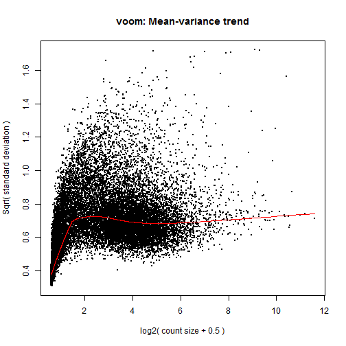
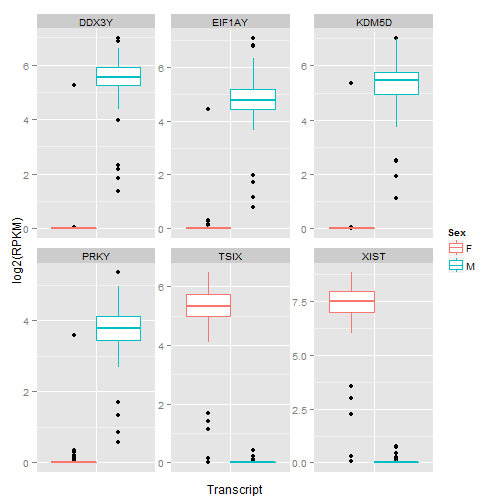
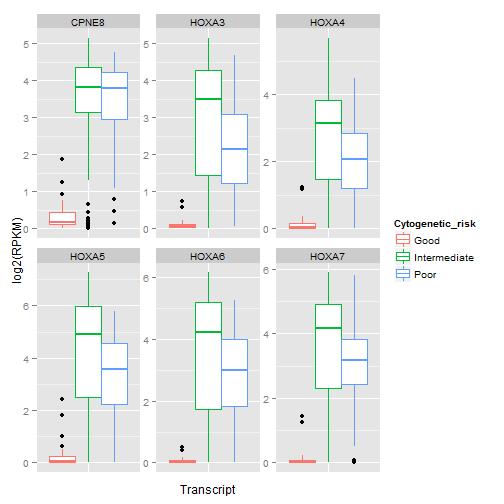
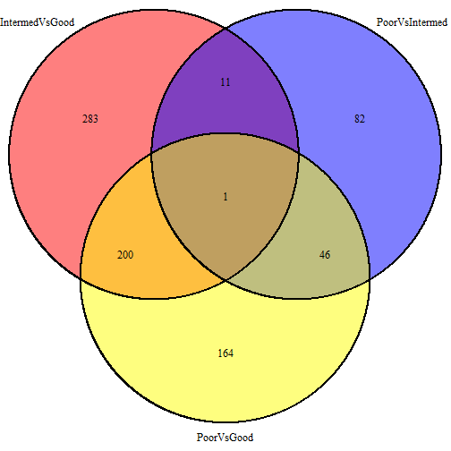

Differential expression analysis of RNA seq RPKM data
=====================================================

> To knit .rmd file, read data files in using "../data"  
> To run chunks in Rstudio, read data files in using "./data"

This code performs differential expression analysis on cleaned RNA-seq RPKM data. In particular, it tests whether there is differential expression between **sexes** (Male vs. Female) and the different **cytogenetic risk** groups (Good vs. Intermediate vs. Poor) using `voom`.


## Load data and required libraries
Load RNA-seq cleaned RPKM data and the cleaned experimental design file:

```r
rDat <- read.table("../data/aml.rnaseq.gaf2.0_rpkm_cleaned.txt", sep = "\t", 
    header = TRUE, check.names = FALSE)
rDes <- read.delim("../data/experimental_design_cleaned.txt")
```


Load required libraries:

```r
library(reshape2)  # for reshaping data from wide to tall format
library(ggplot2)  # for graphing
library(RColorBrewer)  # for better colour palettes
library(plyr)  # data aggregation
library(limma)  # fit linear models
library(edgeR)  # differential expression analysis of RNA-seq data
library(VennDiagram)  # for `venn.plot` function
```


## Data inspection

```r
str(rDat, max.level = 0)
```

```
## 'data.frame':	20001 obs. of  179 variables:
##   [list output truncated]
```

```r
rDat[1:4, 1:4]
```

```
##                            2803  2805  2806   2807
## A1BG-AS|503538_calculated 8.316 4.156 6.895 11.370
## A1BG|1_calculated         8.472 3.105 5.719  8.541
## A1CF|29974_calculated     1.000 1.000 1.000  1.011
## A2LD1|87769_calculated    2.776 2.650 2.176  2.039
```

```r
head(names(rDat))
```

```
## [1] "2803" "2805" "2806" "2807" "2808" "2810"
```

```r
head(rownames(rDat), n = 10)
```

```
##  [1] "A1BG-AS|503538_calculated" "A1BG|1_calculated"        
##  [3] "A1CF|29974_calculated"     "A2LD1|87769_calculated"   
##  [5] "A2ML1|144568_calculated"   "A2M|2_calculated"         
##  [7] "A4GALT|53947_calculated"   "A4GNT|51146_calculated"   
##  [9] "AAA1|404744_calculated"    "AAAS|8086_calculated"
```

```r
tail(rownames(rDat), n = 10)
```

```
##  [1] "ZWINT|11130_calculated"      "ZXDA|7789_calculated"       
##  [3] "ZXDB|158586_calculated"      "ZXDC|79364_calculated"      
##  [5] "ZYG11B|79699_calculated"     "ZYX|7791_calculated"        
##  [7] "ZZEF1|23140_calculated"      "ZZZ3|26009_calculated"      
##  [9] "psiTPTE22|387590_calculated" "tAKR|389932_calculated"
```

```r
str(rDes, max.level = 0)
```

```
## 'data.frame':	179 obs. of  10 variables:
```

```r
head(rDes)
```

```
##   TCGA_patient_id Sex Race FAB_subtype Age trisomy_8 del_5 del_7
## 1            2803   F    W          M3  61     FALSE FALSE FALSE
## 2            2805   M    W          M0  77     FALSE FALSE FALSE
## 3            2806   M    W          M1  46     FALSE FALSE FALSE
## 4            2807   F    W          M1  68     FALSE FALSE FALSE
## 5            2808   M    W          M2  23     FALSE FALSE FALSE
## 6            2810   F    B          M2  76     FALSE FALSE FALSE
##   Cytogenetic_risk Molecular_risk
## 1             Good           Good
## 2     Intermediate   Intermediate
## 3             Good           Good
## 4     Intermediate   Intermediate
## 5     Intermediate   Intermediate
## 6             N.D.           N.D.
```


RNA-seq data: there are 20001 transcripts (rows) for 179 patients (columns). Experimental design: there are 179 rows, representing information for each of the patients with RNA-seq data in the AML TCGA data set, and 179 variables.


## Differential expression analysis using voom

I will use `voom` to perform differential expression analysis. From my experience, `voom` makes the most stringent calls for differential expression. 

**Sex**  
First I will do a simple differential expression analysis: which genes are differentially expressed between males and females?

```r
sex <- rDes$Sex
table(sex)
```

```
## sex
##  F  M 
## 85 94
```


Apply scale normalization:

```r
normFactor <- calcNormFactors(rDat)
```


Use `voom` to convert RPKM to log2-RPKM ready for linear modelling:

```r
design <- model.matrix(~sex)
# The intercept represents females
head(design)
```

```
##   (Intercept) sexM
## 1           1    0
## 2           1    1
## 3           1    1
## 4           1    0
## 5           1    1
## 6           1    0
```

```r
rDatVoom <- voom(rDat, design, plot = TRUE, lib.size = colSums(rDat) * normFactor)
```

 


Now find genes differentially expressed between males and females:

```r
fit <- lmFit(rDatVoom, design)
fit <- eBayes(fit)
voomSex <- topTable(fit, coef = "sexM", p.value = 1e-05, n = Inf)
nrow(voomSex)
```

```
## [1] 29
```

```r
head(topTable(fit, coef = "sexM", n = Inf))
```

```
##                         logFC AveExpr      t    P.Value  adj.P.Val     B
## XIST|7503_calculated   -6.600   5.292 -57.12 2.293e-117 4.586e-113 222.3
## TSIX|9383_calculated   -4.552   4.298 -52.22 9.552e-111 9.552e-107 218.0
## DDX3Y|8653_calculated   4.774   4.698  29.61  4.004e-71  2.669e-67 144.4
## EIF1AY|9086_calculated  4.063   4.327  29.04  7.228e-70  3.614e-66 142.3
## PRKY|5616_calculated    3.094   3.810  28.17  6.446e-68  2.578e-64 138.2
## KDM5D|8284_calculated   4.573   4.590  27.61  1.204e-66  3.440e-63 135.4
```

```r
tail(topTable(fit, coef = "sexM", n = Inf))
```

```
##                                            logFC AveExpr        t P.Value
## SNORD115-12|100033449|2of2_calculated  0.0002742   2.119  0.02298  0.9817
## SPANXC|64663_calculated                0.0001590   2.119  0.01333  0.9894
## KRTAP10-1|386677_calculated           -0.0005203   2.118 -0.04795  0.9618
## HTR2C|3358_calculated                 -0.0005075   2.118 -0.03976  0.9683
## C3orf79|152118_calculated              0.0001668   2.118  0.01467  0.9883
## OR52E6|390078_calculated              -0.0005423   2.117 -0.04691  0.9626
##                                       adj.P.Val      B
## SNORD115-12|100033449|2of2_calculated    0.9976 -7.569
## SPANXC|64663_calculated                  0.9986 -7.569
## KRTAP10-1|386677_calculated              0.9949 -7.569
## HTR2C|3358_calculated                    0.9959 -7.569
## C3orf79|152118_calculated                0.9986 -7.570
## OR52E6|390078_calculated                 0.9953 -7.570
```

```r
(voomSexgenes <- rownames(voomSex))
```

```
##  [1] "XIST|7503_calculated"         "TSIX|9383_calculated"        
##  [3] "DDX3Y|8653_calculated"        "EIF1AY|9086_calculated"      
##  [5] "PRKY|5616_calculated"         "KDM5D|8284_calculated"       
##  [7] "RPS4Y1|6192_calculated"       "UTY|7404_calculated"         
##  [9] "CYorf15A|246126_calculated"   "CYorf15B|84663_calculated"   
## [11] "USP9Y|8287_calculated"        "ZFY|7544_calculated"         
## [13] "TTTY15|64595_calculated"      "NCRNA00185|55410_calculated" 
## [15] "TTTY14|83869_calculated"      "TTTY10|246119_calculated"    
## [17] "BCORP1|286554_calculated"     "TMSB4Y|9087_calculated"      
## [19] "PRKX|5613_calculated"         "KDM5C|8242_calculated"       
## [21] "ZFX|7543_calculated"          "KDM6A|7403_calculated"       
## [23] "NCRNA00183|554203_calculated" "ZRSR2|8233_calculated"       
## [25] "PNPLA4|8228_calculated"       "RPS4X|6191_calculated"       
## [27] "EIF1AX|1964_calculated"       "SRY|6736_calculated"         
## [29] "DDX3X|1654_calculated"
```

```r
# Lower the FDR threshold: how many genes do we find?
nrow(topTable(fit, coef = "sexM", p.value = 0.01, n = Inf))
```

```
## [1] 38
```

Ok XIST|7503_calculated, TSIX|9383_calculated are popping up, this is a promising result! Plus a lot of the gene names end in "Y", meaning they are linked to the Y chromosome, so I must be doing something right :)

Plot the top differentially expressed genes between males and females:

```r
rDatvoomSex <- rDat[voomSexgenes[1:6], ]
dim(rDatvoomSex)
```

```
## [1]   6 179
```

```r
rDatvoomSex$Transcript <- rownames(rDatvoomSex)
rDatvoomSex <- melt(rDatvoomSex, id.vars = "Transcript", 
                   variable.name = "TCGA_patient_id",
                   value.name = "RPKM")
rDatvoomSex$Transcript <- gsub("[|].*$", "", rDatvoomSex$Transcript)
head(rDatvoomSex)
```

```
##   Transcript TCGA_patient_id    RPKM
## 1       XIST            2803 175.314
## 2       TSIX            2803  65.349
## 3      DDX3Y            2803   1.005
## 4     EIF1AY            2803   1.000
## 5       PRKY            2803   1.000
## 6      KDM5D            2803   1.000
```

```r
rDatvoomSex <- merge(rDatvoomSex, rDes, by = "TCGA_patient_id")
head(rDatvoomSex)
```

```
##   TCGA_patient_id Transcript    RPKM Sex Race FAB_subtype Age trisomy_8
## 1            2803       XIST 175.314   F    W          M3  61     FALSE
## 2            2803       TSIX  65.349   F    W          M3  61     FALSE
## 3            2803      DDX3Y   1.005   F    W          M3  61     FALSE
## 4            2803     EIF1AY   1.000   F    W          M3  61     FALSE
## 5            2803       PRKY   1.000   F    W          M3  61     FALSE
## 6            2803      KDM5D   1.000   F    W          M3  61     FALSE
##   del_5 del_7 Cytogenetic_risk Molecular_risk
## 1 FALSE FALSE             Good           Good
## 2 FALSE FALSE             Good           Good
## 3 FALSE FALSE             Good           Good
## 4 FALSE FALSE             Good           Good
## 5 FALSE FALSE             Good           Good
## 6 FALSE FALSE             Good           Good
```

```r
ggplot(rDatvoomSex, aes(Transcript, log2(RPKM), colour = Sex)) +
  geom_boxplot() +
  facet_wrap(~ Transcript, scales = "free")+
  theme(axis.text.x = element_blank(), axis.ticks.x = element_blank())
```

 

So the top genes differentially expressed between males and females have almost no expression in one of the sexes. Given we only found 29 genes differentially expressed with an FDR of 1e-5, we can conclude that sex has limited influence on gene expression in AML patients.


**Cytogenetic risk**  
Now to explore another variable, "Cytogenetic_risk". 

```r
levels(rDes$Cytogenetic_risk)
```

```
## [1] "Good"         "Intermediate" "N.D."         "Poor"
```

```r
table(rDes$Cytogenetic_risk)
```

```
## 
##         Good Intermediate         N.D.         Poor 
##           33          101            3           42
```


Which transcripts are differentially expressed between "Good", "Intermediate", and "Poor" cytogenetic risk?

First, remove samples where cytogenetic risk could not be determined "N.D":

```r
# CRGIP = Cytogenetic Response Good + Intermediate + Poor
rDesCRGIP <- droplevels(subset(rDes, Cytogenetic_risk != "N.D."))
str(rDesCRGIP)
```

```
## 'data.frame':	176 obs. of  10 variables:
##  $ TCGA_patient_id : int  2803 2805 2806 2807 2808 2811 2812 2813 2814 2815 ...
##  $ Sex             : Factor w/ 2 levels "F","M": 1 2 2 1 2 2 1 2 1 2 ...
##  $ Race            : Factor w/ 13 levels "A","B","H","NH/A",..: 12 12 12 12 12 12 2 12 12 12 ...
##  $ FAB_subtype     : Factor w/ 9 levels "M0","M1","M2",..: 4 1 2 2 3 5 3 5 1 5 ...
##  $ Age             : int  61 77 46 68 23 81 25 78 39 49 ...
##  $ trisomy_8       : logi  FALSE FALSE FALSE FALSE FALSE FALSE ...
##  $ del_5           : logi  FALSE FALSE FALSE FALSE FALSE FALSE ...
##  $ del_7           : logi  FALSE FALSE FALSE FALSE FALSE FALSE ...
##  $ Cytogenetic_risk: Factor w/ 3 levels "Good","Intermediate",..: 1 2 1 2 2 2 2 3 3 1 ...
##  $ Molecular_risk  : Factor w/ 3 levels "Good","Intermediate",..: 1 2 1 2 2 2 2 3 3 1 ...
```

```r
dim(rDesCRGIP)
```

```
## [1] 176  10
```

```r
rDatCRGIP <- rDat[, names(rDat) %in% rDesCRGIP$TCGA_patient_id]
dim(rDatCRGIP)
```

```
## [1] 20001   176
```

```r
identical(names(rDatCRGIP), as.character(rDesCRGIP$TCGA_patient_id))
```

```
## [1] TRUE
```

```r
cytoRisk <- rDesCRGIP$Cytogenetic_risk
```


I will make a model with a reference + treatment effect, where I will use "Good" risk as the intercept:

```r
normFactor <- calcNormFactors(rDatCRGIP)
design <- model.matrix(~cytoRisk)
colnames(design)
```

```
## [1] "(Intercept)"          "cytoRiskIntermediate" "cytoRiskPoor"
```

```r
# The intercept represents 'Good' cytogenetic risk
head(design)
```

```
##   (Intercept) cytoRiskIntermediate cytoRiskPoor
## 1           1                    0            0
## 2           1                    1            0
## 3           1                    0            0
## 4           1                    1            0
## 5           1                    1            0
## 6           1                    1            0
```

```r
rDatCRGIPvoom <- voom(rDatCRGIP, design, plot = TRUE, lib.size = colSums(rDatCRGIP) * 
    normFactor)
```

 

```r
fit <- lmFit(rDatCRGIPvoom, design)
fit <- eBayes(fit)
voomCR <- topTable(fit, coef = c("cytoRiskIntermediate", "cytoRiskPoor"), p.value = 1e-05, 
    n = Inf)
nrow(voomCR)
```

```
## [1] 786
```

```r
head(voomCR)
```

```
##                         cytoRiskIntermediate cytoRiskPoor AveExpr     F
## CPNE8|144402_calculated                2.615        2.658   5.343 176.7
## HOXA7|3204_calculated                  2.869        2.372   2.327 164.9
## HOXA6|3203_calculated                  2.947        2.284   4.238 162.3
## HOXA3|3200_calculated                  2.314        1.687   2.339 153.5
## HOXA4|3201_calculated                  2.128        1.454   5.300 141.5
## HOXA5|3202_calculated                  3.363        2.649   4.269 130.2
##                           P.Value adj.P.Val
## CPNE8|144402_calculated 7.661e-43 1.532e-38
## HOXA7|3204_calculated   4.280e-41 4.280e-37
## HOXA6|3203_calculated   1.061e-40 7.071e-37
## HOXA3|3200_calculated   2.542e-39 1.271e-35
## HOXA4|3201_calculated   2.196e-37 8.785e-34
## HOXA5|3202_calculated   1.906e-35 6.354e-32
```

```r
voomCRgenes <- rownames(voomCR)
```


Therefore, there are 786 genes differentially expressed between Good vs. Intermediate and Poor cytogenetic risks.

Which genes are differentially expressed between Good vs. Poor cytogenetic risk?

```r
voomCRGP <- topTable(fit, coef = "cytoRiskPoor", p.value = 1e-05, n = Inf)
nrow(voomCRGP)
```

```
## [1] 411
```

```r
head(voomCRGP)
```

```
##                          logFC AveExpr      t   P.Value adj.P.Val     B
## CPNE8|144402_calculated  2.658   4.513  13.64 2.209e-29 4.418e-25 55.88
## HOXA9|3205_calculated    3.769   5.753  11.38 7.463e-23 7.463e-19 41.16
## PDE4DIP|9659_calculated  1.072   3.962  10.84 2.638e-21 1.759e-17 37.31
## RECK|8434_calculated     1.417   3.806  10.33 7.254e-20 3.317e-16 34.28
## LPO|4025_calculated     -3.040   4.352 -10.31 8.293e-20 3.317e-16 34.03
## SDPR|8436_calculated     2.340   4.162  10.06 4.207e-19 1.402e-15 32.70
```

Therefore there are 411 genes are differentially expressed between Good vs. Poor cytogenetic risk.

Plot top 6 genes differentially expressed between Good vs. Poor cytogenetic risk:

```r
voomCRGPgenes <- rownames(voomCRGP)
rDatvoomCR <- rDatCRGIP[head(voomCRGPgenes), ]
dim(rDatvoomCR)
```

```
## [1]   6 176
```

```r
rDatvoomCR$Transcript <- rownames(rDatvoomCR)
rDatvoomCR <- melt(rDatvoomCR, id.vars = "Transcript", variable.name = "TCGA_patient_id", 
    value.name = "RPKM")
rDatvoomCR$Transcript <- gsub("[|].*$", "", rDatvoomCR$Transcript)
head(rDatvoomCR)
```

```
##   Transcript TCGA_patient_id   RPKM
## 1      CPNE8            2803  1.090
## 2      HOXA9            2803  1.075
## 3    PDE4DIP            2803  1.612
## 4       RECK            2803  2.062
## 5        LPO            2803 71.860
## 6       SDPR            2803  2.369
```

```r
rDatvoomCR <- merge(rDatvoomCR, rDesCRGIP, by = "TCGA_patient_id")
head(rDatvoomCR)
```

```
##   TCGA_patient_id Transcript   RPKM Sex Race FAB_subtype Age trisomy_8
## 1            2803      CPNE8  1.090   F    W          M3  61     FALSE
## 2            2803      HOXA9  1.075   F    W          M3  61     FALSE
## 3            2803    PDE4DIP  1.612   F    W          M3  61     FALSE
## 4            2803       RECK  2.062   F    W          M3  61     FALSE
## 5            2803        LPO 71.860   F    W          M3  61     FALSE
## 6            2803       SDPR  2.369   F    W          M3  61     FALSE
##   del_5 del_7 Cytogenetic_risk Molecular_risk
## 1 FALSE FALSE             Good           Good
## 2 FALSE FALSE             Good           Good
## 3 FALSE FALSE             Good           Good
## 4 FALSE FALSE             Good           Good
## 5 FALSE FALSE             Good           Good
## 6 FALSE FALSE             Good           Good
```

```r
ggplot(rDatvoomCR, aes(Transcript, log2(RPKM), colour = Cytogenetic_risk)) + 
    geom_boxplot() + facet_wrap(~Transcript, scales = "free") + theme(axis.text.x = element_blank(), 
    axis.ticks.x = element_blank())
```

 


Which genes are differentially expressed between Good vs. Intermediate cytogenetic risk?

```r
voomCRGI <- topTable(fit, coef = "cytoRiskIntermediate", p.value = 1e-05, n = Inf)
nrow(voomCRGI)
```

```
## [1] 495
```

```r
head(voomCRGI)
```

```
##                         logFC AveExpr     t   P.Value adj.P.Val     B
## CPNE8|144402_calculated 2.615   4.513 18.70 1.070e-43 2.139e-39 88.59
## HOXA7|3204_calculated   2.869   4.449 18.01 8.243e-42 8.243e-38 84.41
## HOXA6|3203_calculated   2.947   4.431 17.71 5.718e-41 3.812e-37 82.51
## HOXA3|3200_calculated   2.314   3.939 17.11 2.662e-39 1.331e-35 78.69
## HOXA4|3201_calculated   2.128   3.818 16.33 4.180e-37 1.672e-33 73.69
## HOXA5|3202_calculated   3.363   4.911 16.00 3.698e-36 1.233e-32 71.54
```

Therefore there are 495 genes differentially expressed between Good vs. Intermediate cytogenetic risk.

Plot top 6 genes differentially expressed between Good vs. Intermediate cytogenetic risk:

```r
voomCRGIgenes <- rownames(voomCRGI)
rDatvoomCR <- rDatCRGIP[head(voomCRGIgenes), ]
dim(rDatvoomCR)
```

```
## [1]   6 176
```

```r
rDatvoomCR$Transcript <- rownames(rDatvoomCR)
rDatvoomCR <- melt(rDatvoomCR, id.vars = "Transcript", variable.name = "TCGA_patient_id", 
    value.name = "RPKM")
rDatvoomCR$Transcript <- gsub("[|].*$", "", rDatvoomCR$Transcript)
head(rDatvoomCR)
```

```
##   Transcript TCGA_patient_id  RPKM
## 1      CPNE8            2803 1.090
## 2      HOXA7            2803 1.013
## 3      HOXA6            2803 1.088
## 4      HOXA3            2803 1.014
## 5      HOXA4            2803 1.119
## 6      HOXA5            2803 1.404
```

```r
rDatvoomCR <- merge(rDatvoomCR, rDesCRGIP, by = "TCGA_patient_id")
head(rDatvoomCR)
```

```
##   TCGA_patient_id Transcript  RPKM Sex Race FAB_subtype Age trisomy_8
## 1            2803      CPNE8 1.090   F    W          M3  61     FALSE
## 2            2803      HOXA7 1.013   F    W          M3  61     FALSE
## 3            2803      HOXA6 1.088   F    W          M3  61     FALSE
## 4            2803      HOXA3 1.014   F    W          M3  61     FALSE
## 5            2803      HOXA4 1.119   F    W          M3  61     FALSE
## 6            2803      HOXA5 1.404   F    W          M3  61     FALSE
##   del_5 del_7 Cytogenetic_risk Molecular_risk
## 1 FALSE FALSE             Good           Good
## 2 FALSE FALSE             Good           Good
## 3 FALSE FALSE             Good           Good
## 4 FALSE FALSE             Good           Good
## 5 FALSE FALSE             Good           Good
## 6 FALSE FALSE             Good           Good
```

```r
ggplot(rDatvoomCR, aes(Transcript, log2(RPKM), colour = Cytogenetic_risk)) + 
    geom_boxplot() + facet_wrap(~Transcript, scales = "free") + theme(axis.text.x = element_blank(), 
    axis.ticks.x = element_blank())
```

 


How can we compare Intermediate and Poor risk? Create a contrast matrix:

```r
colnames(design)
```

```
## [1] "(Intercept)"          "cytoRiskIntermediate" "cytoRiskPoor"
```

```r
(contMatrix <- makeContrasts(PoorVsInt = cytoRiskPoor - cytoRiskIntermediate, 
    levels = design))
```

```
## Warning: Renaming (Intercept) to Intercept
```

```
##                       Contrasts
## Levels                 PoorVsInt
##   Intercept                    0
##   cytoRiskIntermediate        -1
##   cytoRiskPoor                 1
```

```r
fitCont <- contrasts.fit(fit, contMatrix)
```

```
## Warning: row names of contrasts don't match col names of coefficients
```

```r
EbFitCont <- eBayes(fitCont)
voomCRIP <- topTable(EbFitCont, p.value = 1e-05, n = Inf)
nrow(voomCRIP)
```

```
## [1] 140
```

```r
head(voomCRIP)
```

```
##                            logFC AveExpr       t   P.Value adj.P.Val     B
## HOXB6|3216_calculated    -1.3808   3.331 -11.165 3.130e-22 3.569e-18 39.89
## NKX2-3|159296_calculated -1.2813   3.223 -11.145 3.568e-22 3.569e-18 39.76
## HOXB5|3215_calculated    -1.2676   3.462  -9.088 2.053e-16 1.369e-12 26.76
## SLC18A2|6571_calculated   1.8004   3.796   8.604 4.132e-15 1.911e-11 23.54
## PDAP1|11333_calculated   -0.4459   5.968  -8.580 4.776e-15 1.911e-11 23.49
## ZNF560|147741_calculated  0.5008   2.269   8.215 4.397e-14 1.466e-10 21.45
```

```r
resCont <- decideTests(EbFitCont, p.value = 1e-05, method = "global")
summary(resCont)
```

```
##    PoorVsInt
## -1        80
## 0      19861
## 1         60
```

```r
# negHits <- rownames(rDatCRGIP)[which(resCont[ , 'PoorVsInt'] < 0)] posHits
# <- rownames(rDatCRGIP)[which(resCont[ , 'PoorVsInt'] > 0)]
```

Therefore there are 140 genes differentially expressed between Intermediate and Poor cytogenetic risk.

Plot top 6 genes differentially expressed between Intermediate and Poor cytogenetic risk:

```r
voomCRIPgenes <- rownames(voomCRIP)
rDatvoomCR <- rDatCRGIP[head(voomCRIPgenes), ]
dim(rDatvoomCR)
```

```
## [1]   6 176
```

```r
rDatvoomCR$Transcript <- rownames(rDatvoomCR)
rDatvoomCR <- melt(rDatvoomCR, id.vars = "Transcript", variable.name = "TCGA_patient_id", 
    value.name = "RPKM")
rDatvoomCR$Transcript <- gsub("[|].*$", "", rDatvoomCR$Transcript)
head(rDatvoomCR)
```

```
##   Transcript TCGA_patient_id   RPKM
## 1      HOXB6            2803  1.081
## 2     NKX2-3            2803  1.000
## 3      HOXB5            2803  1.028
## 4    SLC18A2            2803  8.823
## 5      PDAP1            2803 24.777
## 6     ZNF560            2803  1.000
```

```r
rDatvoomCR <- merge(rDatvoomCR, rDesCRGIP, by = "TCGA_patient_id")
head(rDatvoomCR)
```

```
##   TCGA_patient_id Transcript   RPKM Sex Race FAB_subtype Age trisomy_8
## 1            2803      HOXB6  1.081   F    W          M3  61     FALSE
## 2            2803     NKX2-3  1.000   F    W          M3  61     FALSE
## 3            2803      HOXB5  1.028   F    W          M3  61     FALSE
## 4            2803    SLC18A2  8.823   F    W          M3  61     FALSE
## 5            2803      PDAP1 24.777   F    W          M3  61     FALSE
## 6            2803     ZNF560  1.000   F    W          M3  61     FALSE
##   del_5 del_7 Cytogenetic_risk Molecular_risk
## 1 FALSE FALSE             Good           Good
## 2 FALSE FALSE             Good           Good
## 3 FALSE FALSE             Good           Good
## 4 FALSE FALSE             Good           Good
## 5 FALSE FALSE             Good           Good
## 6 FALSE FALSE             Good           Good
```

```r
ggplot(rDatvoomCR, aes(Transcript, log2(RPKM), colour = Cytogenetic_risk)) + 
    geom_boxplot() + facet_wrap(~Transcript, scales = "free") + theme(axis.text.x = element_blank(), 
    axis.ticks.x = element_blank())
```

 


Create a Venn diagram to show which genes were differentially expressed:

```r
deGenes <- list(IntermedVsGood = voomCRGIgenes, PoorVsIntermed = voomCRIPgenes, 
    PoorVsGood = voomCRGPgenes)
plot.new()
vennPlot <- venn.diagram(deGenes, filename = NULL, force.unique = TRUE, fill = c("red", 
    "blue", "yellow"))
grid.draw(vennPlot)
```

 


Wow one gene is differentially expressed between all groups? What is it?!

```r
(luckyGene <- (intersect(intersect(voomCRGIgenes, voomCRIPgenes), voomCRGPgenes)))
```

```
## [1] "ZNF498|221785_calculated"
```


It is a zinc finger protein on chromosome 7, which we know is commonly deleted in AML! Nice. Let's check its expression!

```r
rDatvoomCR <- rDatCRGIP[head(luckyGene), ]
rDatvoomCR$Transcript <- rownames(rDatvoomCR)
rDatvoomCR <- melt(rDatvoomCR, id.vars = "Transcript", variable.name = "TCGA_patient_id", 
    value.name = "RPKM")
rDatvoomCR$Transcript <- gsub("[|].*$", "", rDatvoomCR$Transcript)
head(rDatvoomCR)
```

```
##   Transcript TCGA_patient_id  RPKM
## 1     ZNF498            2803 7.996
## 2     ZNF498            2805 4.411
## 3     ZNF498            2806 5.896
## 4     ZNF498            2807 5.594
## 5     ZNF498            2808 5.220
## 6     ZNF498            2811 3.293
```

```r
rDatvoomCR <- merge(rDatvoomCR, rDesCRGIP, by = "TCGA_patient_id")
head(rDatvoomCR)
```

```
##   TCGA_patient_id Transcript  RPKM Sex Race FAB_subtype Age trisomy_8
## 1            2803     ZNF498 7.996   F    W          M3  61     FALSE
## 2            2805     ZNF498 4.411   M    W          M0  77     FALSE
## 3            2806     ZNF498 5.896   M    W          M1  46     FALSE
## 4            2807     ZNF498 5.594   F    W          M1  68     FALSE
## 5            2808     ZNF498 5.220   M    W          M2  23     FALSE
## 6            2811     ZNF498 3.293   M    W          M4  81     FALSE
##   del_5 del_7 Cytogenetic_risk Molecular_risk
## 1 FALSE FALSE             Good           Good
## 2 FALSE FALSE     Intermediate   Intermediate
## 3 FALSE FALSE             Good           Good
## 4 FALSE FALSE     Intermediate   Intermediate
## 5 FALSE FALSE     Intermediate   Intermediate
## 6 FALSE FALSE     Intermediate   Intermediate
```

```r
ggplot(rDatvoomCR, aes(Transcript, log2(RPKM), colour = Cytogenetic_risk)) + 
    geom_boxplot()
```

 

