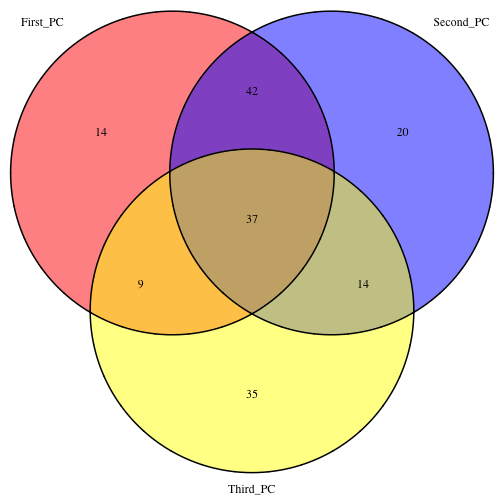
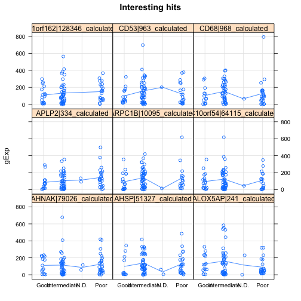

PCA Analysis
================


```r
rna_seq_dat_rpkm <- read.table("../../../data/aml.rnaseq.gaf2.0_rpkm_cleaned.txt", 
    sep = "\t", header = TRUE, check.names = FALSE)
rna_seq_dat_read <- read.table("../../../data/aml.rnaseq.gaf2.0_read_count_cleaned.txt", 
    sep = "\t", header = TRUE, check.names = FALSE)


exp_dat <- read.table("../../../data/experimental_design_cleaned.txt", sep = "\t", 
    header = TRUE, row.names = 1)

joined_dat_rpkm <- cbind(exp_dat, t(rna_seq_dat_rpkm))
joined_dat_read <- cbind(exp_dat, t(rna_seq_dat_read))
```


**Load libraries.**

```r
library(plyr)
library(kernlab)
library(taRifx)
```

```
## Loading required package: reshape2
```

```r
library(cvTools)
```

```
## Loading required package: lattice
## Loading required package: robustbase
```

```r
library(grid)
library(VennDiagram)
```

**Now, let's remove the columns with NA values - we won't use them at this time.**

```r
dat.complete.rpkm <- joined_dat_rpkm

dat.complete.read <- joined_dat_read
```


```
**Remove the rows with N.D.**

```r
dat.filt.rpkm <- subset(dat.complete.rpkm, dat.complete.rpkm$del_7 != "N.D.")
dat.filt.read <- subset(dat.complete.read, dat.complete.read$del_7 != "N.D.")
```


**let's make a binary prognosis columns (TRUE for poor).**

```r
dat.in.read <- dat.filt.read
dat.in.read$prognosis <- mapvalues(dat.in.read$del_7, c("TRUE", "FALSE"), c(1, 
    0), warn_missing = TRUE)
dat.in.rpkm <- dat.filt.rpkm
dat.in.rpkm$prognosis <- mapvalues(dat.in.rpkm$del_7, c("TRUE", "FALSE"), c(1, 
    0), warn_missing = TRUE)
```


**Make prelimary dataset with gene columns + prognosis + cyt risk.**

```r
prelim.in.read <- dat.in.read[, grepl("_*calculated", colnames(dat.in.read))]
gene.name.read <- colnames(prelim.in.read)
prelim.in.read <- dat.in.read[, c(colnames(prelim.in.read), "prognosis", "del_7")]

prelim.in.rpkm <- dat.in.rpkm[, grepl("_*calculated", colnames(dat.in.rpkm))]
gene.name.rpkm <- colnames(prelim.in.rpkm)
prelim.in.rpkm <- dat.in.rpkm[, c(colnames(prelim.in.rpkm), "prognosis", "del_7")]
```


**kernel PCA**

```r
library(geigen)
kernel_pca <- function(x.tr, x.ts, label.tr, d, flag) {
    # x.tr and x.ts are feature*sample flag =TRUE is for supervised kernel PCA
    # and flag= False is for kernel pca 'd' is the dimension of the data in the
    # new feature space
    n <- dim(x.tr)[2]
    I <- diag(n)
    e <- rep(1, n)
    s <- 1/n
    H <- I - s * tcrossprod(e)
    if (flag == TRUE) {
        L <- label.tr %*% t(label.tr)
        cat("Flag is true\n")
    } else {
        cat("Flag is false\n")
        L <- I
    }
    
    k <- t(x.tr) %*% x.tr
    Q <- k %*% H %*% L %*% H %*% k
    Q.svd <- svd(Q, nu = d, nv = d)
    U <- Q.svd$u[, 1:d]
    V <- Q.svd$v[, 1:d]
    D <- Q.svd$d[1:d]
    cat("Eigen values =", D, "\n")
    beta <- geigen(Q, k)
    mapped.tr <- beta$vectors %*% k
    mapped.ts <- beta$vectors %*% t(x.tr) %*% x.ts
    
    list(tr.dat = mapped.tr[1:d, ], ts.dat = mapped.ts[1:d, ])
}
```


**run svm**

```r
run_svm <- function(x.tr, x.ts) {
    conf_matrix <- matrix(0, nrow = 2, ncol = 2, dimnames = list(c("truePoor", 
        "trueNotPoor"), c("predPoor", "predNotPoor")))
    fit_svm <- ksvm(prognosis ~ ., x.tr)
    pred_svm <- predict(fit_svm, newdata = x.ts, type = "response")
    
    results <- table(x.ts$prognosis, pred_svm)
    print(results)
    conf_matrix[1, 1] <- conf_matrix[1, 1] + results[1, 1]
    conf_matrix[1, 2] <- conf_matrix[1, 2] + results[1, 2]
    conf_matrix[2, 1] <- conf_matrix[2, 1] + results[2, 1]
    conf_matrix[2, 2] <- conf_matrix[2, 2] + results[2, 2]
    
    sens_svm <- conf_matrix[1, 1]/sum(conf_matrix[1, ])
    spec_svm <- conf_matrix[2, 2]/sum(conf_matrix[2, ])
    cat("Specificity = ", sens_svm, "\n")
    cat("Sensitvity = ", spec_svm, "\n")
    
}
```


**Perform PCA-SVM by cross validation.**

```r
cross_validate <- function(prelim_in, d) {
    k <- 5
    set.seed(540)
    folds <- cvFolds(nrow(prelim.in.read), K = k)
    conf_matrix_ker <- matrix(0, nrow = 2, ncol = 2, dimnames = list(c("truePoor", 
        "trueNotPoor"), c("predPoor", "predNotPoor")))
    conf_matrix_sup <- matrix(0, nrow = 2, ncol = 2, dimnames = list(c("truePoor", 
        "trueNotPoor"), c("predPoor", "predNotPoor")))
    conf_matrix_basic <- matrix(0, nrow = 2, ncol = 2, dimnames = list(c("truePoor", 
        "trueNotPoor"), c("predPoor", "predNotPoor")))
    for (f in 1:k) {
        
        x.ts <- t(data.matrix(prelim.in[folds$subsets[folds$which == f, ], grepl(".*calculated", 
            colnames(prelim.in))]))
        ytest <- factor(prelim.in[folds$subsets[folds$which == f, ], c("prognosis")])
        ytest <- as.numeric(levels(ytest))[ytest]
        x.tr <- t(data.matrix(prelim.in[folds$subsets[folds$which != f, ], grepl(".*calculated", 
            colnames(prelim.in))]))
        ytrain <- factor(prelim.in[folds$subsets[folds$which != f, ], c("prognosis")])
        ytrain <- as.numeric(levels(ytrain))[ytrain]
        cat(ytest, "\n")
        cat(nrow(which(ytest == "1")))
        cat(nrow(which(ytest == "0")))
        
        # kernel PCA
        res <- kernel_pca((x.tr), (x.ts), ytrain, d, FALSE)
        
        xtrain <- t(res$tr.dat)
        xtest <- t(res$ts.dat)
        
        svp <- ksvm(xtrain, factor(ytrain), type = "C-svc", kernel = "rbfdot", 
            C = 100, scaled = c())
        ypred = predict(svp, xtest)
        results.ker <- table(factor(ytest), ypred)
        
        
        conf_matrix_ker[1, 1] <- conf_matrix_ker[1, 1] + results.ker[1, 1]
        conf_matrix_ker[1, 2] <- conf_matrix_ker[1, 2] + results.ker[1, 2]
        conf_matrix_ker[2, 1] <- conf_matrix_ker[2, 1] + results.ker[2, 1]
        conf_matrix_ker[2, 2] <- conf_matrix_ker[2, 2] + results.ker[2, 2]
        
        ############### supervised PCA
        cat("supervised PCA\n")
        sup.res <- kernel_pca((x.tr), (x.ts), ytrain, d, TRUE)
        
        xtrain <- t(res$tr.dat)
        
        xtest <- t(res$ts.dat)
        
        svp <- ksvm(xtrain, factor(ytrain), type = "C-svc", kernel = "rbfdot", 
            C = 100, scaled = c())
        ypred = predict(svp, xtest)
        results.sup <- table(factor(ytest), ypred)
        
        conf_matrix_sup[1, 1] <- conf_matrix_sup[1, 1] + results.sup[1, 1]
        conf_matrix_sup[1, 2] <- conf_matrix_sup[1, 2] + results.sup[1, 2]
        conf_matrix_sup[2, 1] <- conf_matrix_sup[2, 1] + results.sup[2, 1]
        conf_matrix_sup[2, 2] <- conf_matrix_sup[2, 2] + results.sup[2, 2]
        ############## 
        cat("basic PCA\n")
        # basic PCA
        princomp <- prcomp(prelim.in[, grepl(".*calculated", colnames(prelim.in))], 
            center = T, scale = F)
        
        xtrain <- princomp$x[folds$subsets[folds$which != f, ], 1:d]
        xtest <- princomp$x[folds$subsets[folds$which == f, ], 1:d]
        
        svp <- ksvm(xtrain, factor(ytrain), type = "C-svc", kernel = "rbfdot", 
            C = 100, scaled = c())
        ypred = predict(svp, xtest)
        results.basic <- table(factor(ytest), ypred)
        
        conf_matrix_basic[1, 1] <- conf_matrix_basic[1, 1] + results.basic[1, 
            1]
        conf_matrix_basic[1, 2] <- conf_matrix_basic[1, 2] + results.basic[1, 
            2]
        conf_matrix_basic[2, 1] <- conf_matrix_basic[2, 1] + results.basic[2, 
            1]
        conf_matrix_basic[2, 2] <- conf_matrix_basic[2, 2] + results.basic[2, 
            2]
    }
    list(basic = conf_matrix_basic, ker = conf_matrix_ker, sup = conf_matrix_sup)
}
```


```r
prepareData <- function(g, prDat, prDes) {
    pDat <- data.frame()
    for (i in 1:length(g)) {
        pDat1 <- data.frame(prDes, gExp = as.vector(as.matrix(prDat[g[i], ])), 
            gene = g[i])
        pDat <- rbind(pDat, pDat1)
    }
    pDat
}
```


**RPKM data analysis**

```r

prelim.in <- prelim.in.rpkm
gene.name <- gene.name.rpkm

rpkm.results <- cross_validate(prelim.in, 20)
```

```
## 0 1 0 0 0 0 1 0 0 0 0 0 1 0 0 0 0 0 0 0 0 0 0 0 0 0 0 0 1 0 0 0 0 0 0 0 
## Flag is false
## Eigen values = 2.542e+19 2.029e+19 6.83e+18 1.555e+18 2.879e+17 1.81e+17 1.076e+17 3.974e+16 3.386e+16 2.209e+16 1.536e+16 8.228e+15 6.351e+15 4.995e+15 2.883e+15 2.5e+15 1.809e+15 1.502e+15 1.111e+15 8.532e+14 
## Using automatic sigma estimation (sigest) for RBF or laplace kernel 
## supervised PCA
## Flag is true
## Eigen values = 1.489e+19 25219 13494 10509 9392 8745 8150 6285 5810 5664 5220 4499 4476 4262 3884 3788 3543 3394 3319 3164 
## Using automatic sigma estimation (sigest) for RBF or laplace kernel 
## basic PCA
## Using automatic sigma estimation (sigest) for RBF or laplace kernel 
## 0 0 0 0 0 0 0 0 1 1 1 1 0 0 0 0 0 0 0 0 0 0 0 0 0 0 0 0 0 0 0 0 0 0 0 0 
## Flag is false
## Eigen values = 3.03e+19 2.509e+19 8.713e+18 1.552e+18 2.576e+17 1.776e+17 1.048e+17 4.194e+16 2.959e+16 1.541e+16 8.361e+15 6.613e+15 4.832e+15 2.91e+15 1.98e+15 1.647e+15 1.127e+15 1.055e+15 8.542e+14 7.494e+14 
## Using automatic sigma estimation (sigest) for RBF or laplace kernel 
## supervised PCA
## Flag is true
## Eigen values = 1.661e+19 31123 15540 14565 13751 10220 10085 9754 8962 7954 7400 7127 6243 6159 6115 5763 5420 5230 4477 4364 
## Using automatic sigma estimation (sigest) for RBF or laplace kernel 
## basic PCA
## Using automatic sigma estimation (sigest) for RBF or laplace kernel 
## 0 0 0 0 0 0 1 0 0 0 0 1 0 0 1 0 0 0 0 0 0 0 1 0 0 0 0 0 0 0 0 0 0 0 0 0 
## Flag is false
## Eigen values = 3.087e+19 1.786e+19 5.969e+18 1.626e+18 2.874e+17 1.473e+17 9.163e+16 4.216e+16 3.499e+16 1.994e+16 9.734e+15 6.95e+15 6.156e+15 5.6e+15 3.029e+15 2.427e+15 1.75e+15 1.274e+15 9.921e+14 8.826e+14 
## Using automatic sigma estimation (sigest) for RBF or laplace kernel 
## supervised PCA
## Flag is true
## Eigen values = 2.176e+19 20585 19135 14426 12703 12556 10328 9879 9701 9459 9358 9287 8487 7523 6861 6251 5873 5833 5703 4710 
## Using automatic sigma estimation (sigest) for RBF or laplace kernel 
## basic PCA
## Using automatic sigma estimation (sigest) for RBF or laplace kernel 
## 0 0 0 0 0 0 0 0 0 0 1 1 0 0 0 0 0 1 1 0 0 0 0 0 0 0 0 0 0 0 0 0 0 0 0 0 
## Flag is false
## Eigen values = 3.222e+19 1.699e+19 9.727e+18 1.501e+18 3.549e+17 2.231e+17 7.782e+16 4.195e+16 2.705e+16 2.362e+16 1.528e+16 6.593e+15 5.275e+15 4.782e+15 3.054e+15 2.214e+15 1.691e+15 1.393e+15 1.048e+15 7.294e+14 
## Using automatic sigma estimation (sigest) for RBF or laplace kernel 
## supervised PCA
## Flag is true
## Eigen values = 2.223e+19 25826 21932 19745 17095 16900 16649 14353 14270 14036 13550 13428 13001 12459 11909 11729 10004 8950 8252 7490 
## Using automatic sigma estimation (sigest) for RBF or laplace kernel 
## basic PCA
## Using automatic sigma estimation (sigest) for RBF or laplace kernel 
## 0 0 0 0 0 0 0 0 0 0 0 0 0 1 0 1 0 0 0 0 0 0 0 1 0 0 0 0 0 0 1 0 1 0 0 
## Flag is false
## Eigen values = 2.839e+19 2.446e+19 7.79e+18 1.855e+18 2.515e+17 1.89e+17 9.881e+16 4.503e+16 3.888e+16 2.496e+16 1.312e+16 8.46e+15 6.38e+15 5.293e+15 3.602e+15 3.13e+15 2.22e+15 1.843e+15 1.262e+15 1.013e+15 
## Using automatic sigma estimation (sigest) for RBF or laplace kernel 
## supervised PCA
## Flag is true
## Eigen values = 1.926e+19 20237 19111 17109 15424 14491 13087 12696 12466 11431 11038 9498 8829 8637 8588 8102 7236 6572 6482 6383 
## Using automatic sigma estimation (sigest) for RBF or laplace kernel 
## basic PCA
## Using automatic sigma estimation (sigest) for RBF or laplace kernel
```

```r
# process CV results
conf_matrix_basic <- rpkm.results$basic
conf_matrix_ker <- rpkm.results$ker
conf_matrix_sup <- rpkm.results$sup

(sens_svm_basic <- conf_matrix_basic[1, 1]/sum(conf_matrix_basic[1, ]))
```

```
## [1] 0.981
```

```r
(spec_svm_basic <- conf_matrix_basic[2, 2]/sum(conf_matrix_basic[2, ]))
```

```
## [1] 0.381
```

```r


(sens_svm_ker <- conf_matrix_ker[1, 1]/sum(conf_matrix_ker[1, ]))
```

```
## [1] 0.9494
```

```r
(spec_svm_ker <- conf_matrix_ker[2, 2]/sum(conf_matrix_ker[2, ]))
```

```
## [1] 0.2857
```

```r


(sens_svm_sup <- conf_matrix_sup[1, 1]/sum(conf_matrix_sup[1, ]))
```

```
## [1] 0.9557
```

```r
(spec_svm_sup <- conf_matrix_sup[2, 2]/sum(conf_matrix_sup[2, ]))
```

```
## [1] 0.2857
```

```r

counts <- data.frame(specificty = c(sens_svm_basic, sens_svm_ker), sensetivity = c(spec_svm_basic, 
    spec_svm_ker))

row.names(counts) <- c("Basic PCA", "Kernelized PCA")
counts
```

```
##                specificty sensetivity
## Basic PCA          0.9810      0.3810
## Kernelized PCA     0.9494      0.2857
```

```r

barplot(c(counts$sensetivity, counts$specificty), main = "preformance of SVM on PCA versions on RPKM data", 
    xlab = "Sensetivity and specificity", col = c("red", "blue"), legend = c("Basic PCA", 
        "Kernelized PCA", "Supervised PCA"), beside = TRUE)
```

 


```r
sample <- rownames(dat.filt.rpkm[, grepl(".*calculated", colnames(dat.filt.rpkm))])
princomp <- prcomp(dat.filt.rpkm[, grepl(".*calculated", colnames(dat.filt.rpkm))], 
    center = T, scale = F)
pc <- data.matrix(cbind(exp_dat[sample, ], princomp$x[sample, 1:20]))

scatter <- pc[, c("Cytogenetic_risk", "del_5", "del_7", "PC1", "PC2", "PC3")]

splom(scatter, pch = 16, col = 1, pscale = 0, xlab = NULL, main = "Scatter plot matrix", 
    diag.panel = function(x, ...) {
        yLim <- current.panel.limits()$ylim
        d <- density(x, na.rm = TRUE)
        d$y <- with(d, yLim[1] + 0.95 * diff(yLim) * y/max(y))
        panel.lines(d, col = 1)
        diag.panel.splom(x, ...)
    })
```

 

```r

plot(princomp$x[, c("PC1", "PC2")], bg = as.numeric(dat.filt.rpkm$del_7), pch = 21, 
    cex = 1.5, main = "del_7")
legend("topright", as.character(levels(factor(dat.filt.rpkm$del_7))), pch = 21, 
    pt.bg = c(0, 1))
```

 

```r


selected_gene_1 <- rownames(subset(princomp$rotation, subset = abs(princomp$rotation[, 
    1]) > abs(mean(princomp$rotation[, 1]) + 1 * sd(princomp$rotation[, 1]))))
selected_gene_2 <- rownames(subset(princomp$rotation, subset = abs(princomp$rotation[, 
    2]) > abs(mean(princomp$rotation[, 2]) + 1 * sd(princomp$rotation[, 2]))))
selected_gene_3 <- rownames(subset(princomp$rotation, subset = abs(princomp$rotation[, 
    3]) > abs(mean(princomp$rotation[, 3]) + 1 * sd(princomp$rotation[, 3]))))
plot.new()
gene.set <- list(First_PC = selected_gene_1, Second_PC = selected_gene_2, Third_PC = selected_gene_3)
venn.plot <- venn.diagram(gene.set, filename = NULL, fill = c("red", "blue", 
    "yellow"), force.unique)

grid.draw(venn.plot)
```

 

```r

barplot(princomp$sd^2, main = "PCA Eigen Values")
```

 

```r

intersection_rpkm <- setdiff(union(union(selected_gene_1, selected_gene_2), 
    selected_gene_3), intersect(intersect(selected_gene_1, selected_gene_2), 
    selected_gene_3))

# comparing Read-count and RPKM data
intersection <- intersection_rpkm

gset <- list(RPKM = intersection_rpkm, Read_count = intersection_read)
```

```
## Error: object 'intersection_read' not found
```

```r


data <- prelim.in[, grepl("_*calculated", colnames(prelim.in))]
des <- exp_dat[rownames(prelim.in), ]

# stripplot(gExp ~ del_7 | intersection[1:9] ,
# prepareData(intersection[1:9], t(data), (des)), jitter.data = TRUE,
# auto.key = TRUE, type = c('p', 'a'), grid = TRUE, main= 'Interesting
# hits')
stripplot(gExp ~ Molecular_risk | intersection[1:9], prepareData(intersection[1:4], 
    t(data), (des)), jitter.data = TRUE, auto.key = TRUE, type = c("p", "a"), 
    grid = TRUE, main = "Interesting hits")
```

 

```r

```


