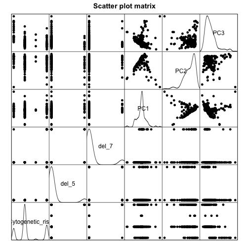
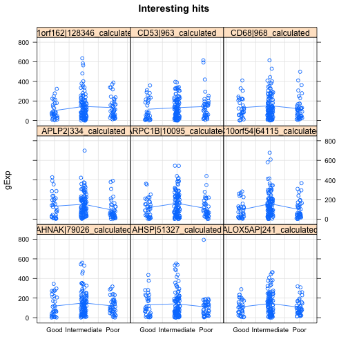

PCA Analysis
================


```r
rna_seq_dat_rpkm <- read.table("../../data/aml.rnaseq.gaf2.0_rpkm_cleaned.txt", 
    sep = "\t", header = TRUE, check.names = FALSE)
rna_seq_dat_read <- read.table("../../data/aml.rnaseq.gaf2.0_read_count_cleaned.txt", 
    sep = "\t", header = TRUE, check.names = FALSE)


exp_dat <- read.table("../../data/experimental_design_cleaned.txt", sep = "\t", 
    header = TRUE, row.names = 1)

joined_dat_rpkm <- cbind(exp_dat, t(rna_seq_dat_rpkm))
joined_dat_read <- cbind(exp_dat, t(rna_seq_dat_read))
```


**Load libraries.**

```r
library(plyr)
library(kernlab)
library(taRifx)
```

```
## Loading required package: reshape2
```

```r
library(cvTools)
```

```
## Loading required package: lattice
## Loading required package: robustbase
```

```r
library(grid)
library(VennDiagram)
```

**Now, let's remove the columns with NA values - we won't use them at this time.**

```r
dat.complete.rpkm <- joined_dat_rpkm

dat.complete.read <- joined_dat_read
```


```
**Remove the rows with N.D.**

```r
dat.filt.rpkm <- subset(dat.complete.rpkm, dat.complete.rpkm$Cytogenetic_risk != 
    "N.D.")
dat.filt.read <- subset(dat.complete.read, dat.complete.read$Cytogenetic_risk != 
    "N.D.")
```


**let's make a binary prognosis columns (TRUE for poor).**

```r
dat.in.read <- dat.filt.read
# change ccc for different classification
c.class <- c(0, 1, 0)
dat.in.read$prognosis <- mapvalues(dat.in.read$Cytogenetic_risk, c("Good", "Intermediate", 
    "Poor"), c.class, warn_missing = TRUE)
dat.in.rpkm <- dat.filt.rpkm
dat.in.rpkm$prognosis <- mapvalues(dat.in.rpkm$Cytogenetic_risk, c("Good", "Intermediate", 
    "Poor"), c.class, warn_missing = TRUE)
```


**Make prelimary dataset with gene columns + prognosis + cyt risk.**

```r
prelim.in.read <- dat.in.read[, grepl("_*calculated", colnames(dat.in.read))]
gene.name.read <- colnames(prelim.in.read)
prelim.in.read <- dat.in.read[, c(colnames(prelim.in.read), "prognosis", "Cytogenetic_risk")]

prelim.in.rpkm <- dat.in.rpkm[, grepl("_*calculated", colnames(dat.in.rpkm))]
gene.name.rpkm <- colnames(prelim.in.rpkm)
prelim.in.rpkm <- dat.in.rpkm[, c(colnames(prelim.in.rpkm), "prognosis", "Cytogenetic_risk")]
```


**kernel PCA**

```r
library(geigen)
kernel_pca <- function(x.tr, x.ts, label.tr, d, flag) {
    # x.tr and x.ts are feature*sample flag =TRUE is for supervised kernel PCA
    # and flag= False is for kernel pca 'd' is the dimension of the data in the
    # new feature space
    n <- dim(x.tr)[2]
    I <- diag(n)
    e <- rep(1, n)
    s <- 1/n
    H <- I - s * tcrossprod(e)
    if (flag == TRUE) {
        L <- label.tr %*% t(label.tr)
        cat("Flag is true\n")
    } else {
        cat("Flag is false\n")
        L <- I
    }
    
    k <- t(x.tr) %*% x.tr
    Q <- k %*% H %*% L %*% H %*% k
    Q.svd <- svd(Q, nu = d, nv = d)
    U <- Q.svd$u[, 1:d]
    V <- Q.svd$v[, 1:d]
    D <- Q.svd$d[1:d]
    cat("Eigen values =", D, "\n")
    beta <- geigen(Q, k)
    mapped.tr <- beta$vectors %*% k
    mapped.ts <- beta$vectors %*% t(x.tr) %*% x.ts
    
    list(tr.dat = mapped.tr[1:d, ], ts.dat = mapped.ts[1:d, ])
}
```


**run svm**

```r
run_svm <- function(x.tr, x.ts) {
    conf_matrix <- matrix(0, nrow = 2, ncol = 2, dimnames = list(c("truePoor", 
        "trueNotPoor"), c("predPoor", "predNotPoor")))
    fit_svm <- ksvm(prognosis ~ ., x.tr)
    pred_svm <- predict(fit_svm, newdata = x.ts, type = "response")
    
    results <- table(x.ts$prognosis, pred_svm)
    print(results)
    conf_matrix[1, 1] <- conf_matrix[1, 1] + results[1, 1]
    conf_matrix[1, 2] <- conf_matrix[1, 2] + results[1, 2]
    conf_matrix[2, 1] <- conf_matrix[2, 1] + results[2, 1]
    conf_matrix[2, 2] <- conf_matrix[2, 2] + results[2, 2]
    
    sens_svm <- conf_matrix[1, 1]/sum(conf_matrix[1, ])
    spec_svm <- conf_matrix[2, 2]/sum(conf_matrix[2, ])
    cat("Sensitvity = ", sens_svm, "\n")
    cat("Specificity = ", spec_svm, "\n")
    
}
```


**Perform PCA-SVM by cross validation.**

```r
cross_validate <- function(prelim_in, d) {
    k <- 5
    set.seed(540)
    folds <- cvFolds(nrow(prelim.in.read), K = k)
    conf_matrix_ker <- matrix(0, nrow = 2, ncol = 2, dimnames = list(c("truePoor", 
        "trueNotPoor"), c("predPoor", "predNotPoor")))
    conf_matrix_sup <- matrix(0, nrow = 2, ncol = 2, dimnames = list(c("truePoor", 
        "trueNotPoor"), c("predPoor", "predNotPoor")))
    conf_matrix_basic <- matrix(0, nrow = 2, ncol = 2, dimnames = list(c("truePoor", 
        "trueNotPoor"), c("predPoor", "predNotPoor")))
    for (f in 1:k) {
        
        x.ts <- t(data.matrix(prelim.in[folds$subsets[folds$which == f, ], grepl(".*calculated", 
            colnames(prelim.in))]))
        ytest <- factor(prelim.in[folds$subsets[folds$which == f, ], c("prognosis")])
        ytest <- as.numeric(levels(ytest))[ytest]
        x.tr <- t(data.matrix(prelim.in[folds$subsets[folds$which != f, ], grepl(".*calculated", 
            colnames(prelim.in))]))
        ytrain <- factor(prelim.in[folds$subsets[folds$which != f, ], c("prognosis")])
        ytrain <- as.numeric(levels(ytrain))[ytrain]
        cat(ytest, "\n")
        cat(nrow(which(ytest == "1")))
        cat(nrow(which(ytest == "0")))
        
        # kernel PCA
        res <- kernel_pca((x.tr), (x.ts), ytrain, d, FALSE)
        
        xtrain <- t(res$tr.dat)
        xtest <- t(res$ts.dat)
        
        svp <- ksvm(xtrain, factor(ytrain), type = "C-svc", kernel = "rbfdot", 
            C = 100, scaled = c())
        ypred = predict(svp, xtest)
        results.ker <- table(factor(ytest), ypred)
        
        
        # # #R kernel PCA xtest <-
        # prelim.in[folds$subsets[folds$which==f,],grepl('.*calculated',colnames(prelim.in))]
        # xtrain <-
        # prelim.in[folds$subsets[folds$which!=f,],grepl('.*calculated',colnames(prelim.in))]
        # kpc <- kpca(~.,data=xtrain,kernel='rbfdot',
        # kpar=list(sigma=0.2),features=d) #
        # plot(rotated(kpc),col=as.integer(ytrain),xlab='1st Principal
        # Component',ylab='2nd Principal Component') emb <- predict(kpc,xtest) #
        # points(emb,col=as.integer(ytest)) xtrain.ker.r <-
        # cbind(as.data.frame(rotated(kpc)), prognosis=factor(ytrain)) xtest.ker.r
        # <- cbind(as.data.frame(emb), prognosis=factor(ytest)) fit_svm <-
        # ksvm(prognosis~.,xtrain.ker.r) pred_svm <- predict(fit_svm, newdata=
        # xtest.ker.r, type='response')
        
        conf_matrix_ker[1, 1] <- conf_matrix_ker[1, 1] + results.ker[1, 1]
        conf_matrix_ker[1, 2] <- conf_matrix_ker[1, 2] + results.ker[1, 2]
        conf_matrix_ker[2, 1] <- conf_matrix_ker[2, 1] + results.ker[2, 1]
        conf_matrix_ker[2, 2] <- conf_matrix_ker[2, 2] + results.ker[2, 2]
        
        ############### supervised PCA
        cat("supervised PCA\n")
        sup.res <- kernel_pca((x.tr), (x.ts), ytrain, d, TRUE)
        
        xtrain <- t(res$tr.dat)
        
        xtest <- t(res$ts.dat)
        
        svp <- ksvm(xtrain, factor(ytrain), type = "C-svc", kernel = "rbfdot", 
            C = 100, scaled = c())
        ypred = predict(svp, xtest)
        results.sup <- table(factor(ytest), ypred)
        
        # fit_svm <- ksvm(prognosis~.,xtrain) pred_svm <- predict(fit_svm,
        # newdata=xtest, type='response')
        
        
        conf_matrix_sup[1, 1] <- conf_matrix_sup[1, 1] + results.sup[1, 1]
        conf_matrix_sup[1, 2] <- conf_matrix_sup[1, 2] + results.sup[1, 2]
        conf_matrix_sup[2, 1] <- conf_matrix_sup[2, 1] + results.sup[2, 1]
        conf_matrix_sup[2, 2] <- conf_matrix_sup[2, 2] + results.sup[2, 2]
        ############## 
        cat("basic PCA\n")
        # basic PCA
        princomp <- prcomp(prelim.in[, grepl(".*calculated", colnames(prelim.in))], 
            center = T, scale = F)
        # princomp.t <-
        # prcomp(t(prelim.in[,grepl('.*calculated',colnames(prelim.in))]), center =
        # T, scale = F) xtrain <-
        # princomp.t$rotation[folds$subsets[folds$which!=f,], 1:d] xtest <-
        # princomp.t$rotation[folds$subsets[folds$which==f,], 1:d]
        
        
        
        
        xtrain <- princomp$x[folds$subsets[folds$which != f, ], 1:d]
        xtest <- princomp$x[folds$subsets[folds$which == f, ], 1:d]
        
        svp <- ksvm(xtrain, factor(ytrain), type = "C-svc", kernel = "rbfdot", 
            C = 100, scaled = c())
        ypred = predict(svp, xtest)
        results.basic <- table(factor(ytest), ypred)
        
        
        conf_matrix_basic[1, 1] <- conf_matrix_basic[1, 1] + results.basic[1, 
            1]
        conf_matrix_basic[1, 2] <- conf_matrix_basic[1, 2] + results.basic[1, 
            2]
        conf_matrix_basic[2, 1] <- conf_matrix_basic[2, 1] + results.basic[2, 
            1]
        conf_matrix_basic[2, 2] <- conf_matrix_basic[2, 2] + results.basic[2, 
            2]
    }
    list(basic = conf_matrix_basic, ker = conf_matrix_ker, sup = conf_matrix_sup)
}
```


```r
prepareData <- function(g, prDat, prDes) {
    pDat <- data.frame()
    for (i in 1:length(g)) {
        pDat1 <- data.frame(prDes, gExp = as.vector(as.matrix(prDat[g[i], ])), 
            gene = g[i])
        pDat <- rbind(pDat, pDat1)
    }
    pDat
}
```


```r
# main part

# prelim.in <- prelim.in.read gene.name <- gene.name.read read.results <-
# cross_validate(prelim.in, 20) conf_matrix_basic <- read.results$basic
# conf_matrix_ker <- read.results$ker conf_matrix_sup <- read.results$sup
# #process CV results (sens_svm_basic <-
# conf_matrix_basic[1,1]/sum(conf_matrix_basic[1,])) (spec_svm_basic <-
# conf_matrix_basic[2,2]/sum(conf_matrix_basic[2,])) (sens_svm_ker <-
# conf_matrix_ker[1,1]/sum(conf_matrix_ker[1,])) (spec_svm_ker <-
# conf_matrix_ker[2,2]/sum(conf_matrix_ker[2,])) (sens_svm_sup <-
# conf_matrix_sup[1,1]/sum(conf_matrix_sup[1,])) (spec_svm_sup <-
# conf_matrix_sup[2,2]/sum(conf_matrix_sup[2,])) counts <-
# data.frame(sensetivity = c(sens_svm_basic,sens_svm_ker,sens_svm_sup ),
# specificty=c(spec_svm_basic,spec_svm_ker,spec_svm_sup)) row.names(counts)
# <- c('Basic PCA','Kernelized PCA','Supervised PCA') counts
# barplot(c(counts$sensetivity, counts$specificty), main='preformance of SVM
# on PCa versions', xlab='Number of Gears', col=c('red', 'blue', 'green'),
# legend = c('Basic PCA','Kernelized PCA','Supervised PCA'), beside=TRUE)
# princomp <- prcomp(prelim.in[,grepl('.*calculated',colnames(prelim.in))],
# center = T, scale = F) smoothScatter(princomp$x) #generates a smooth
# scatter plot that shows the density of the data points.  selected_gene_1
# <- rownames(subset(princomp$rotation,
# subset=abs(princomp$rotation[,1])>abs(mean(princomp$rotation[,1])+1*sd(princomp$rotation[,1]))))
# selected_gene_2 <- rownames(subset(princomp$rotation,
# subset=abs(princomp$rotation[,2])>abs(mean(princomp$rotation[,2])+1*sd(princomp$rotation[,2]))))
# selected_gene_3 <- rownames(subset(princomp$rotation,
# subset=abs(princomp$rotation[,3])>abs(mean(princomp$rotation[,3])+1*sd(princomp$rotation[,3]))))
# plot.new() gene.set <- list(First_PC= selected_gene_1, Second_PC=
# selected_gene_2, Third_PC = selected_gene_3) venn.plot <-
# venn.diagram(gene.set, filename = NULL, fill = c('red', 'blue',
# 'yellow'),force.unique) grid.draw(venn.plot) barplot(princomp$sd^2, main
# ='PCA Eigen Values') intersection_read <-
# intersect(intersect(selected_gene_1, selected_gene_2), selected_gene_3)
```

**RPKM data analysis**

```r

prelim.in <- prelim.in.rpkm
gene.name <- gene.name.rpkm

rpkm.results <- cross_validate(prelim.in, 20)
```

```
## 0 0 1 1 0 0 1 0 1 0 1 1 0 1 0 1 1 0 1 1 0 1 1 0 0 1 1 0 0 0 0 0 0 0 0 1 
## Flag is false
## Eigen values = 3.097e+19 2.251e+19 6.338e+18 1.364e+18 2.369e+17 1.467e+17 1.034e+17 4.26e+16 3.033e+16 1.728e+16 1.256e+16 8.594e+15 5.361e+15 4.715e+15 3.106e+15 1.868e+15 1.519e+15 1.293e+15 1.095e+15 7.985e+14 
## Using automatic sigma estimation (sigest) for RBF or laplace kernel 
## supervised PCA
## Flag is true
## Eigen values = 4.663e+19 818270 55584 52074 43880 41419 32097 31507 29994 28228 26343 24742 22940 22162 20580 18559 15402 14373 14038 14030 
## Using automatic sigma estimation (sigest) for RBF or laplace kernel 
## basic PCA
## Using automatic sigma estimation (sigest) for RBF or laplace kernel 
## 1 0 0 1 1 0 1 1 0 0 0 1 1 1 1 1 0 0 1 1 1 1 1 0 0 0 0 1 0 1 1 1 1 1 1 
## Flag is false
## Eigen values = 3.261e+19 2.059e+19 8.025e+18 1.812e+18 3.295e+17 2.022e+17 1.188e+17 3.931e+16 3.372e+16 2.361e+16 1.423e+16 7.582e+15 5.743e+15 4.101e+15 3.227e+15 1.761e+15 1.453e+15 1.097e+15 9.347e+14 8.47e+14 
## Using automatic sigma estimation (sigest) for RBF or laplace kernel 
## supervised PCA
## Flag is true
## Eigen values = 9.922e+19 1553390 127914 88386 88124 75560 61805 58743 56888 54209 50619 48087 41459 38724 35811 33187 32488 32361 29439 27777 
## Using automatic sigma estimation (sigest) for RBF or laplace kernel 
## basic PCA
## Using automatic sigma estimation (sigest) for RBF or laplace kernel 
## 1 1 1 0 1 1 0 0 1 0 1 0 1 0 1 1 1 0 0 0 1 1 1 1 1 0 1 0 1 1 1 1 0 1 0 
## Flag is false
## Eigen values = 2.794e+19 2.139e+19 5.985e+18 1.637e+18 2.837e+17 1.568e+17 7.886e+16 3.344e+16 2.437e+16 1.873e+16 1.222e+16 6.149e+15 5.801e+15 4.806e+15 2.461e+15 2.08e+15 1.57e+15 1.332e+15 9.391e+14 8.723e+14 
## Using automatic sigma estimation (sigest) for RBF or laplace kernel 
## supervised PCA
## Flag is true
## Eigen values = 5.177e+19 1136392 45979 38526 37905 33994 30920 26795 23874 23768 23589 22177 21294 21022 20323 20257 19538 15936 15260 13836 
## Using automatic sigma estimation (sigest) for RBF or laplace kernel 
## basic PCA
## Using automatic sigma estimation (sigest) for RBF or laplace kernel 
## 1 0 1 0 0 0 1 1 0 1 0 0 1 1 0 0 1 1 0 1 0 1 1 1 1 0 1 0 1 1 1 0 0 0 0 
## Flag is false
## Eigen values = 2.952e+19 1.824e+19 8.705e+18 1.413e+18 2.818e+17 2.122e+17 8.527e+16 3.965e+16 2.954e+16 2.427e+16 8.895e+15 6.684e+15 6.535e+15 4.633e+15 2.948e+15 2.458e+15 2.043e+15 1.584e+15 1.054e+15 8.188e+14 
## Using automatic sigma estimation (sigest) for RBF or laplace kernel 
## supervised PCA
## Flag is true
## Eigen values = 4.2e+19 914334 44448 41425 37307 36994 29767 29710 28490 22901 22192 19540 18000 16055 14982 14530 14106 13370 12716 12554 
## Using automatic sigma estimation (sigest) for RBF or laplace kernel 
## basic PCA
## Using automatic sigma estimation (sigest) for RBF or laplace kernel 
## 1 1 0 1 1 1 1 1 0 0 1 1 0 0 1 0 1 1 1 1 1 0 1 1 0 0 1 0 1 0 1 1 0 1 1 
## Flag is false
## Eigen values = 2.852e+19 1.791e+19 7.489e+18 1.66e+18 2.927e+17 1.401e+17 1.273e+17 4.912e+16 3.795e+16 2.517e+16 1.181e+16 7.113e+15 5.149e+15 3.496e+15 3.148e+15 2.286e+15 1.708e+15 1.21e+15 1.001e+15 7.766e+14 
## Using automatic sigma estimation (sigest) for RBF or laplace kernel 
## supervised PCA
## Flag is true
## Eigen values = 3.899e+19 894841 42729 34630 34619 32387 26495 25720 25695 25169 23702 20326 19217 18470 17989 17055 16933 16834 14541 12329 
## Using automatic sigma estimation (sigest) for RBF or laplace kernel 
## basic PCA
## Using automatic sigma estimation (sigest) for RBF or laplace kernel
```

```r
# process CV results
conf_matrix_basic <- rpkm.results$basic
conf_matrix_ker <- rpkm.results$ker
conf_matrix_sup <- rpkm.results$sup

(sens_svm_basic <- conf_matrix_basic[1, 1]/sum(conf_matrix_basic[1, ]))
```

```
## [1] 0.6933
```

```r
(spec_svm_basic <- conf_matrix_basic[2, 2]/sum(conf_matrix_basic[2, ]))
```

```
## [1] 0.6634
```

```r


(sens_svm_ker <- conf_matrix_ker[1, 1]/sum(conf_matrix_ker[1, ]))
```

```
## [1] 0.6
```

```r
(spec_svm_ker <- conf_matrix_ker[2, 2]/sum(conf_matrix_ker[2, ]))
```

```
## [1] 0.6733
```

```r


(sens_svm_sup <- conf_matrix_sup[1, 1]/sum(conf_matrix_sup[1, ]))
```

```
## [1] 0.6
```

```r
(spec_svm_sup <- conf_matrix_sup[2, 2]/sum(conf_matrix_sup[2, ]))
```

```
## [1] 0.6337
```

```r
counts <- data.frame(specificty = c(sens_svm_basic, sens_svm_ker), sensetivity = c(spec_svm_basic, 
    spec_svm_ker))

# row.names(counts) <- c('Basic PCA','Kernelized PCA','Supervised PCA')
row.names(counts) <- c("Basic PCA", "Kernelized PCA")
counts
```

```
##                specificty sensetivity
## Basic PCA          0.6933      0.6634
## Kernelized PCA     0.6000      0.6733
```

```r


barplot(c(counts$sensetivity, counts$specificty), main = "preformance of SVM on PCA versions on RPKM data", 
    xlab = "Sensetivity and specificity", col = c("red", "blue"), legend = c("Basic PCA", 
        "Kernelized PCA"), beside = TRUE)
```

 

```r

princomp <- prcomp(prelim.in[, grepl(".*calculated", colnames(prelim.in))], 
    center = T, scale = F)
smoothScatter(princomp$x)  #generates a smooth scatter plot that shows the density of the data points.
```

```
## KernSmooth 2.23 loaded
## Copyright M. P. Wand 1997-2009
```

 

```r
pdf(file = "cytogenetic_risk.pdf")
plot(princomp$x[, c("PC1", "PC2")], bg = as.numeric(prelim.in$Cytogenetic_risk), 
    pch = 21, cex = 1.5, main = "Cytogenic_risk")
legend("topright", as.character(levels(factor(prelim.in$Cytogenetic_risk))), 
    pch = 21, pt.bg = c(1, 2, 4))
dev.off()
```

```
## pdf 
##   2
```

```r

selected_gene_1 <- rownames(subset(princomp$rotation, subset = abs(princomp$rotation[, 
    1]) > abs(mean(princomp$rotation[, 1]) + 1 * sd(princomp$rotation[, 1]))))
selected_gene_2 <- rownames(subset(princomp$rotation, subset = abs(princomp$rotation[, 
    2]) > abs(mean(princomp$rotation[, 2]) + 1 * sd(princomp$rotation[, 2]))))
selected_gene_3 <- rownames(subset(princomp$rotation, subset = abs(princomp$rotation[, 
    3]) > abs(mean(princomp$rotation[, 3]) + 1 * sd(princomp$rotation[, 3]))))
plot.new()
gene.set <- list(First_PC = selected_gene_1, Second_PC = selected_gene_2, Third_PC = selected_gene_3)
venn.plot <- venn.diagram(gene.set, filename = NULL, fill = c("red", "blue", 
    "yellow"), force.unique)

grid.draw(venn.plot)
```

 

```r

barplot(princomp$sd^2, main = "PCA Eigen Values")
```

 

```r

intersection_rpkm <- setdiff(union(union(selected_gene_1, selected_gene_2), 
    selected_gene_3), intersect(intersect(selected_gene_1, selected_gene_2), 
    selected_gene_3))
```


```r
# comparing Read-count and RPKM data
intersection <- intersection_rpkm

gset <- list(RPKM = intersection_rpkm, Read_count = intersection_read)
```

```
## Error: object 'intersection_read' not found
```

```r

data <- prelim.in[, grepl("_*calculated", colnames(prelim.in))]
des <- exp_dat[rownames(prelim.in), ]

stripplot(gExp ~ Cytogenetic_risk | intersection[1:9], prepareData(intersection[1:9], 
    t(data), (des)), jitter.data = TRUE, auto.key = TRUE, type = c("p", "a"), 
    grid = TRUE, main = "Interesting hits")
```

 

```r
stripplot(gExp ~ Molecular_risk | intersection[1:9], prepareData(intersection[1:4], 
    t(data), (des)), jitter.data = TRUE, auto.key = TRUE, type = c("p", "a"), 
    grid = TRUE, main = "Interesting hits")
```

 


```r
sample <- rownames(dat.filt.rpkm[, grepl(".*calculated", colnames(dat.filt.rpkm))])
princomp <- prcomp(dat.filt.rpkm[, grepl(".*calculated", colnames(dat.filt.rpkm))], 
    center = T, scale = F)
pc <- data.matrix(cbind(exp_dat[sample, ], princomp$x[sample, 1:20]))
scatter <- pc[, c("Cytogenetic_risk", "del_5", "del_7", "PC1", "PC2", "PC3")]
splom(scatter, pch = 16, col = 1, pscale = 0, xlab = NULL, main = "Scatter plot matrix", 
    diag.panel = function(x, ...) {
        yLim <- current.panel.limits()$ylim
        d <- density(x, na.rm = TRUE)
        d$y <- with(d, yLim[1] + 0.95 * diff(yLim) * y/max(y))
        panel.lines(d, col = 1)
        diag.panel.splom(x, ...)
    })
```

 


