Random forest exploratory analysis
========================================================

Load the data and metadata. In this analysis, I will be using the cleaned RPKM data.

Load libraries:

```r
library(kernlab)
library(cvTools)
```

```
## Loading required package: lattice
## Loading required package: robustbase
```

```r
library(randomForest)
```

```
## randomForest 4.6-7
## Type rfNews() to see new features/changes/bug fixes.
```

```r
library(edgeR)
```

```
## Loading required package: limma
```

```r
library(caret)
```

```
## Warning: package 'caret' was built under R version 3.0.3
```

```
## Loading required package: ggplot2
```

```r
library(plyr)
library(limma)
library(VennDiagram)
```

```
## Loading required package: grid
```


```r
rDes <- read.delim("../../data/experimental_design_cleaned.txt")
rownames(rDes) <- rDes$TCGA_patient_id
rDat <- read.delim("../../data/aml.rnaseq.gaf2.0_rpkm_cleaned.txt", row.names = 1, 
    check.names = FALSE)
```


## 1) Functions for cross-validation

```r
# Function to select features using linear models input.dat: training data
# set input.labels: true outcomes for training data
fs.lm <- function(input.dat, input.labels) {
    norm.factor <- calcNormFactors(input.dat)
    design <- model.matrix(~input.labels)
    colnames(design) <- c("Intercept", "Label")
    dat.voomed <- voom(input.dat, design, lib.size = colSums(input.dat) * norm.factor)
    fit <- lmFit(dat.voomed, design)
    ebFit <- eBayes(fit)
    hits <- topTable(ebFit, n = Inf, coef = "Label")
    train.features <- rownames(hits)[1:25]
    return(train.features)
}
```


```r
# Function to choose features using correlations to outcomes input.dat:
# training data set input.labels: true outcomes for training data
fs.corr <- function(input.dat, input.levels) {
    gene.corrs <- apply(input.dat, 1, function(x) return(suppressWarnings(cor(x, 
        as.numeric(input.levels)))))
    gene.corrs <- gene.corrs[order(abs(gene.corrs), na.last = NA, decreasing = TRUE)]
    return(names(gene.corrs[1:25]))
}
```


```r
# Function to run k-fold cross validation with a random forest all.dat: all
# data used in the analysis all.labels: true outcomes for the data K: number
# of folds to use in CV fs.method: the strategy to use for feature selection
rf.cv <- function(all.dat, all.labels, all.levels, K = 5, fs.method = "lm", 
    plot.varimp = TRUE) {
    set.seed(540)
    folds <- cvFolds(ncol(all.dat), K = K)
    
    conf_matrix <- matrix(0, nrow = 2, ncol = 2, dimnames = list(c("true0", 
        "true1"), c("pred0", "pred1")))
    feature.list <- list()
    
    for (f in 1:K) {
        train.samples <- folds$subsets[folds$which != f, ]
        test.samples <- folds$subsets[folds$which == f, ]
        
        if (fs.method == "lm") {
            train.features <- fs.lm(all.dat[, train.samples], all.labels[train.samples])
        } else if (fs.method == "corr") {
            train.features <- fs.corr(all.dat[, train.samples], all.labels[train.samples])
        }
        feature.list[[paste("Fold", f, sep = "")]] <- train.features
        
        train.dat <- data.frame(class = all.labels[train.samples], t(all.dat[train.features, 
            train.samples]))
        test.dat <- data.frame(t(all.dat[train.features, test.samples]))
        test.labels <- all.labels[test.samples]
        
        fit.rf <- randomForest(class ~ ., train.dat)
        if (plot.varimp) {
            varImpPlot(fit.rf)
        }
        
        pred.rf <- predict(fit.rf, newdata = test.dat, type = "response")
        
        results <- table(test.labels, pred.rf)
        
        conf_matrix[1, 1] <- conf_matrix[1, 1] + results[1, 1]
        conf_matrix[1, 2] <- conf_matrix[1, 2] + results[1, 2]
        conf_matrix[2, 1] <- conf_matrix[2, 1] + results[2, 1]
        conf_matrix[2, 2] <- conf_matrix[2, 2] + results[2, 2]
    }
    
    rf.sens <- conf_matrix[2, 2]/sum(conf_matrix[2, ])
    rf.spec <- conf_matrix[1, 1]/sum(conf_matrix[1, ])
    rf.acc <- (conf_matrix[1, 1] + conf_matrix[2, 2])/sum(conf_matrix)
    
    return(list(acc = rf.acc, sens = rf.sens, spec = rf.spec, feature.list = feature.list))
}
```


## 2) Train RF to predict cytogenetic risk, use linear models for feature selection

Set up the data. Remove samples where the cytogenetic risk category is not determined, and set categories to poor and not poor:

```r
rfDes <- rDes[rDes$Cytogenetic_risk != "N.D.", ]
rf.labels <- mapvalues(rfDes$Cytogenetic_risk, c("Good", "Intermediate", "Poor"), 
    c(0, 0, 1), warn_missing = TRUE)
rf.labels <- factor(rf.labels)
rf.levels <- mapvalues(rfDes$Cytogenetic_risk, c("Good", "Intermediate", "Poor"), 
    c(3, 2, 1), warn_missing = TRUE)
rf.levels <- factor(rf.levels)
rfDat <- rDat[, rownames(rfDes)]
```


Run a 5-fold cross-validation for the data:

```r
cv.risk.res <- rf.cv(rfDat, rf.labels, rf.levels, K = 5, fs.method = "lm")
```

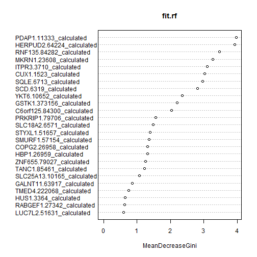 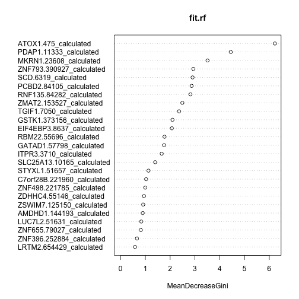 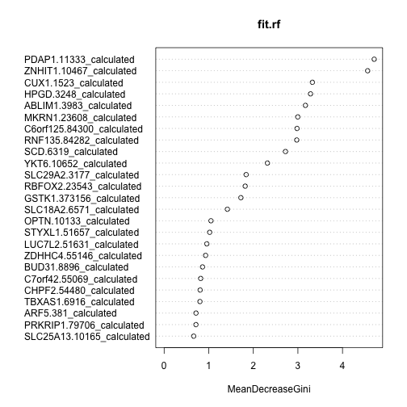 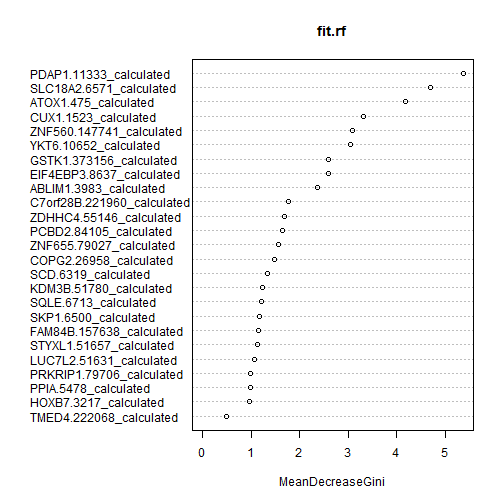 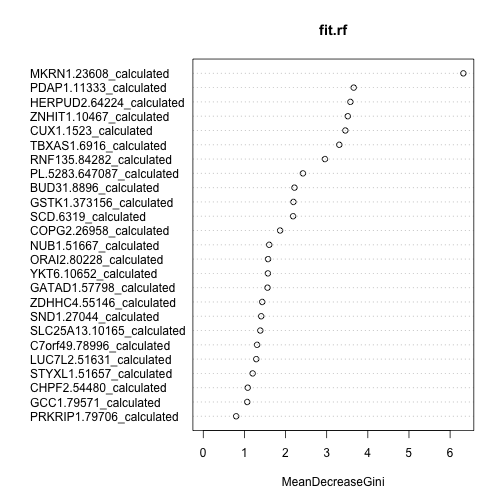 

```r
cv.risk.res[1:3]
```

```
## $acc
## [1] 0.8523
## 
## $sens
## [1] 0.5714
## 
## $spec
## [1] 0.9403
```

```r
fts <- cv.risk.res[[4]]

plot.new()
venn.plot <- venn.diagram(fts, filename = NULL, fill = c("red", "blue", "green", 
    "yellow", "purple"), margin = 0.1)
grid.draw(venn.plot)
```

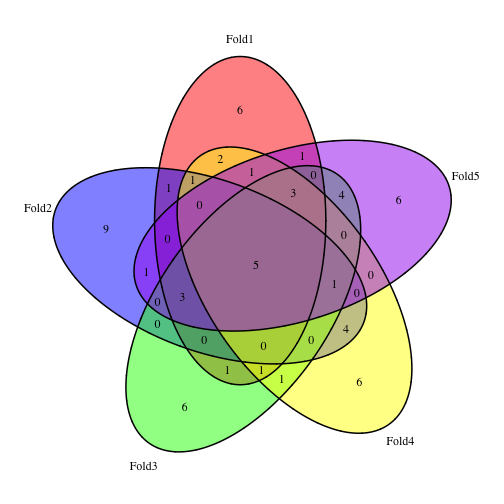 

```r

(common.fts.risk <- intersect(fts[[1]], intersect(fts[[2]], intersect(fts[[3]], 
    intersect(fts[[4]], fts[[5]])))))
```

```
## [1] "SCD|6319_calculated"     "STYXL1|51657_calculated"
## [3] "PDAP1|11333_calculated"  "LUC7L2|51631_calculated"
## [5] "GSTK1|373156_calculated"
```


## 3) Predict the different cytogenetic mutations, use linear models for feature selection

First look at trisomy 8:

```r
cv.trisomy8.res <- rf.cv(rDat, factor(as.numeric(rDes$trisomy_8)), rf.levels, 
    K = 5, fs.method = "lm")
```

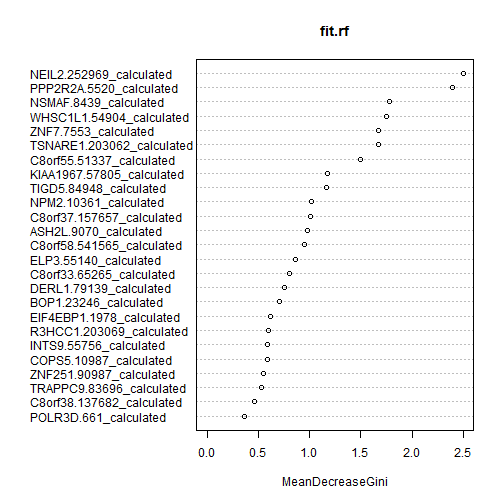 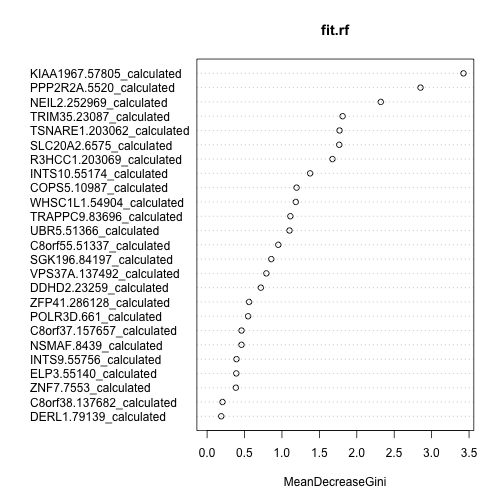  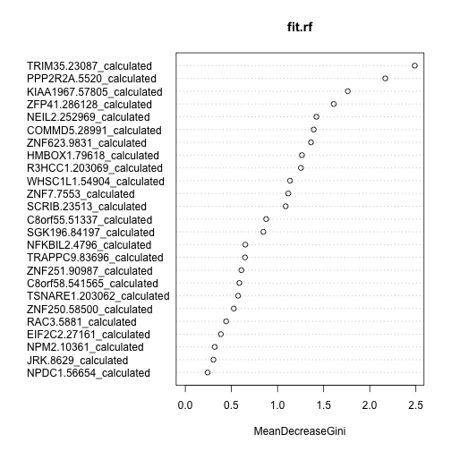 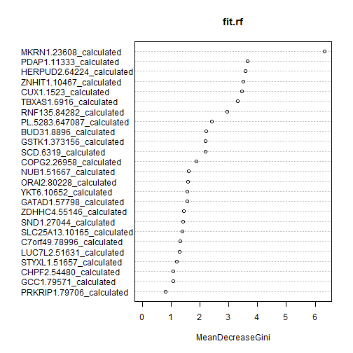 

```r
cv.trisomy8.res[1:3]
```

```
## $acc
## [1] 0.9553
## 
## $sens
## [1] 0.6842
## 
## $spec
## [1] 0.9875
```

```r
fts <- cv.trisomy8.res[[4]]

plot.new()
venn.plot <- venn.diagram(fts, filename = NULL, fill = c("red", "blue", "green", 
    "yellow", "purple"), margin = 0.1)
grid.draw(venn.plot)
```

 

```r

(common.fts.trisomy8 <- intersect(fts[[1]], intersect(fts[[2]], intersect(fts[[3]], 
    intersect(fts[[4]], fts[[5]])))))
```

```
## [1] "NEIL2|252969_calculated"   "PPP2R2A|5520_calculated"  
## [3] "ZNF7|7553_calculated"      "KIAA1967|57805_calculated"
## [5] "R3HCC1|203069_calculated"  "TSNARE1|203062_calculated"
## [7] "C8orf55|51337_calculated"  "ZFP41|286128_calculated"
```


Next look at deletions of chromosome 5:

```r
cv.del5.res <- rf.cv(rDat, factor(as.numeric(rDes$del_5)), rf.levels, K = 5, 
    fs.method = "lm")
```

     

```r
cv.del5.res[1:3]
```

```
## $acc
## [1] 0.9721
## 
## $sens
## [1] 0.8125
## 
## $spec
## [1] 0.9877
```

```r
fts <- cv.del5.res[[4]]

plot.new()
venn.plot <- venn.diagram(fts, filename = NULL, fill = c("red", "blue", "green", 
    "yellow", "purple"), margin = 0.1)
grid.draw(venn.plot)
```

 

```r

(common.fts.del5 <- intersect(fts[[1]], intersect(fts[[2]], intersect(fts[[3]], 
    intersect(fts[[4]], fts[[5]])))))
```

```
##  [1] "KDM3B|51780_calculated"        "EIF4EBP3|8637_calculated"     
##  [3] "PCBD2|84105_calculated"        "KIAA0141|9812|1of2_calculated"
##  [5] "PFDN1|5201_calculated"         "RBM22|55696_calculated"       
##  [7] "ZMAT2|153527_calculated"       "CSNK1A1|1452_calculated"      
##  [9] "PPP2CA|5515_calculated"        "WDR55|54853_calculated"       
## [11] "CATSPER3|347732_calculated"    "HARS|3035_calculated"
```


Next look at deletions of chromosome 7:

```r
cv.del7.res <- rf.cv(rDat, factor(as.numeric(rDes$del_7)), rf.levels, K = 5, 
    fs.method = "lm")
```

     

```r
cv.del7.res[1:3]
```

```
## $acc
## [1] 0.9497
## 
## $sens
## [1] 0.7143
## 
## $spec
## [1] 0.981
```

```r
fts <- cv.del7.res[[4]]

plot.new()
venn.plot <- venn.diagram(fts, filename = NULL, fill = c("red", "blue", "green", 
    "yellow", "purple"), margin = 0.1)
grid.draw(venn.plot)
```

 

```r

(common.fts.del7 <- intersect(fts[[1]], intersect(fts[[2]], intersect(fts[[3]], 
    intersect(fts[[4]], fts[[5]])))))
```

```
## [1] "LUC7L2|51631_calculated"   "PDAP1|11333_calculated"   
## [3] "MKRN1|23608_calculated"    "SLC25A13|10165_calculated"
## [5] "GATAD1|57798_calculated"   "GSTK1|373156_calculated"  
## [7] "STYXL1|51657_calculated"   "SUMF2|25870_calculated"   
## [9] "CASP2|835_calculated"
```


Now get a sense of how many genes are shared between these 4 different sets:

```r
fts.all <- list(risk = common.fts.risk, trisomy8 = common.fts.trisomy8, del5 = common.fts.del5, 
    del7 = common.fts.del7)
plot.new()
venn.plot <- venn.diagram(fts.all, filename = NULL, fill = c("red", "yellow", 
    "blue", "green"))
grid.draw(venn.plot)
```

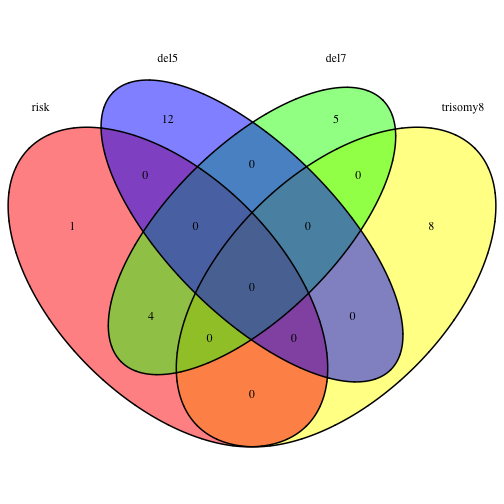 


## 4) Train RF to predict cytogenetic risk, use correlations for feature selection

Set up the data. Remove samples where the cytogenetic risk category is not determined, and set categories to poor and not poor:


Run a 5-fold cross-validation for the data:

```r
cv.risk.res <- rf.cv(rfDat, rf.labels, rf.levels, K = 5, fs.method = "corr")
```

     

```r
cv.risk.res[1:3]
```

```
## $acc
## [1] 0.875
## 
## $sens
## [1] 0.619
## 
## $spec
## [1] 0.9552
```

```r
fts <- cv.risk.res[[4]]

plot.new()
venn.plot <- venn.diagram(fts, filename = NULL, fill = c("red", "blue", "green", 
    "yellow", "purple"), margin = 0.1)
grid.draw(venn.plot)
```

 

```r

(common.fts.risk <- intersect(fts[[1]], intersect(fts[[2]], intersect(fts[[3]], 
    intersect(fts[[4]], fts[[5]])))))
```

```
## [1] "ZNF229|7772_calculated" "ITPR3|3710_calculated"
```


## 3) Predict the different cytogenetic mutations, use correlations for feature selection

First look at trisomy 8:

```r
cv.trisomy8.res <- rf.cv(rDat, factor(as.numeric(rDes$trisomy_8)), rf.levels, 
    K = 5, fs.method = "corr")
```

     

```r
cv.trisomy8.res[1:3]
```

```
## $acc
## [1] 0.9441
## 
## $sens
## [1] 0.6316
## 
## $spec
## [1] 0.9812
```

```r
fts <- cv.trisomy8.res[[4]]

plot.new()
venn.plot <- venn.diagram(fts, filename = NULL, fill = c("red", "blue", "green", 
    "yellow", "purple"), margin = 0.1)
grid.draw(venn.plot)
```

 

```r

(common.fts.trisomy8 <- intersect(fts[[1]], intersect(fts[[2]], intersect(fts[[3]], 
    intersect(fts[[4]], fts[[5]])))))
```

```
## [1] "PPP2R2A|5520_calculated"   "NEIL2|252969_calculated"  
## [3] "KIAA1967|57805_calculated" "ZNF7|7553_calculated"     
## [5] "TSNARE1|203062_calculated" "C8orf55|51337_calculated" 
## [7] "R3HCC1|203069_calculated"
```


Next look at deletions of chromosome 5:

```r
cv.del5.res <- rf.cv(rDat, factor(as.numeric(rDes$del_5)), rf.levels, K = 5, 
    fs.method = "corr")
```

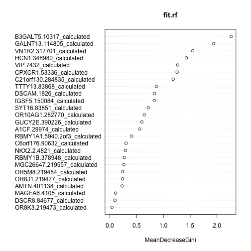 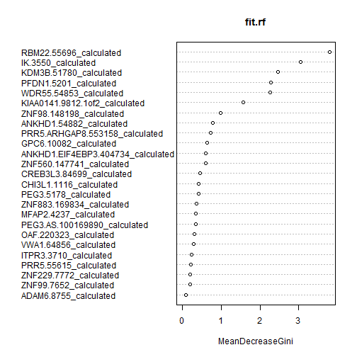 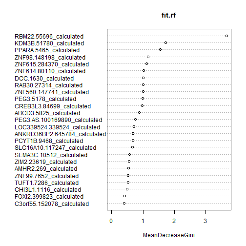 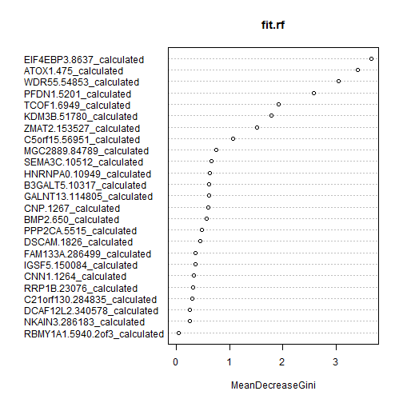 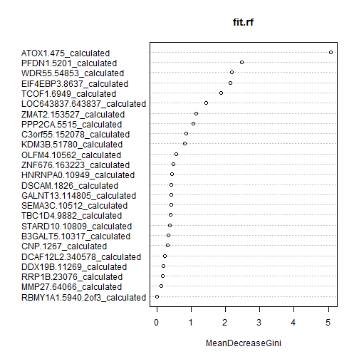 

```r
cv.del5.res[1:3]
```

```
## $acc
## [1] 0.9385
## 
## $sens
## [1] 0.4375
## 
## $spec
## [1] 0.9877
```

```r
fts <- cv.del5.res[[4]]

plot.new()
venn.plot <- venn.diagram(fts, filename = NULL, fill = c("red", "blue", "green", 
    "yellow", "purple"), margin = 0.1)
grid.draw(venn.plot)
```

 

```r

(common.fts.del5 <- intersect(fts[[1]], intersect(fts[[2]], intersect(fts[[3]], 
    intersect(fts[[4]], fts[[5]])))))
```

```
## [1] "ZNF560|147741_calculated" "ZNF98|148198_calculated" 
## [3] "CREB3L3|84699_calculated"
```


Next look at deletions of chromosome 7:

```r
cv.del7.res <- rf.cv(rDat, factor(as.numeric(rDes$del_7)), rf.levels, K = 5, 
    fs.method = "corr")
```

     

```r
cv.del7.res[1:3]
```

```
## $acc
## [1] 0.9385
## 
## $sens
## [1] 0.619
## 
## $spec
## [1] 0.981
```

```r
fts <- cv.del7.res[[4]]

plot.new()
venn.plot <- venn.diagram(fts, filename = NULL, fill = c("red", "blue", "green", 
    "yellow", "purple"), margin = 0.1)
grid.draw(venn.plot)
```

 

```r

(common.fts.del7 <- intersect(fts[[1]], intersect(fts[[2]], intersect(fts[[3]], 
    intersect(fts[[4]], fts[[5]])))))
```

```
## [1] "PDAP1|11333_calculated"  "MKRN1|23608_calculated" 
## [3] "LUC7L2|51631_calculated" "HEYL|26508_calculated"  
## [5] "STYXL1|51657_calculated"
```


Now get a sense of how many genes are shared between these 4 different sets:

```r
fts.all <- list(risk = common.fts.risk, trisomy8 = common.fts.trisomy8, del5 = common.fts.del5, 
    del7 = common.fts.del7)
plot.new()
venn.plot <- venn.diagram(fts.all, filename = NULL, fill = c("red", "yellow", 
    "blue", "green"))
grid.draw(venn.plot)
```

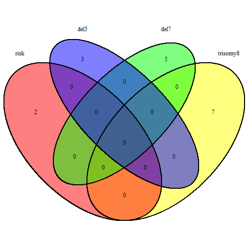 

