Random forest analysis
========================================================

Load the data and metadata. In this analysis, I will be using the cleaned RPKM data.

Load libraries:

```r
library(kernlab)
library(cvTools)
library(plyr)
library(randomForest)
library(edgeR)
library(limma)
library(VennDiagram)
library(xtable)
```


```r
rDes <- read.delim("../../data/experimental_design_cleaned.txt")
rownames(rDes) <- rDes$TCGA_patient_id
rDat <- read.delim("../../data/aml.rnaseq.gaf2.0_rpkm_cleaned.txt", row.names = 1, 
    check.names = FALSE)

all.results <- list()
```


## 1) Functions for feature selection and cross-validation

```r
# Function to select features, takes the top 25 differentially expressed
# genes as determined with limma input.dat: training data set input.labels:
# true outcomes for training data
fs.lm <- function(input.dat, input.labels) {
    norm.factor <- calcNormFactors(input.dat)
    design <- model.matrix(~input.labels)
    colnames(design) <- c("Intercept", "Label")
    dat.voomed <- voom(input.dat, design, lib.size = colSums(input.dat) * norm.factor)
    fit <- lmFit(dat.voomed, design)
    ebFit <- eBayes(fit)
    hits <- topTable(ebFit, n = Inf, coef = "Label")
    # train.features <- hits$ID[1:25] FOR OLDER VERSION OF R
    train.features <- rownames(hits)[1:25]
    return(train.features)
}
```


```r
# Function to choose features by selecting genes whose expression have the
# highest correlations to the outcomes (top 25) input.dat: training data set
# input.levels: true outcome levels for training data
fs.corr <- function(input.dat, input.levels) {
    gene.corrs <- apply(input.dat, 1, function(x) return(suppressWarnings(cor(x, 
        as.numeric(input.levels), method = "spearman"))))
    gene.corrs <- gene.corrs[order(abs(gene.corrs), na.last = NA, decreasing = TRUE)]
    return(names(gene.corrs[1:25]))
}
```


```r
# Function to create a roc curve for a classifier prob.mat: matrix of the
# probabilities assigned to each sample
plot.roc <- function(votes.mat, true.labels, plot = TRUE) {
    tprs <- c()
    fprs <- c()
    for (i in seq(0, 100, by = 0.1)) {
        roc.classification <- vector(length = nrow(votes.mat))
        for (j in 1:nrow(votes.mat)) {
            if (votes.mat[j, 1] >= (i/100)) {
                roc.classification[j] <- 0
            } else {
                roc.classification[j] <- 1
            }
        }
        roc.results <- table(factor(true.labels, levels = c(0, 1)), factor(roc.classification, 
            levels = c(0, 1)), dnn = c("obs", "pred"))
        tprs <- c(tprs, roc.results[2, 2]/sum(roc.results[2, ]))
        fprs <- c(fprs, roc.results[1, 2]/sum(roc.results[1, ]))
    }
    
    roc.data <- data.frame(Cutoff = seq(0, 100, by = 0.1), TPR = tprs, FPR = fprs)
    
    auc <- 0
    for (n in 1:(nrow(roc.data) - 1)) {
        auc <- auc + ((roc.data$FPR[n + 1] - roc.data$FPR[n]) * roc.data$TPR[n])
    }
    
    if (plot) {
        xyplot(TPR ~ FPR, roc.data, panel = function(...) {
            panel.abline(h = 0, v = 1, col = "darkgrey")
            panel.xyplot(...)
        }, type = c("s"), col = "black")
    }
    
    return(auc)
}
```


```r
# Function to run k-fold cross validation with a random forest classifier
# all.dat: all data used in the analysis all.labels: true outcomes for the
# data K: number of folds to use in CV fs.method: the strategy to use for
# feature selection plot.varimp: whether to plot the variable importance for
# each of the trained forests
rf.cv <- function(all.dat, all.labels, all.levels, K = 5, fs.method = "lm", 
    plot.varimp = TRUE) {
    set.seed(540)
    folds <- cvFolds(ncol(all.dat), K = K)
    
    conf_matrix <- matrix(0, nrow = 2, ncol = 2, dimnames = list(c("true0", 
        "true1"), c("pred0", "pred1")))
    feature.list <- list()
    
    for (f in 1:K) {
        train.samples <- folds$subsets[folds$which != f, ]
        test.samples <- folds$subsets[folds$which == f, ]
        
        if (fs.method == "lm") {
            train.features <- fs.lm(all.dat[, train.samples], all.labels[train.samples])
        } else if (fs.method == "corr") {
            train.features <- fs.corr(all.dat[, train.samples], all.levels[train.samples])
        }
        feature.list[[paste("Fold", f, sep = "")]] <- train.features
        
        train.dat <- data.frame(class = all.labels[train.samples], t(all.dat[train.features, 
            train.samples]))
        test.dat <- data.frame(t(all.dat[train.features, test.samples]))
        test.labels <- all.labels[test.samples]
        
        fit.rf <- randomForest(class ~ ., train.dat)
        if (plot.varimp) {
            varImpPlot(fit.rf)
        }
        
        pred.rf <- predict(fit.rf, newdata = test.dat, type = "response")
        results <- table(factor(test.labels, levels = c(0, 1)), factor(pred.rf, 
            levels = c(0, 1)), dnn = c("obs", "pred"))
        
        conf_matrix[1, 1] <- conf_matrix[1, 1] + results[1, 1]
        conf_matrix[1, 2] <- conf_matrix[1, 2] + results[1, 2]
        conf_matrix[2, 1] <- conf_matrix[2, 1] + results[2, 1]
        conf_matrix[2, 2] <- conf_matrix[2, 2] + results[2, 2]
    }
    
    rf.sens <- conf_matrix[2, 2]/sum(conf_matrix[2, ])
    rf.spec <- conf_matrix[1, 1]/sum(conf_matrix[1, ])
    rf.acc <- (conf_matrix[1, 1] + conf_matrix[2, 2])/sum(conf_matrix)
    
    return(list(acc = rf.acc, sens = rf.sens, spec = rf.spec, feature.list = feature.list))
}
```


```r
# Function to analyse a list of selected features by drawing a venn diagram
# and finding the overlaps fts: list of length 5 containing the features
# selected in each training set draw: whether to draw a venn diagram
# filename: file where venn diagram should be printed (default NA means not
# saved to file)
summarize.cv.fts <- function(fts, draw = TRUE, filename = NA) {
    venn.plot <- venn.diagram(fts, filename = NULL, fill = c("red", "blue", 
        "green", "yellow", "purple"), margin = 0.1)
    
    if (draw) {
        plot.new()
        grid.draw(venn.plot)
    }
    if (!is.na(filename)) {
        pdf(filename)
        grid.draw(venn.plot)
        dev.off()
    }
    
    common.fts <- intersect(fts[[1]], intersect(fts[[2]], intersect(fts[[3]], 
        intersect(fts[[4]], fts[[5]]))))
    return(common.fts)
}
```


## 2) Train RF to predict "Poor" cytogenetic risk, use linear models for feature selection

Set up the data. Remove samples where the cytogenetic risk category is not determined, and set outcomes to poor vs. not poor:

```r
rfDes <- rDes[rDes$Cytogenetic_risk != "N.D.", ]
rf.labels.poor <- mapvalues(rfDes$Cytogenetic_risk, c("Good", "Intermediate", 
    "Poor"), c(0, 0, 1), warn_missing = TRUE)
rf.labels.poor <- factor(rf.labels.poor)
rf.levels <- mapvalues(rfDes$Cytogenetic_risk, c("Good", "Intermediate", "Poor"), 
    c(3, 2, 1), warn_missing = TRUE)
rf.levels <- factor(rf.levels)
rfDat <- rDat[, rownames(rfDes)]
```


Run a 5-fold cross-validation for the data:

```r
cv.lm.poor <- rf.cv(rfDat, rf.labels.poor, rf.levels, K = 5, fs.method = "lm")
```

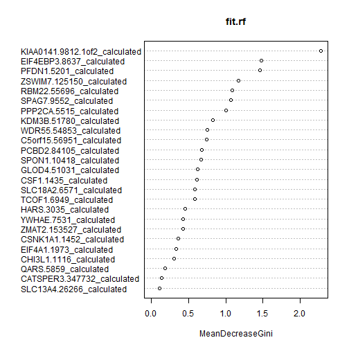 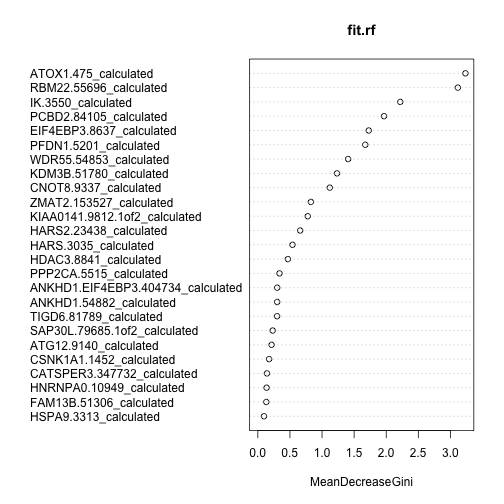 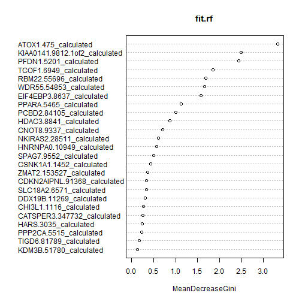 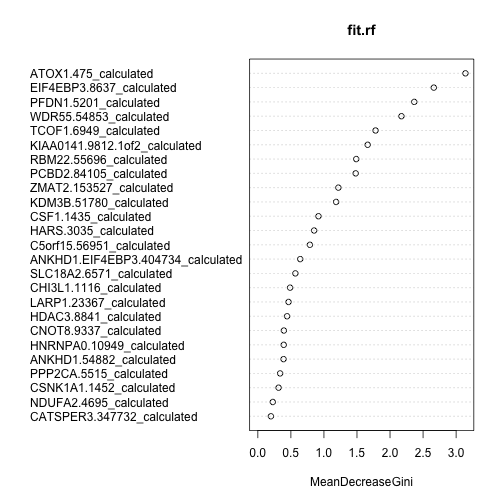 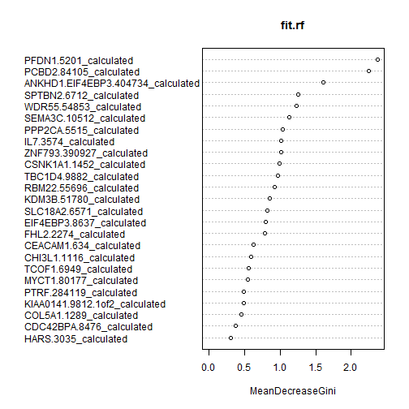 

```r
cv.lm.poor[1:3]
```

```
## $acc
## [1] 0.8523
## 
## $sens
## [1] 0.5714
## 
## $spec
## [1] 0.9403
```

```r
all.results[["lm.poor"]] <- cv.lm.poor[1:3]
(common.fts.lm.poor <- summarize.cv.fts(cv.lm.poor[[4]]))
```

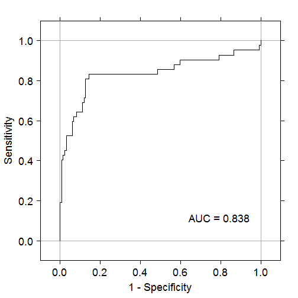 

```
## [1] "SCD|6319_calculated"     "STYXL1|51657_calculated"
## [3] "PDAP1|11333_calculated"  "LUC7L2|51631_calculated"
## [5] "GSTK1|373156_calculated"
```


## 3) Predict "poor" cytogenetic risk, this time using correlations for feature selection

Run a 5-fold cross-validation for the data:

```r
cv.corr.poor <- rf.cv(rfDat, rf.labels.poor, rf.levels, K = 5, fs.method = "corr")
```

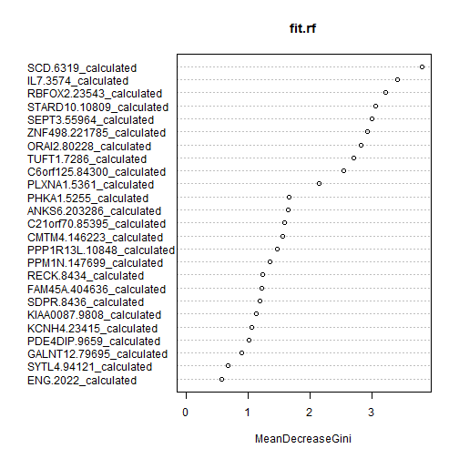 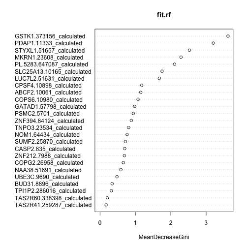 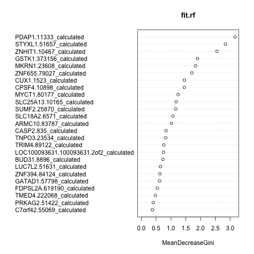 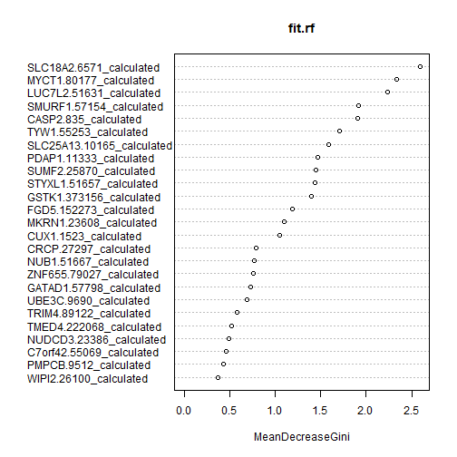  

```r
cv.corr.poor[1:3]
```

```
## $acc
## [1] 0.8239
## 
## $sens
## [1] 0.381
## 
## $spec
## [1] 0.9627
```

```r
all.results[["corr.poor"]] <- cv.corr.poor[1:3]
(common.fts.corr.poor <- summarize.cv.fts(cv.corr.poor[[4]]))
```

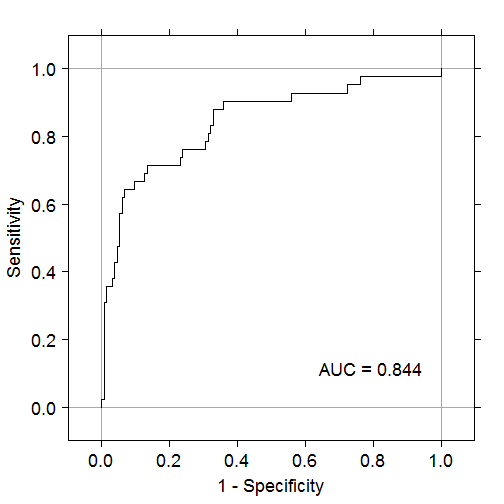 

```
## [1] "PDE4DIP|9659_calculated"  "PHKA1|5255_calculated"   
## [3] "SDPR|8436_calculated"     "RECK|8434_calculated"    
## [5] "IL7|3574_calculated"      "STARD10|10809_calculated"
```


## 4) Train RF to predict "Intermediate" cytogenetic risk, use linear models for feature selection

Set up the data. Remove samples where the cytogenetic risk category is not determined, and set categories to intermediate and not intermediate:

```r
rfDes <- rDes[rDes$Cytogenetic_risk != "N.D.", ]
rf.labels.intermediate <- mapvalues(rfDes$Cytogenetic_risk, c("Good", "Intermediate", 
    "Poor"), c(0, 1, 0), warn_missing = TRUE)
rf.labels.intermediate <- factor(rf.labels.intermediate)
rf.levels <- mapvalues(rfDes$Cytogenetic_risk, c("Good", "Intermediate", "Poor"), 
    c(3, 2, 1), warn_missing = TRUE)
rf.levels <- factor(rf.levels)
rfDat <- rDat[, rownames(rfDes)]
```


Run a 5-fold cross-validation for the data:

```r
cv.lm.intermediate <- rf.cv(rfDat, rf.labels.intermediate, rf.levels, K = 5, 
    fs.method = "lm")
```

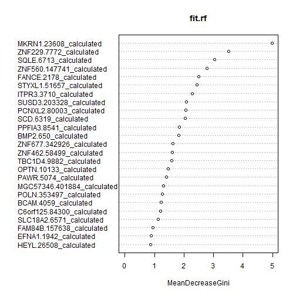 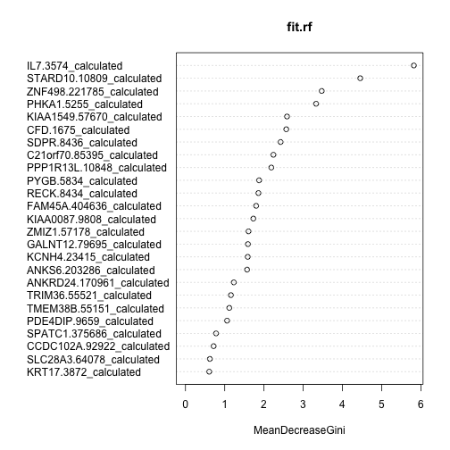 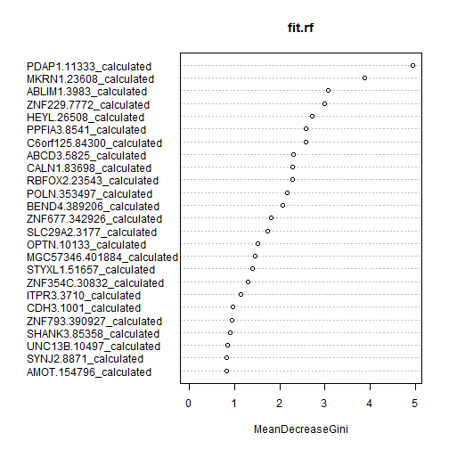 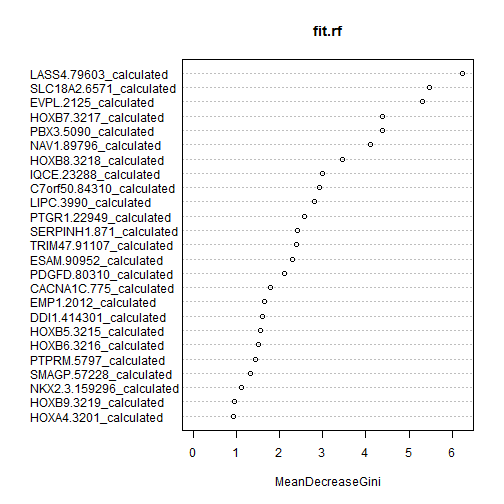 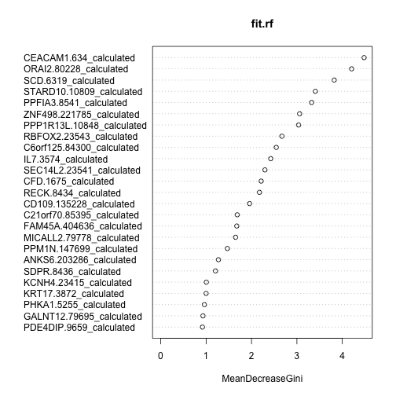 

```r
cv.lm.intermediate[1:3]
```

```
## $acc
## [1] 0.8636
## 
## $sens
## [1] 0.901
## 
## $spec
## [1] 0.8133
```

```r
all.results[["lm.intermediate"]] <- cv.lm.intermediate[1:3]
(common.fts.lm.intermediate <- summarize.cv.fts(cv.lm.intermediate[[4]]))
```

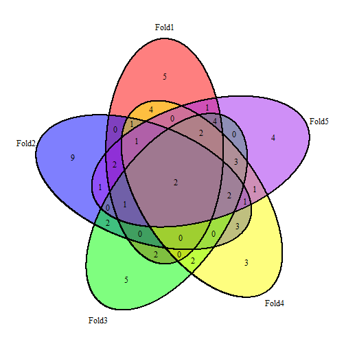 

```
##  [1] "NAV1|89796_calculated"    "SLC18A2|6571_calculated" 
##  [3] "LASS4|79603_calculated"   "PBX3|5090_calculated"    
##  [5] "HOXB6|3216_calculated"    "HOXB5|3215_calculated"   
##  [7] "NKX2-3|159296_calculated" "IQCE|23288_calculated"   
##  [9] "EVPL|2125_calculated"     "C7orf50|84310_calculated"
```


## 5) Train RF to predict "Intermediate" cytogenetic risk, now using correlations for feature selection

```r
cv.corr.intermediate <- rf.cv(rfDat, rf.labels.intermediate, rf.levels, K = 5, 
    fs.method = "corr")
```

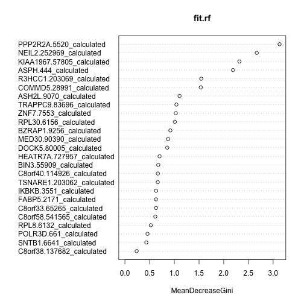 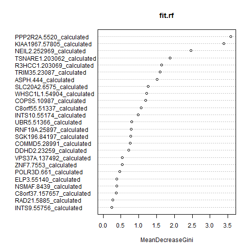 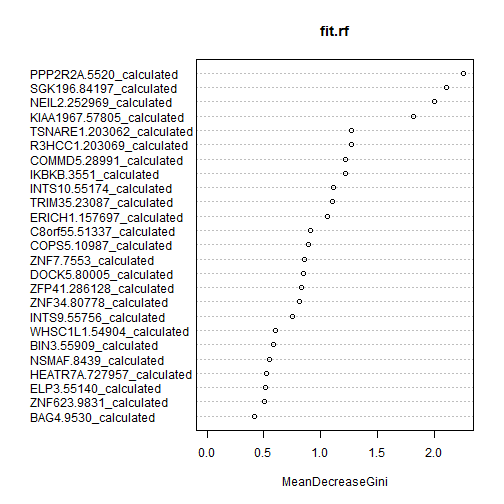  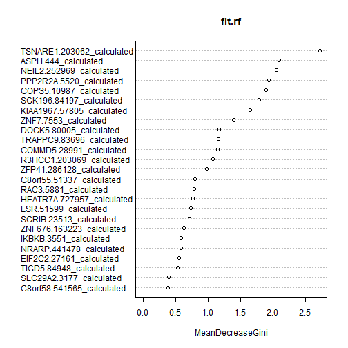 

```r
cv.corr.intermediate[1:3]
```

```
## $acc
## [1] 0.7784
## 
## $sens
## [1] 0.901
## 
## $spec
## [1] 0.6133
```

```r
all.results[["corr.intermediate"]] <- cv.corr.intermediate[1:3]
(common.fts.corr.intermediate <- summarize.cv.fts(cv.corr.intermediate[[4]]))
```

 

```
## [1] "PDE4DIP|9659_calculated"  "PHKA1|5255_calculated"   
## [3] "SDPR|8436_calculated"     "RECK|8434_calculated"    
## [5] "IL7|3574_calculated"      "STARD10|10809_calculated"
```


## 6) Train RF to predict "Good" cytogenetic risk, use linear models for feature selection

Set up the data. Remove samples where the cytogenetic risk category is not determined, and set categories to good and not good:

```r
rfDes <- rDes[rDes$Cytogenetic_risk != "N.D.", ]
rf.labels.good <- mapvalues(rfDes$Cytogenetic_risk, c("Good", "Intermediate", 
    "Poor"), c(1, 0, 0), warn_missing = TRUE)
rf.labels.good <- factor(rf.labels.good)
rf.levels <- mapvalues(rfDes$Cytogenetic_risk, c("Good", "Intermediate", "Poor"), 
    c(3, 2, 1), warn_missing = TRUE)
rf.levels <- factor(rf.levels)
rfDat <- rDat[, rownames(rfDes)]
```


Run a 5-fold cross-validation for the data:

```r
cv.lm.good <- rf.cv(rfDat, rf.labels.good, rf.levels, K = 5, fs.method = "lm")
```

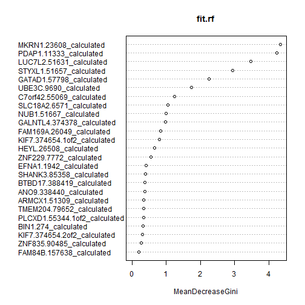 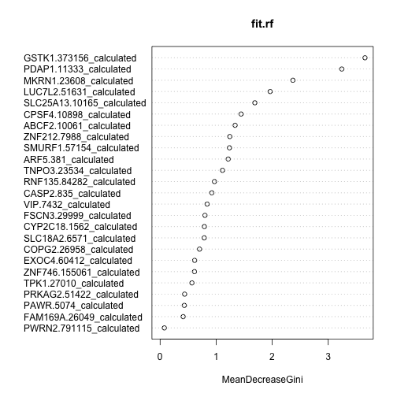 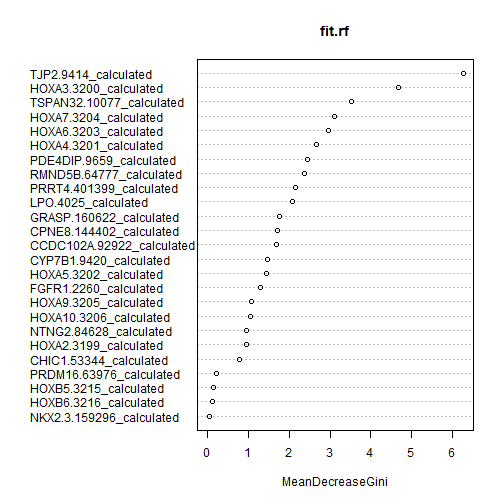 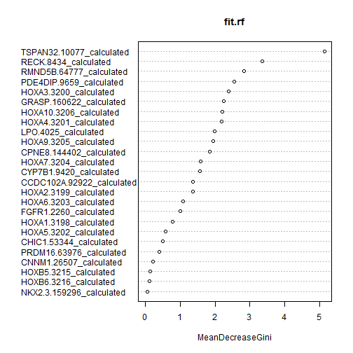 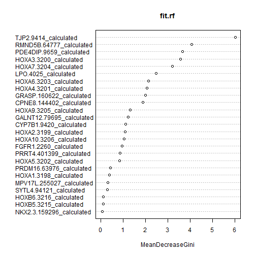 

```r
cv.lm.good[1:3]
```

```
## $acc
## [1] 0.9659
## 
## $sens
## [1] 0.8485
## 
## $spec
## [1] 0.993
```

```r
all.results[["lm.good"]] <- cv.lm.good[1:3]
(common.fts.lm.good <- summarize.cv.fts(cv.lm.good[[4]]))
```

 

```
##  [1] "CPNE8|144402_calculated"  "HOXA7|3204_calculated"   
##  [3] "HOXA6|3203_calculated"    "HOXA5|3202_calculated"   
##  [5] "HOXA3|3200_calculated"    "HOXA4|3201_calculated"   
##  [7] "HOXA9|3205_calculated"    "HOXA10|3206_calculated"  
##  [9] "HOXA2|3199_calculated"    "FGFR1|2260_calculated"   
## [11] "CYP7B1|9420_calculated"   "PDE4DIP|9659_calculated" 
## [13] "HOXB5|3215_calculated"    "NKX2-3|159296_calculated"
## [15] "LPO|4025_calculated"      "RMND5B|64777_calculated" 
## [17] "PRDM16|63976_calculated"  "HOXB6|3216_calculated"
```


## 7) Train RF to predict "Good" cytogenetic risk, use correlations for feature selection

```r
cv.corr.good <- rf.cv(rfDat, rf.labels.good, rf.levels, K = 5, fs.method = "corr")
```

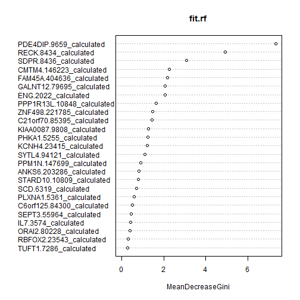 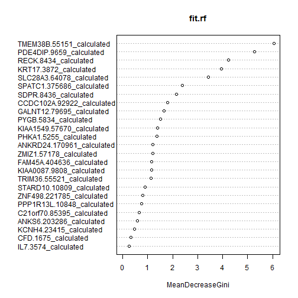 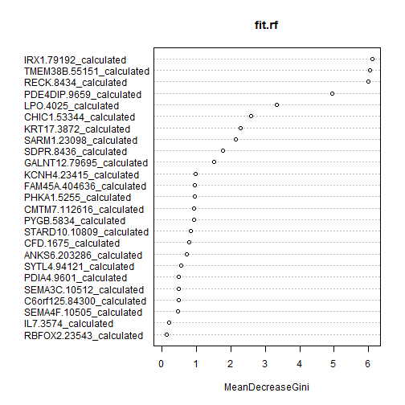 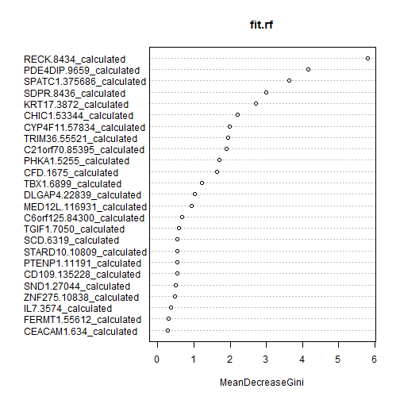 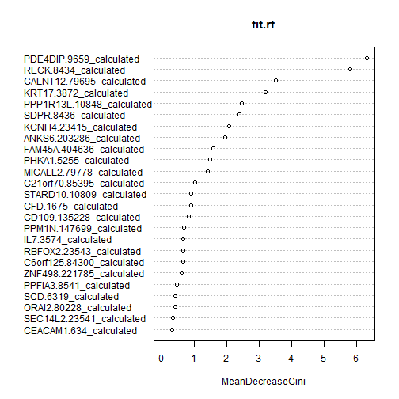 

```r
cv.corr.good[1:3]
```

```
## $acc
## [1] 0.9602
## 
## $sens
## [1] 0.8485
## 
## $spec
## [1] 0.986
```

```r
all.results[["corr.good"]] <- cv.corr.good[1:3]
(common.fts.corr.good <- summarize.cv.fts(cv.corr.good[[4]]))
```

 

```
## [1] "PDE4DIP|9659_calculated"  "PHKA1|5255_calculated"   
## [3] "SDPR|8436_calculated"     "RECK|8434_calculated"    
## [5] "IL7|3574_calculated"      "STARD10|10809_calculated"
```


## 8) Predict the different cytogenetic mutations, use linear models for feature selection

First look at trisomy 8:

```r
cv.lm.trisomy8 <- rf.cv(rDat, factor(as.numeric(rDes$trisomy_8)), factor(as.numeric(rDes$trisomy_8)), 
    K = 5, fs.method = "lm")
```

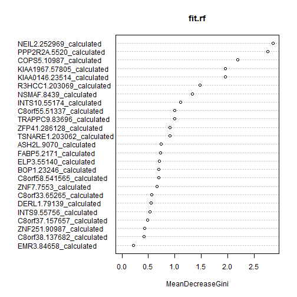 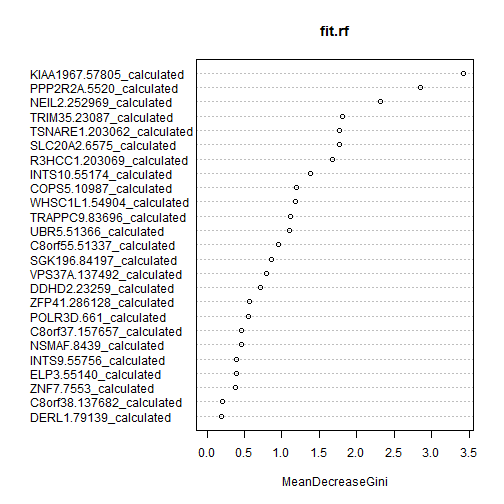    

```r
cv.lm.trisomy8[1:3]
```

```
## $acc
## [1] 0.9553
## 
## $sens
## [1] 0.6842
## 
## $spec
## [1] 0.9875
```

```r
all.results[["lm.trisomy8"]] <- cv.lm.trisomy8[1:3]
(common.fts.lm.trisomy8 <- summarize.cv.fts(cv.lm.trisomy8[[4]]))
```

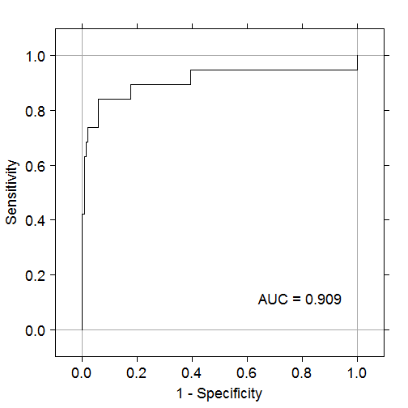 

```
## [1] "NEIL2|252969_calculated"   "PPP2R2A|5520_calculated"  
## [3] "ZNF7|7553_calculated"      "KIAA1967|57805_calculated"
## [5] "R3HCC1|203069_calculated"  "TSNARE1|203062_calculated"
## [7] "C8orf55|51337_calculated"  "ZFP41|286128_calculated"
```


Next look at deletions of chromosome 5:

```r
cv.lm.del5 <- rf.cv(rDat, factor(as.numeric(rDes$del_5)), factor(as.numeric(rDes$del_5)), 
    K = 5, fs.method = "lm")
```

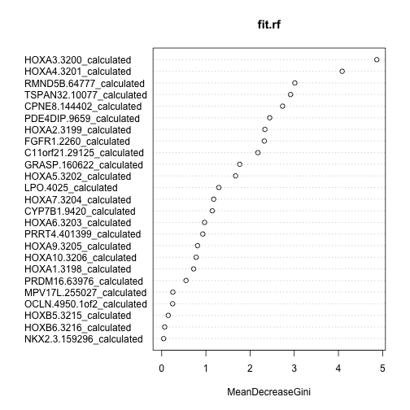  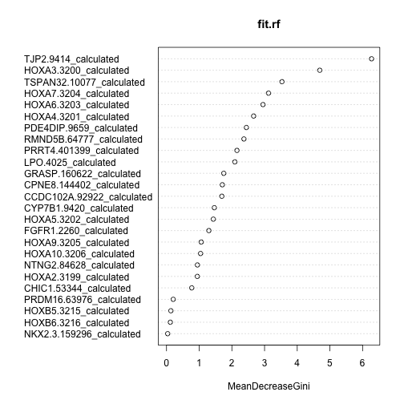 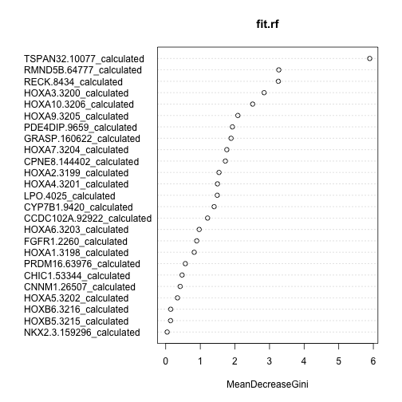 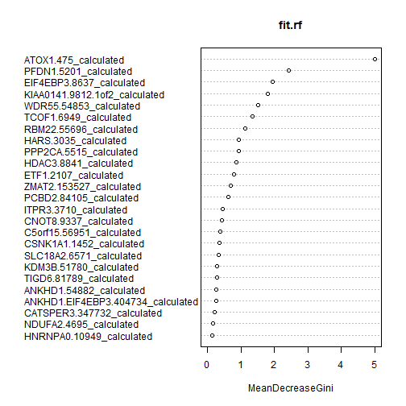 

```r
cv.lm.del5[1:3]
```

```
## $acc
## [1] 0.9721
## 
## $sens
## [1] 0.8125
## 
## $spec
## [1] 0.9877
```

```r
all.results[["lm.del5"]] <- cv.lm.del5[1:3]
(common.fts.lm.del5 <- summarize.cv.fts(cv.lm.del5[[4]]))
```

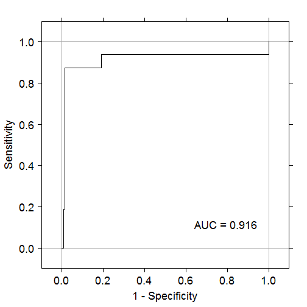 

```
##  [1] "KDM3B|51780_calculated"        "EIF4EBP3|8637_calculated"     
##  [3] "PCBD2|84105_calculated"        "KIAA0141|9812|1of2_calculated"
##  [5] "PFDN1|5201_calculated"         "RBM22|55696_calculated"       
##  [7] "ZMAT2|153527_calculated"       "CSNK1A1|1452_calculated"      
##  [9] "PPP2CA|5515_calculated"        "WDR55|54853_calculated"       
## [11] "CATSPER3|347732_calculated"    "HARS|3035_calculated"
```


Next look at deletions of chromosome 7:

```r
cv.lm.del7 <- rf.cv(rDat, factor(as.numeric(rDes$del_7)), factor(as.numeric(rDes$del_7)), 
    K = 5, fs.method = "lm")
```

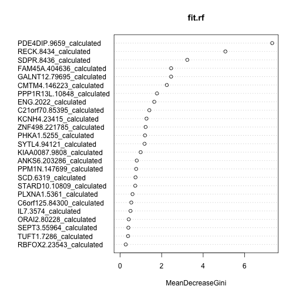 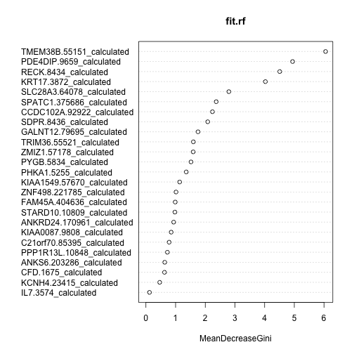 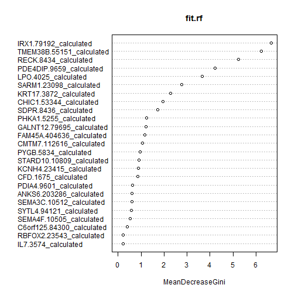 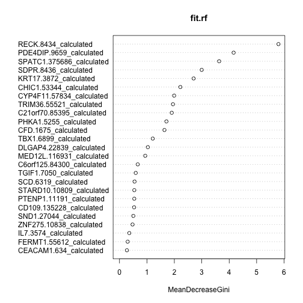 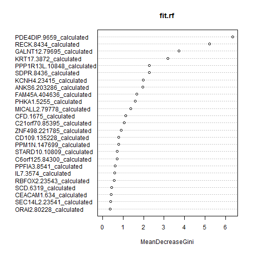 

```r
cv.lm.del7[1:3]
```

```
## $acc
## [1] 0.9497
## 
## $sens
## [1] 0.7143
## 
## $spec
## [1] 0.981
```

```r
all.results[["lm.del7"]] <- cv.lm.del7[1:3]
(common.fts.lm.del7 <- summarize.cv.fts(cv.lm.del7[[4]]))
```

 

```
## [1] "LUC7L2|51631_calculated"   "PDAP1|11333_calculated"   
## [3] "MKRN1|23608_calculated"    "SLC25A13|10165_calculated"
## [5] "GATAD1|57798_calculated"   "GSTK1|373156_calculated"  
## [7] "STYXL1|51657_calculated"   "SUMF2|25870_calculated"   
## [9] "CASP2|835_calculated"
```


## 9) Predict the different cytogenetic mutations, now using correlations for feature selection

First look at trisomy 8:

```r
cv.corr.trisomy8 <- rf.cv(rDat, factor(as.numeric(rDes$trisomy_8)), factor(as.numeric(rDes$trisomy_8)), 
    K = 5, fs.method = "corr")
```

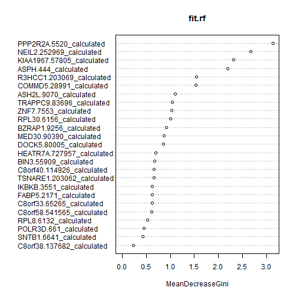  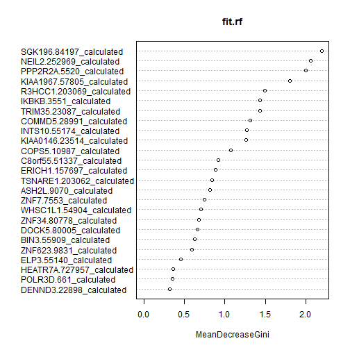  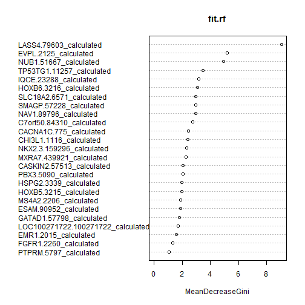 

```r
cv.corr.trisomy8[1:3]
```

```
## $acc
## [1] 0.9609
## 
## $sens
## [1] 0.6842
## 
## $spec
## [1] 0.9938
```

```r
all.results[["corr.trisomy8"]] <- cv.corr.trisomy8[1:3]
(common.fts.corr.trisomy8 <- summarize.cv.fts(cv.corr.trisomy8[[4]]))
```

 

```
##  [1] "NEIL2|252969_calculated"   "KIAA1967|57805_calculated"
##  [3] "R3HCC1|203069_calculated"  "DOCK5|80005_calculated"   
##  [5] "BIN3|55909_calculated"     "POLR3D|661_calculated"    
##  [7] "PPP2R2A|5520_calculated"   "TSNARE1|203062_calculated"
##  [9] "ZNF7|7553_calculated"      "HEATR7A|727957_calculated"
## [11] "COMMD5|28991_calculated"   "IKBKB|3551_calculated"
```


Next look at deletions of chromosome 5:

```r
cv.corr.del5 <- rf.cv(rDat, factor(as.numeric(rDes$del_5)), factor(as.numeric(rDes$del_5)), 
    K = 5, fs.method = "corr")
```

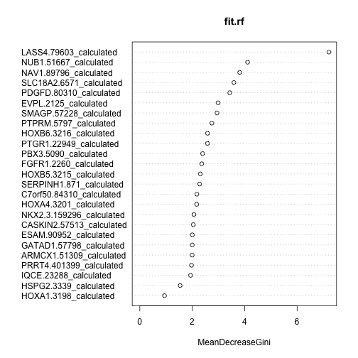 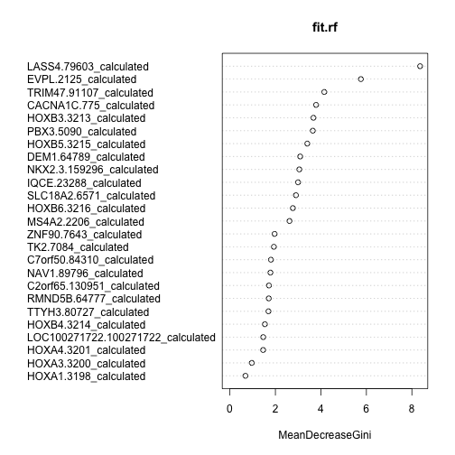 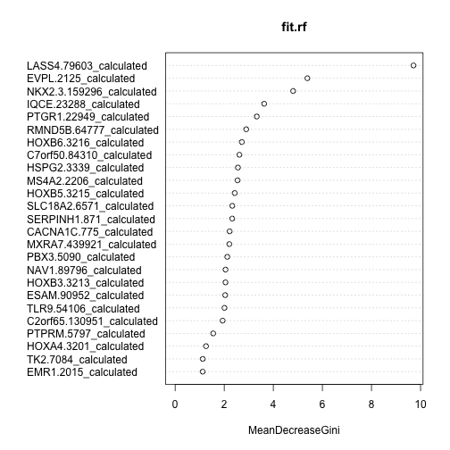 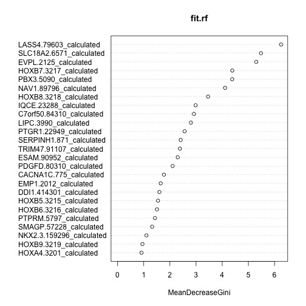 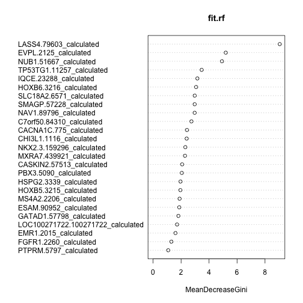 

```r
cv.corr.del5[1:3]
```

```
## $acc
## [1] 0.9385
## 
## $sens
## [1] 0.4375
## 
## $spec
## [1] 0.9877
```

```r
all.results[["corr.del5"]] <- cv.corr.del5[1:3]
(common.fts.corr.del5 <- summarize.cv.fts(cv.corr.del5[[4]]))
```

 

```
## [1] "DSCAM|1826_calculated"
```


Next look at deletions of chromosome 7:

```r
cv.corr.del7 <- rf.cv(rDat, factor(as.numeric(rDes$del_7)), factor(as.numeric(rDes$del_7)), 
    K = 5, fs.method = "corr")
```

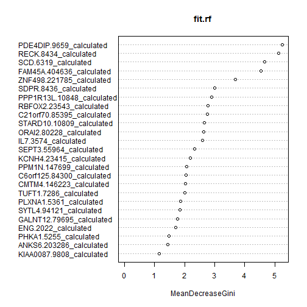 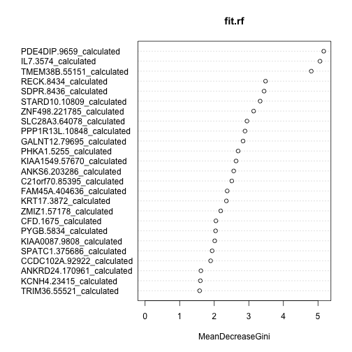 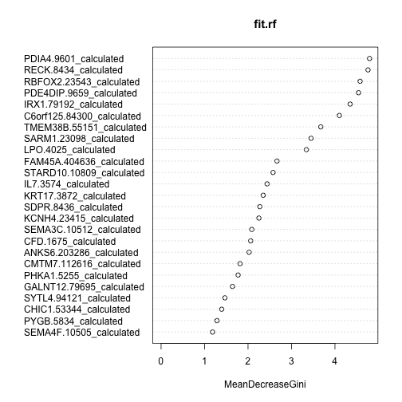 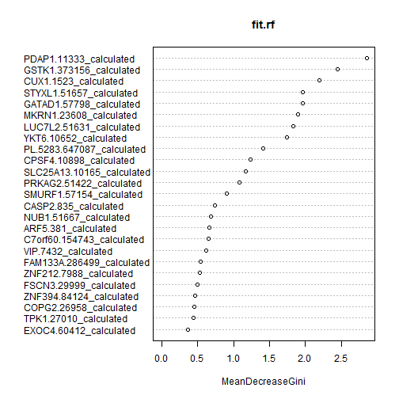 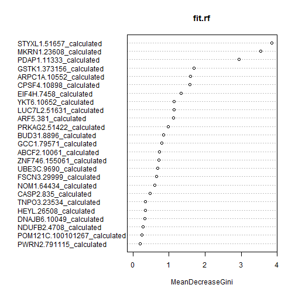 

```r
cv.corr.del7[1:3]
```

```
## $acc
## [1] 0.9497
## 
## $sens
## [1] 0.7143
## 
## $spec
## [1] 0.981
```

```r
all.results[["corr.del7"]] <- cv.corr.del7[1:3]
(common.fts.corr.del7 <- summarize.cv.fts(cv.corr.del7[[4]]))
```

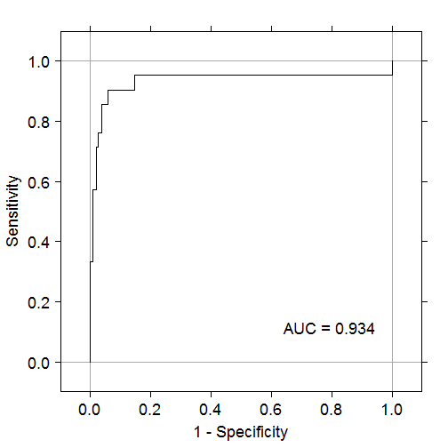 

```
## [1] "MKRN1|23608_calculated"  "LUC7L2|51631_calculated"
## [3] "GSTK1|373156_calculated" "PDAP1|11333_calculated" 
## [5] "FSCN3|29999_calculated"  "CASP2|835_calculated"   
## [7] "PRKAG2|51422_calculated" "CPSF4|10898_calculated" 
## [9] "ARF5|381_calculated"
```


## 10) Compare features between outcomes
Compare some of the significant gene lists between classifiers (just considering linear model feature selection).

Compare the three different levels of cytogenetic risk:

```r
cyto.all <- list(poor = common.fts.lm.poor, intermediate = common.fts.lm.intermediate, 
    good = common.fts.lm.good)
venn.plot <- venn.diagram(cyto.all, filename = NULL, fill = c("red", "yellow", 
    "blue"))
plot.new()
grid.draw(venn.plot)
```

 


Look at poor risk vs. the 3 CNAs:

```r
fts.all <- list(poor = common.fts.lm.poor, trisomy8 = common.fts.lm.trisomy8, 
    del5 = common.fts.lm.del5, del7 = common.fts.lm.del7)
venn.plot <- venn.diagram(fts.all, filename = NULL, fill = c("red", "yellow", 
    "blue", "green"))
plot.new()
grid.draw(venn.plot)
```

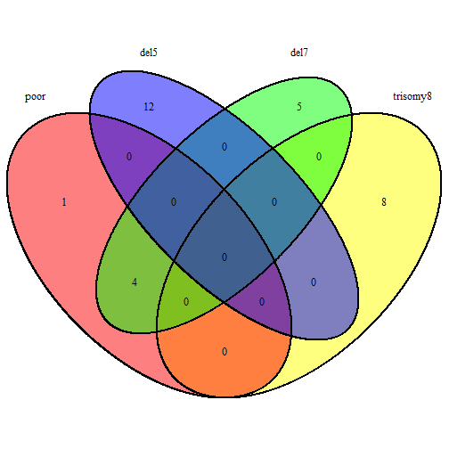 


Look at intermediate risk vs. the 3 CNAs:

```r
fts.all <- list(intermediate = common.fts.lm.intermediate, trisomy8 = common.fts.lm.trisomy8, 
    del5 = common.fts.lm.del5, del7 = common.fts.lm.del7)
venn.plot <- venn.diagram(fts.all, filename = NULL, fill = c("red", "yellow", 
    "blue", "green"))
plot.new()
grid.draw(venn.plot)
```

 


Look at good risk vs. the 3 CNAs:

```r
fts.all <- list(good = common.fts.lm.good, trisomy8 = common.fts.lm.trisomy8, 
    del5 = common.fts.lm.del5, del7 = common.fts.lm.del7)
venn.plot <- venn.diagram(fts.all, filename = NULL, fill = c("red", "yellow", 
    "blue", "green"))
plot.new()
grid.draw(venn.plot)
```

 


## 10) Summarize results for all classifiers

```r
all.results.df <- data.frame(matrix(unlist(all.results), ncol = 3, byrow = TRUE))
rownames(all.results.df) <- names(all.results)
colnames(all.results.df) <- c("accuracy", "sensitivity", "specificity")
all.results.xt <- xtable(all.results.df)
print(all.results.xt, type = "html")
```

<!-- html table generated in R 3.0.2 by xtable 1.7-3 package -->
<!-- Fri Apr 11 01:24:34 2014 -->
<TABLE border=1>
<TR> <TH>  </TH> <TH> accuracy </TH> <TH> sensitivity </TH> <TH> specificity </TH>  </TR>
  <TR> <TD align="right"> lm.poor </TD> <TD align="right"> 0.85 </TD> <TD align="right"> 0.57 </TD> <TD align="right"> 0.94 </TD> </TR>
  <TR> <TD align="right"> corr.poor </TD> <TD align="right"> 0.82 </TD> <TD align="right"> 0.38 </TD> <TD align="right"> 0.96 </TD> </TR>
  <TR> <TD align="right"> lm.intermediate </TD> <TD align="right"> 0.86 </TD> <TD align="right"> 0.90 </TD> <TD align="right"> 0.81 </TD> </TR>
  <TR> <TD align="right"> corr.intermediate </TD> <TD align="right"> 0.78 </TD> <TD align="right"> 0.90 </TD> <TD align="right"> 0.61 </TD> </TR>
  <TR> <TD align="right"> lm.good </TD> <TD align="right"> 0.97 </TD> <TD align="right"> 0.85 </TD> <TD align="right"> 0.99 </TD> </TR>
  <TR> <TD align="right"> corr.good </TD> <TD align="right"> 0.96 </TD> <TD align="right"> 0.85 </TD> <TD align="right"> 0.99 </TD> </TR>
  <TR> <TD align="right"> lm.trisomy8 </TD> <TD align="right"> 0.96 </TD> <TD align="right"> 0.68 </TD> <TD align="right"> 0.99 </TD> </TR>
  <TR> <TD align="right"> lm.del5 </TD> <TD align="right"> 0.97 </TD> <TD align="right"> 0.81 </TD> <TD align="right"> 0.99 </TD> </TR>
  <TR> <TD align="right"> lm.del7 </TD> <TD align="right"> 0.95 </TD> <TD align="right"> 0.71 </TD> <TD align="right"> 0.98 </TD> </TR>
  <TR> <TD align="right"> corr.trisomy8 </TD> <TD align="right"> 0.96 </TD> <TD align="right"> 0.68 </TD> <TD align="right"> 0.99 </TD> </TR>
  <TR> <TD align="right"> corr.del5 </TD> <TD align="right"> 0.94 </TD> <TD align="right"> 0.44 </TD> <TD align="right"> 0.99 </TD> </TR>
  <TR> <TD align="right"> corr.del7 </TD> <TD align="right"> 0.95 </TD> <TD align="right"> 0.71 </TD> <TD align="right"> 0.98 </TD> </TR>
   </TABLE>

