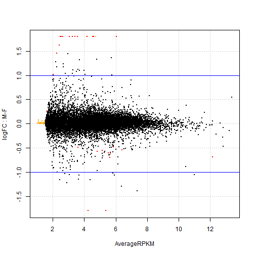
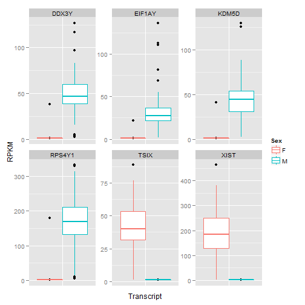
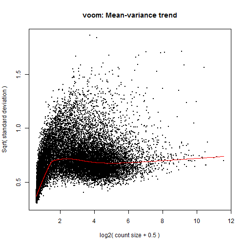
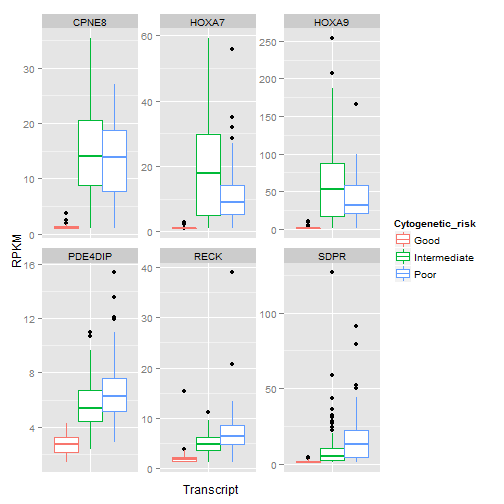

RNA-seq differential expression analysis
========================================
> To knit .rmd file, read data files in using "../data"  
> To run chunks in Rstudio, read data files in using "./data"

Use `voom + limma` to perform differential expression analysis on the RNA-seq data.

Load required libraries:

```r
library(RColorBrewer)
library(reshape2)
library(plyr)
library(ggplot2)
library(limma)
library(edgeR)
```


Load RNA-seq data and the experimental design:

```r
rDat <- read.table("../data/aml.rnaseq.gaf2.0_rpkm_cleaned.txt", sep = "\t", 
    header = TRUE, check.names = FALSE)
rDes <- read.delim("../data/experimental_design_cleaned.txt")
```


Data inspection:

```r
str(rDat, max.level = 0)
```

```
## 'data.frame':	20001 obs. of  179 variables:
##   [list output truncated]
```

```r
str(rDes, max.level = 0)
```

```
## 'data.frame':	179 obs. of  10 variables:
```


## Differential expression analysis
I will use `voom` to perform differential expression analysis. From my experience, `voom` makes the most stringent calls for differential expression. 

**Sex**  
First I will do a simple differential expression analysis: which genes are differentially expressed between males and females?

```r
sex <- rDes$Sex
table(sex)
```

```
## sex
##  F  M 
## 85 94
```


Apply scale normalization. I'm not sure if I need to do this given we have RPKM values?

```r
normFactor <- calcNormFactors(rDat)
```


Linear modelling: Use `voom` to convert RPKM to log2-RPKM ready for linear modelling:

```r
design <- model.matrix(~sex)
# The intercept represents females
head(design)
```

```
##   (Intercept) sexM
## 1           1    0
## 2           1    1
## 3           1    1
## 4           1    0
## 5           1    1
## 6           1    0
```

```r
rDatVoom <- voom(rDat, design, plot = TRUE)
```

 


Now find genes differentially expressed between males and females:

```r
fit <- lmFit(rDatVoom, design)
fit <- eBayes(fit)
voomSex <- topTable(fit, coef = "sexM", p.value = 1e-05, n = Inf)
nrow(voomSex)
```

```
## [1] 28
```

```r
head(voomSex, n = 10)
```

```
##                             logFC AveExpr      t    P.Value  adj.P.Val
## XIST|7503_calculated       -6.580   5.292 -55.68 1.282e-115 2.565e-111
## TSIX|9383_calculated       -4.527   4.298 -49.82 1.934e-107 1.935e-103
## RPS4Y1|6192_calculated      6.549   5.648  37.57  2.907e-87  1.938e-83
## DDX3Y|8653_calculated       4.792   4.698  36.96  3.999e-86  2.000e-82
## EIF1AY|9086_calculated      4.081   4.327  34.40  3.339e-81  1.336e-77
## KDM5D|8284_calculated       4.591   4.590  34.02  1.948e-80  6.492e-77
## PRKY|5616_calculated        3.105   3.810  32.72  8.374e-78  2.393e-74
## UTY|7404_calculated         2.909   3.687  31.14  1.609e-74  4.023e-71
## CYorf15A|246126_calculated  4.001   4.274  30.33  8.783e-73  1.952e-69
## CYorf15B|84663_calculated   3.923   4.234  29.16  3.264e-70  6.527e-67
##                                B
## XIST|7503_calculated       226.4
## TSIX|9383_calculated       214.4
## RPS4Y1|6192_calculated     176.9
## DDX3Y|8653_calculated      175.6
## EIF1AY|9086_calculated     165.9
## KDM5D|8284_calculated      164.4
## PRKY|5616_calculated       158.5
## UTY|7404_calculated        151.6
## CYorf15A|246126_calculated 148.8
## CYorf15B|84663_calculated  143.4
```

```r
(voomSexgenes <- rownames(voomSex))
```

```
##  [1] "XIST|7503_calculated"         "TSIX|9383_calculated"        
##  [3] "RPS4Y1|6192_calculated"       "DDX3Y|8653_calculated"       
##  [5] "EIF1AY|9086_calculated"       "KDM5D|8284_calculated"       
##  [7] "PRKY|5616_calculated"         "UTY|7404_calculated"         
##  [9] "CYorf15A|246126_calculated"   "CYorf15B|84663_calculated"   
## [11] "ZFY|7544_calculated"          "USP9Y|8287_calculated"       
## [13] "TTTY15|64595_calculated"      "NCRNA00185|55410_calculated" 
## [15] "TTTY14|83869_calculated"      "TMSB4Y|9087_calculated"      
## [17] "TTTY10|246119_calculated"     "BCORP1|286554_calculated"    
## [19] "PRKX|5613_calculated"         "ZRSR2|8233_calculated"       
## [21] "KDM5C|8242_calculated"        "RPS4X|6191_calculated"       
## [23] "KDM6A|7403_calculated"        "ZFX|7543_calculated"         
## [25] "PNPLA4|8228_calculated"       "NCRNA00183|554203_calculated"
## [27] "SRY|6736_calculated"          "EIF1AX|1964_calculated"
```

```r
# Lower the FDR threshold: how many genes do we find?
nrow(topTable(fit, coef = "sexM", p.value = 0.01, n = Inf))
```

```
## [1] 35
```

Ok XIST and TSIX are popping up, this is a promising result! Plus it turns out the top hit, XIST|7503_calculated is "Ribosomal Protein S4, Y-Linked 1", so I must be doing something right :)

Can I plot the differentially expressed genes using a DGEList object and plotSmear function from `edgeR`?

```r
# Create a DGEList object
dgeGlm <- DGEList(counts = rDat, group = sex)
plotSmear(dgeGlm, de.tags = voomSexgenes, ylab = "logFC", xlab = "AverageRPKM")
abline(h = c(-1, 1), col = "blue")
```

 

Why aren't all genes with > 1 and < -1 logFC not called as differentially expressed?

I want to check the expression of the genes in the smear plot that had logFC < -1 between males and females yet were not called as differentially expressed:

```r
voomSexFCtest <- topTable(fit, coef = "sexM", n = Inf)
voomSexFCtest$transcript <- rownames(voomSexFCtest)
voomSexFCtest <- arrange(voomSexFCtest, logFC)
nrow(voomSexFCtest)
```

```
## [1] 20001
```

```r
voomSexFCtest <- subset(voomSexFCtest, logFC < -1)
nrow(voomSexFCtest)
```

```
## [1] 2
```

```r
voomSexFCtest
```

```
##    logFC AveExpr      t    P.Value  adj.P.Val     B           transcript
## 1 -6.580   5.292 -55.68 1.282e-115 2.565e-111 226.4 XIST|7503_calculated
## 2 -4.527   4.298 -49.82 1.934e-107 1.935e-103 214.4 TSIX|9383_calculated
```

Ok this is really weird, why can't I find the genes on the smear plot? There should be 6 genes in total with logFC < -1 yet I can only find the 2 that were called as differentially expressed??? I'm not sure that I understand what the smear plot is showing anymore, given I can't find transcripts that meet a certain criteria given the results of this plot...

Let's plot the top hits from differential expression analysis to see if I'm on the right track:

```r
rDatvoomSex <- rDat[voomSexgenes[1:6], ]
dim(rDatvoomSex)
```

```
## [1]   6 179
```

```r
rDatvoomSex$Transcript <- rownames(rDatvoomSex)
rDatvoomSex <- melt(rDatvoomSex, id.vars = "Transcript", 
                   variable.name = "TCGA_patient_id",
                   value.name = "RPKM")
rDatvoomSex$Transcript <- gsub("[|].*$", "", rDatvoomSex$Transcript)
head(rDatvoomSex)
```

```
##   Transcript TCGA_patient_id    RPKM
## 1       XIST            2803 175.314
## 2       TSIX            2803  65.349
## 3     RPS4Y1            2803   1.000
## 4      DDX3Y            2803   1.005
## 5     EIF1AY            2803   1.000
## 6      KDM5D            2803   1.000
```

```r
rDatvoomSex <- merge(rDatvoomSex, rDes, by = "TCGA_patient_id")
head(rDatvoomSex)
```

```
##   TCGA_patient_id Transcript    RPKM Sex Race FAB_subtype Age trisomy_8
## 1            2803       XIST 175.314   F    W          M3  61     FALSE
## 2            2803       TSIX  65.349   F    W          M3  61     FALSE
## 3            2803     RPS4Y1   1.000   F    W          M3  61     FALSE
## 4            2803      DDX3Y   1.005   F    W          M3  61     FALSE
## 5            2803     EIF1AY   1.000   F    W          M3  61     FALSE
## 6            2803      KDM5D   1.000   F    W          M3  61     FALSE
##   del_5 del_7 Cytogenetic_risk Molecular_risk
## 1 FALSE FALSE             Good           Good
## 2 FALSE FALSE             Good           Good
## 3 FALSE FALSE             Good           Good
## 4 FALSE FALSE             Good           Good
## 5 FALSE FALSE             Good           Good
## 6 FALSE FALSE             Good           Good
```

```r
ggplot(rDatvoomSex, aes(Transcript, RPKM, colour = Sex)) +
  geom_boxplot() +
  facet_wrap(~ Transcript, scales = "free")+
  theme(axis.text.x = element_blank(), axis.ticks.x = element_blank())
```

 

So the top genes differentially expressed between males and females have almost no expression in one of the sexes. Given we only found 28 genes differentially expressed with an FDR of 1e-5, we can conclude that sex has limited influence on gene expression in AML patients.


**Cytogenetic risk**  
Now to explore another variable, "Cytogenetic_risk". 

```r
levels(rDes$Cytogenetic_risk)
```

```
## [1] "Good"         "Intermediate" "N.D."         "Poor"
```

```r
table(rDes$Cytogenetic_risk)
```

```
## 
##         Good Intermediate         N.D.         Poor 
##           33          101            3           42
```


Which transcripts are differentially expressed between "Good", "Intermediate", and "Poor" cytogenetic risk?

First, remove samples where cytogenetic risk could not be determined "N.D":

```r
# CRGIP = Cytogenetic Response Good + Intermediate + Poor
rDesCRGIP <- droplevels(subset(rDes, Cytogenetic_risk != "N.D."))
str(rDesCRGIP)
```

```
## 'data.frame':	176 obs. of  10 variables:
##  $ TCGA_patient_id : int  2803 2805 2806 2807 2808 2811 2812 2813 2814 2815 ...
##  $ Sex             : Factor w/ 2 levels "F","M": 1 2 2 1 2 2 1 2 1 2 ...
##  $ Race            : Factor w/ 13 levels "A","B","H","NH/A",..: 12 12 12 12 12 12 2 12 12 12 ...
##  $ FAB_subtype     : Factor w/ 9 levels "M0","M1","M2",..: 4 1 2 2 3 5 3 5 1 5 ...
##  $ Age             : int  61 77 46 68 23 81 25 78 39 49 ...
##  $ trisomy_8       : logi  FALSE FALSE FALSE FALSE FALSE FALSE ...
##  $ del_5           : logi  FALSE FALSE FALSE FALSE FALSE FALSE ...
##  $ del_7           : logi  FALSE FALSE FALSE FALSE FALSE FALSE ...
##  $ Cytogenetic_risk: Factor w/ 3 levels "Good","Intermediate",..: 1 2 1 2 2 2 2 3 3 1 ...
##  $ Molecular_risk  : Factor w/ 3 levels "Good","Intermediate",..: 1 2 1 2 2 2 2 3 3 1 ...
```

```r
dim(rDesCRGIP)
```

```
## [1] 176  10
```

```r
rDatCRGIP <- rDat[, names(rDat) %in% rDesCRGIP$TCGA_patient_id]
dim(rDatCRGIP)
```

```
## [1] 20001   176
```

```r
identical(names(rDatCRGIP), as.character(rDesCRGIP$TCGA_patient_id))
```

```
## [1] TRUE
```

```r
cytoRisk <- rDesCRGIP$Cytogenetic_risk
```


Now I will make a model with a reference + treatment effect, where the intercept is the reference:

```r
normFactor <- calcNormFactors(rDatCRGIP)
design <- model.matrix(~cytoRisk)
colnames(design)
```

```
## [1] "(Intercept)"          "cytoRiskIntermediate" "cytoRiskPoor"
```

```r
# The intercept represents 'Good' cytogenetic risk
head(design)
```

```
##   (Intercept) cytoRiskIntermediate cytoRiskPoor
## 1           1                    0            0
## 2           1                    1            0
## 3           1                    0            0
## 4           1                    1            0
## 5           1                    1            0
## 6           1                    1            0
```

```r
rDatCRGIPvoom <- voom(rDatCRGIP, design, plot = TRUE)
```

 

```r
fit <- lmFit(rDatCRGIPvoom, design)
fit <- eBayes(fit)
voomCR <- topTable(fit, coef = c("cytoRiskIntermediate", "cytoRiskPoor"), p.value = 1e-05, 
    n = Inf)
nrow(voomCR)
```

```
## [1] 667
```

```r
head(voomCR)
```

```
##                         cytoRiskIntermediate cytoRiskPoor AveExpr     F
## CPNE8|144402_calculated                2.629        2.730   2.149 168.2
## HOXA7|3204_calculated                  2.874        2.435   2.290 153.9
## HOXA6|3203_calculated                  2.965        2.363   2.126 149.9
## HOXA3|3200_calculated                  2.337        1.767   5.486 146.7
## HOXA4|3201_calculated                  2.147        1.530   2.127 135.2
## HOXA5|3202_calculated                  3.402        2.745   2.115 125.4
##                           P.Value adj.P.Val
## CPNE8|144402_calculated 1.263e-41 2.526e-37
## HOXA7|3204_calculated   2.043e-39 2.043e-35
## HOXA6|3203_calculated   8.775e-39 5.850e-35
## HOXA3|3200_calculated   2.919e-38 1.460e-34
## HOXA4|3201_calculated   2.422e-36 9.690e-33
## HOXA5|3202_calculated   1.284e-34 4.279e-31
```

```r
voomCRgenes <- rownames(voomCR)
```


Genes differentially expressed between Good and Poor cytogenetic risk:

```r
voomCRGP <- topTable(fit, coef = "cytoRiskPoor", p.value = 1e-05, n = Inf)
nrow(voomCRGP)
```

```
## [1] 394
```

```r
voomCRGPgenes <- rownames(voomCRGP)
```


Let's plot the top 6 hits to see if I'm on the right track:

```r
rDatvoomCR <- rDatCRGIP[voomCRGPgenes[1:6], ]
dim(rDatvoomCR)
```

```
## [1]   6 176
```

```r
rDatvoomCR$Transcript <- rownames(rDatvoomCR)
rDatvoomCR <- melt(rDatvoomCR, id.vars = "Transcript", 
                   variable.name = "TCGA_patient_id",
                   value.name = "RPKM")
rDatvoomCR$Transcript <- gsub("[|].*$", "", rDatvoomCR$Transcript)
head(rDatvoomCR)
```

```
##   Transcript TCGA_patient_id  RPKM
## 1      CPNE8            2803 1.090
## 2      HOXA9            2803 1.075
## 3       RECK            2803 2.062
## 4    PDE4DIP            2803 1.612
## 5       SDPR            2803 2.369
## 6      HOXA7            2803 1.013
```

```r
rDatvoomCR <- merge(rDatvoomCR, rDesCRGIP, by = "TCGA_patient_id")
head(rDatvoomCR)
```

```
##   TCGA_patient_id Transcript  RPKM Sex Race FAB_subtype Age trisomy_8
## 1            2803      CPNE8 1.090   F    W          M3  61     FALSE
## 2            2803      HOXA9 1.075   F    W          M3  61     FALSE
## 3            2803       RECK 2.062   F    W          M3  61     FALSE
## 4            2803    PDE4DIP 1.612   F    W          M3  61     FALSE
## 5            2803       SDPR 2.369   F    W          M3  61     FALSE
## 6            2803      HOXA7 1.013   F    W          M3  61     FALSE
##   del_5 del_7 Cytogenetic_risk Molecular_risk
## 1 FALSE FALSE             Good           Good
## 2 FALSE FALSE             Good           Good
## 3 FALSE FALSE             Good           Good
## 4 FALSE FALSE             Good           Good
## 5 FALSE FALSE             Good           Good
## 6 FALSE FALSE             Good           Good
```

```r
ggplot(rDatvoomCR, aes(Transcript, RPKM, colour = Cytogenetic_risk)) +
  geom_boxplot() +
  facet_wrap(~ Transcript, scales = "free") +
  theme(axis.text.x = element_blank(), axis.ticks.x = element_blank())  
```

 


What about the hits with little logFC? Let's plot these:

```r
voomCRGP <- topTable(fit, coef = "cytoRiskPoor", p.value = 1e-05, n = Inf, sort.by = "logFC")
```


```r
voomCRGPgenes <- rownames(voomCRGP)
rDatvoomCR <- rDatCRGIP[tail(voomCRGPgenes), ]
dim(rDatvoomCR)
```

```
## [1]   6 176
```

```r
rDatvoomCR$Transcript <- rownames(rDatvoomCR)
rDatvoomCR <- melt(rDatvoomCR, id.vars = "Transcript", variable.name = "TCGA_patient_id", 
    value.name = "RPKM")
rDatvoomCR$Transcript <- gsub("[|].*$", "", rDatvoomCR$Transcript)
head(rDatvoomCR)
```

```
##   Transcript TCGA_patient_id  RPKM
## 1     ZSCAN1            2803 1.011
## 2  LOC283050            2803 1.243
## 3      OXCT2            2803 1.000
## 4    TMEM190            2803 1.041
## 5       ZIM2            2803 1.000
## 6  LOC154761            2803 1.206
```

```r
rDatvoomCR <- merge(rDatvoomCR, rDesCRGIP, by = "TCGA_patient_id")
head(rDatvoomCR)
```

```
##   TCGA_patient_id Transcript  RPKM Sex Race FAB_subtype Age trisomy_8
## 1            2803     ZSCAN1 1.011   F    W          M3  61     FALSE
## 2            2803  LOC283050 1.243   F    W          M3  61     FALSE
## 3            2803      OXCT2 1.000   F    W          M3  61     FALSE
## 4            2803    TMEM190 1.041   F    W          M3  61     FALSE
## 5            2803       ZIM2 1.000   F    W          M3  61     FALSE
## 6            2803  LOC154761 1.206   F    W          M3  61     FALSE
##   del_5 del_7 Cytogenetic_risk Molecular_risk
## 1 FALSE FALSE             Good           Good
## 2 FALSE FALSE             Good           Good
## 3 FALSE FALSE             Good           Good
## 4 FALSE FALSE             Good           Good
## 5 FALSE FALSE             Good           Good
## 6 FALSE FALSE             Good           Good
```

```r
ggplot(rDatvoomCR, aes(Transcript, RPKM, colour = Cytogenetic_risk)) + geom_boxplot() + 
    facet_wrap(~Transcript, scales = "free") + theme(axis.text.x = element_blank(), 
    axis.ticks.x = element_blank())
```

 


Ok something is really up. Diffential expression is being called on transcripts with very small RPKM values. Look at the y axis: these values are NOT log transformed! This is very concerning.

I believe I am not analysing the RPKM values correctly during differential expression analysis with voom. 

I will complete differential expression analysis using read count data instead.
