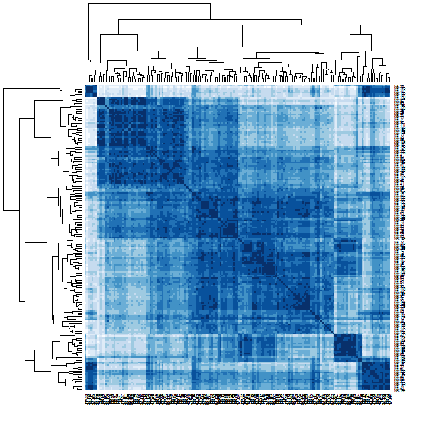
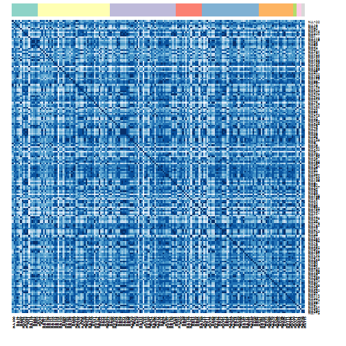
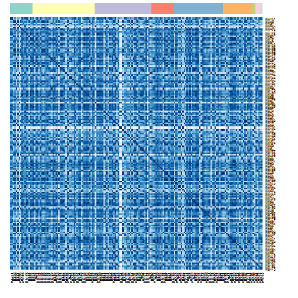

RNA-seq read count sample-to-sample correlation heatmaps
========================================================
> To knit .rmd file, read data files in using "../data"  
> To run chunks in Rstudio, read data files in using "./data"

Explore cleaned RNA-seq read count data using sample-to-sample correlation heatmaps.

Load required libraries:

```r
library(RColorBrewer)  # for better colour palettes
library(reshape2)  # for reshaping data from wide to tall format
library(plyr)  # data aggregation
library(ggplot2)  # for graphing
library(scales)  # scale functions for graphics, esp. alpha() function
```


Load required files, RNA-seq data and the experimental design:

```r
rDat <- read.table("../data/aml.rnaseq.gaf2.0_read_count_cleaned.txt", sep = "\t", 
    header = TRUE, check.names = FALSE)
rDes <- read.delim("../data/experimental_design_cleaned.txt")
```


Data inspection:

```r
str(rDat, max.level = 0)
```

```
## 'data.frame':	20001 obs. of  179 variables:
##   [list output truncated]
```

```r
str(rDes, max.level = 0)
```

```
## 'data.frame':	179 obs. of  10 variables:
```


**Sample-to-sample correlation heatmaps**  
I will reorder samples based on hierarchical clustering and different clinical variables to find if there are trends in RNA-seq expression values.

Heatmap with hierarchical clustering:

```r
heatmap(cor(rDat), Rowv = TRUE, symm = TRUE, col = brewer.pal(n = 9, name = "Blues"))
```




Order the data based on sex:

```r
# Palette for colour side bar Cannot use RColorBrewer with < 3 variables
pal <- c("#FB8072", "#80B1D3")

# Create a colour side by making a vector of colours based on rDes$Sex
# Create a new data frame with rDes$Sex and hexColours, then join with rDes
mapCols <- data.frame(palette = pal, Sex = levels(rDes$Sex))
rDesCol <- join(rDes, mapCols, by = "Sex")

# Ensure samples in rDat are ordered in the same way as colours in rDesCol
rDesColOrd <- arrange(rDesCol, Sex)
sexCols <- unlist(as.character(rDesColOrd$palette))
rDatLab <- rDat[, order(rDesColOrd$TCGA_patient_id)]

# Plot the heatmap with colour side bar
heatmap(cor(rDatLab), Rowv = NA, symm = TRUE, ColSideColors = sexCols, col = brewer.pal(n = 9, 
    name = "Blues"))
```


Order the data based on cytogenetic risk:

```r
pal <- brewer.pal(n = nlevels(rDes$Cytogenetic_risk), name = "Dark2")
mapCols <- data.frame(palette = pal, Cytogenetic_risk = levels(rDes$Cytogenetic_risk))
rDesCol <- join(rDes, mapCols, by = "Cytogenetic_risk")
rDesColOrd <- arrange(rDesCol, Cytogenetic_risk)
crCols <- unlist(as.character(rDesColOrd$palette))
rDatLab <- rDat[, order(rDesColOrd$TCGA_patient_id)]
heatmap(cor(rDatLab), Rowv = NA, symm = TRUE, ColSideColors = crCols, col = brewer.pal(n = 9, 
    name = "Blues"))
```


Order the data based on FAB subtype:

```r
pal <- brewer.pal(n = nlevels(rDes$FAB_subtype), name = "Set3")
mapCols <- data.frame(palette = pal, FAB_subtype = levels(rDes$FAB_subtype))
rDesCol <- join(rDes, mapCols, by = "FAB_subtype")
rDesColOrd <- arrange(rDesCol, FAB_subtype)
fabCols <- unlist(as.character(rDesColOrd$palette))
rDatLab <- rDat[, order(rDesColOrd$TCGA_patient_id)]
heatmap(cor(rDatLab), Rowv = NA, symm = TRUE, ColSideColors = fabCols, col = brewer.pal(n = 9, 
    name = "Blues"))
```




Order the data based on cytogenetic risk, then sex, then race:

```r
pal <- brewer.pal(n = nlevels(rDes$Cytogenetic_risk), name = "Dark2")
mapCols <- data.frame(palette = pal, Cytogenetic_risk = levels(rDes$Cytogenetic_risk))
rDesCol <- join(rDes, mapCols, by = "Cytogenetic_risk")
rDesColOrd <- arrange(rDesCol, Cytogenetic_risk, Sex, Race)
crCols <- unlist(as.character(rDesColOrd$palette))
rDatLab <- rDat[, order(rDesColOrd$TCGA_patient_id)]
heatmap(cor(rDatLab), Rowv = NA, symm = TRUE, ColSideColors = crCols, col = brewer.pal(n = 9, 
    name = "Blues"))
```


Order the data based on FAB subtype, age, then sex:

```r
pal <- brewer.pal(n = nlevels(rDes$FAB_subtype), name = "Set3")
mapCols <- data.frame(palette = pal, FAB_subtype = levels(rDes$FAB_subtype))
rDesCol <- join(rDes, mapCols, by = "FAB_subtype")
rDesColOrd <- arrange(rDesCol, FAB_subtype, Age, Sex)
fabCols <- unlist(as.character(rDesColOrd$palette))
rDatLab <- rDat[, order(rDesColOrd$TCGA_patient_id)]
heatmap(cor(rDatLab), Rowv = NA, symm = TRUE, ColSideColors = fabCols, col = brewer.pal(n = 9, 
    name = "Blues"))
```




So far, I cannot recreate the clear clusters identified using hierarchical clustering by reordering rDat by a single variable or multiple variables. I think the heatmap with hierarchical clustering is scaling the data using default arguments? I need to read the manual on the heatmap function more carefully.
